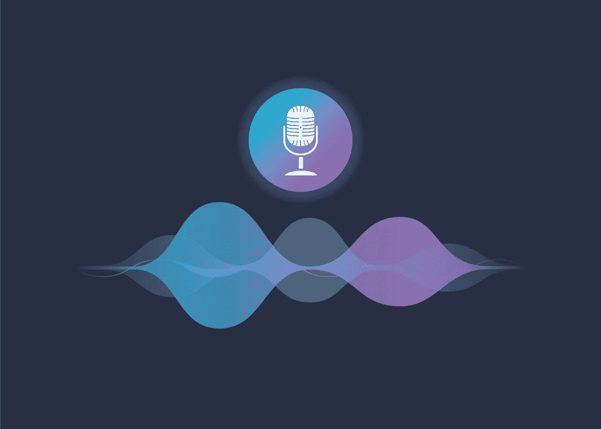

# 语音助手——它们能帮助企业吗？

> 原文：<https://medium.datadriveninvestor.com/voice-assistants-can-they-help-businesses-f82830689658?source=collection_archive---------15----------------------->

我相信现在每个人都已经听说过、使用过或知道今天市场上的语音助手。从亚马逊 Echo 开始的东西，变成了谷歌 Home、亚马逊 Alexa、微软 Cortana、Siri 等等。这些语音计算系统旨在为人们的日常生活提供简单性和即时性。通过使用一个简单的唤醒命令，如“嘿谷歌”，用户可以要求这些助手播放音乐，阅读新闻，并改变家中的温度。虽然这些助手中有许多是为消费者设计的，但许多大公司正在开发企业可以在办公室和会议室使用的平台。

它们是如何工作的？

这些便利的类似个人助理的设备使用了人工智能的一个分支，称为自然语言处理。NPL 帮助计算机理解、解释和响应人类语言，目标是弥合人类交流和计算机理解之间的差距。这种语音到文本的应用使用一系列底层任务，例如内容分类、上下文提取和行为分析，以便解释人类语言。这些任务允许助手识别用户的意图、情绪和上下文。文本到意图功能使用成千上万的算法来研究短语的相关信息，准确地解释用户所说的话和他们实际的意思。像动画机器人一样与计算机交谈的日子已经一去不复返了，自然语言处理已经出现了！最后，助手使用文本到动作的功能来满足用户的特定需求。整个过程只需几秒钟，满足了当今世界日益增长的即时性需求趋势。

**商业中的语音助手**

毫无疑问，这些迷你助手对我们的日常生活很有帮助，但它们主要是为消费者创造的。有证据表明，这些设备为我们提供了效率，必须确定它们可以在商业环境中实施，以提高工作场所的效率。如前所述，许多为消费者市场开发语音助手的大公司也在为商业平台开发语音助手。这些设备在商业场合的主要用途出现在会议和办公室。例如，在会议室实现的语音助手可以做笔记，解放那些感觉被束缚在键盘上的人的双手。随着时间的推移，这些设备可以被编程为允许他们在会议进行时插入想法和观点。此外，他们可以代替传统助理回答员工关于办公室的问题(库存水平、员工办公室的位置等。)，并通过简单地说“今天安排与 Sharon 的会议”来安排会议。这种智能办公室的想法将在效率、生产力和通信方面对商业环境产生积极影响。

**语音助手的问题**

虽然这些设备似乎对我们执行日常任务的生活产生了积极的影响，但也出现了一些与商业环境特别相关的问题。尽管应用了自然语言处理，但语音识别仍存在明显的问题。当然，并不是一切都是完美的，包括 NPL 和人类语言。句子必须清晰、直接、结构合理，以便识别。因为不是所有人都有完美的语言，这可能很难实现。此外，如果这些设备被放置在商务会议中，它们必须以一种允许它们对常规对话进行编码的方式进行编程，才能有效。

尽管存在这些问题，语音助手通过提供效率、简单性和即时性来改善许多日常任务。在当今快节奏的世界中，为了保持竞争优势，这些品质是必要的，尤其是在商业场合。这些设备的一个重要组成部分是它们不需要培训，几乎每个人都可以使用它们。因此，这些设备非常用户友好、实用和方便。

最初发布于 2018 年 12 月 14 日@ [aiapplied.ca](https://www.aiapplied.ca/2018/12/14/voice-assistants-can-they-help-businesses/)