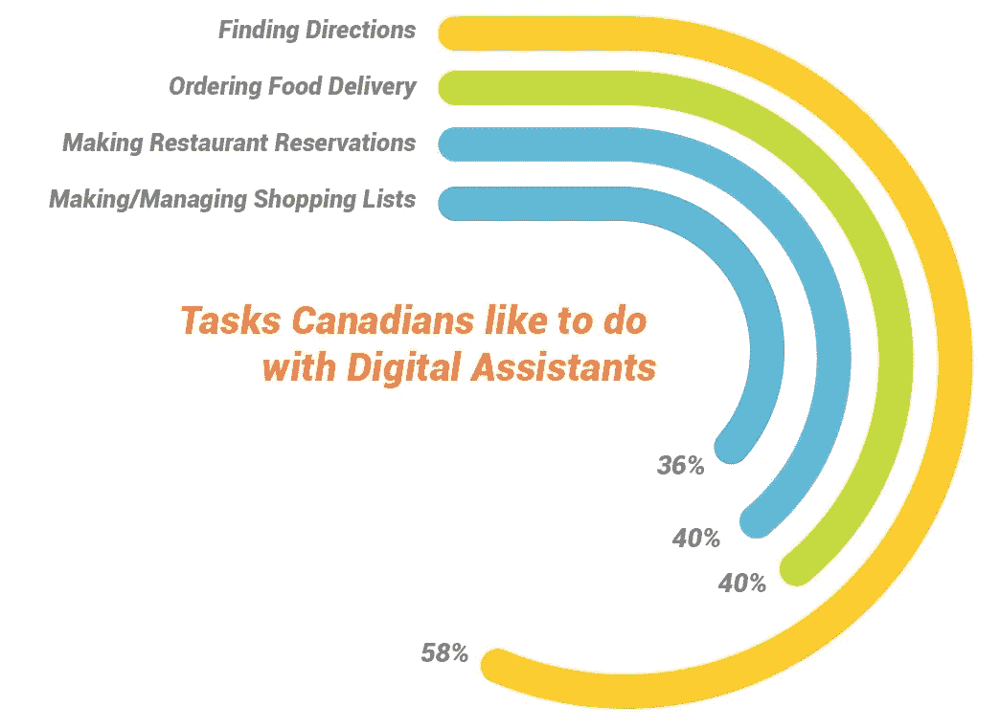
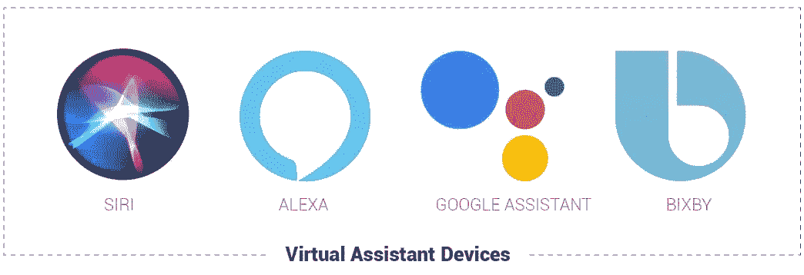
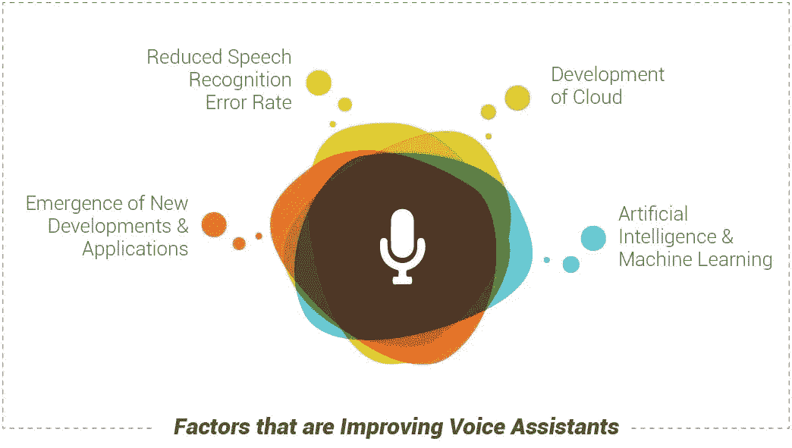

# 语音助手:通过授权给客户来提高期望值

> 原文：<https://medium.datadriveninvestor.com/voice-assistants-raising-expectations-by-empowering-the-customer-7551f724df71?source=collection_archive---------7----------------------->

近年来，语音命令技术主要用于智能手机和计算机，但今天，语音助手越来越多地用于虚拟和家庭助理设备、消费产品、电器、客户服务产品、电子商务等。事实上，随着操作语音助手所需的技术不断改进，消费者对他们支持的品牌的这种互动水平的期望也将变得越来越普遍。我们大多数人已经在他们的智能手机上使用语音命令，预计到 2021 年，这项技术将安装在超过 75 亿台设备上。在拉斯维加斯举行的 [2018 CES](https://www.ces.tech/) 活动上，有许多新的原型和产品集成了语音助手技术，证明这一趋势将持续下去。

只要看看最近围绕亚马逊 Alexa 的新闻，无论是她因[超级碗广告](https://www.youtube.com/watch?v=J6-8DQALGt4)而“失声”，还是现在臭名昭著的“[大笑事件](https://globalnews.ca/news/4068800/amazon-alexa-laughing-randomly/)，消费者正变得更加熟悉和依赖语音助手。但是随着不同品牌找到创造性的方法来实现语音助手，以及更多的消费者熟悉这项技术，更多的公司将不得不认真考虑如何将语音命令集成到他们自己的客户体验中，这正在被这项有趣的互动技术带来革命性的变化。

> [DDI 编辑推荐——学习构建亚马逊 Alexa 技能&与机器对话](http://go.datadriveninvestor.com/alexa1/matf)

# 语音助手的现状:网络搜索、问题和语音命令调用

由于现代智能手机配备的语音命令技术，我们都熟悉语音助手的概念，例如苹果设备的 Siri、谷歌助手和三星的语音。事实上，2017 年[皮尤研究中心](https://www.emarketer.com/content/us-voice-assistant-users-favor-their-smartphones)对互联网用户进行了调查，发现 42%的人通过智能手机使用虚拟助理技术，无论是提问、设置提醒、定位商品和服务，还是发起呼叫。

我们使用[语音命令的主要原因之一是该技术提供的便利](https://medium.com/@mobileLIVEinc/voice-assistants-the-gateway-drug-to-conversational-commerce-aa93f89780e7)，通过允许我们使用设备而不必打字或看屏幕，允许我们更有效地进行多任务处理。同样的皮尤研究数据显示，80%的语音助手用户喜欢不必触摸他们的设备的想法。交谈也比书写更自然，速度也明显更快:大多数人每分钟只能打 40 个单词，但他们可以在同样的时间内说 175 个以上的单词。尽管如此，语音命令设备的使用仍然在很大程度上局限于智能手机、电脑和家庭助理。此外，我们大多数人使用该技术只有几个基本原因，常见的语音命令示例包括:

# 技术发展和家庭助理的兴起

在过去的几年里，像亚马逊这样的科技公司一直在寻找使用语音技术的创新方法，最终诞生了语音命令家庭助理。这些虚拟助手包括像亚马逊的 Alexa、三星的 Bixby 和谷歌 Home 这样的设备，我们用它们来寻找问题的答案、获取天气或交通更新、控制房子周围的各种功能、订购外卖等等。这些设备的首要目标是方便，只需寻址设备激活它，然后提出问题或发出命令。例如，Alexa 的一个流行语音命令是“Alexa，给我看看我的照片”，这时语音助手将访问你智能手机上的照片并显示它们。

# 技术发展正在扩大语音助手的潜力

语音命令识别算法技术仍处于萌芽阶段，新的发展一直在发生，使语音助手更具吸引力，更易于使用。此外，这些发展也增加了该技术的应用，这就是为什么语音助手的使用在未来几年只会继续增长。例如，自然语言处理近年来取得了一些重大进展，自 2012 年以来，仅谷歌一家就将其语音识别错误率降低了 30%以上。另一个使语音助手更加可行的主要发展是云，因为设备可以使用远程服务器来处理信息和请求，而不是设备自己的处理器，这使得技术更加强大。最后，[人工智能](https://medium.com/@mobileLIVEinc/10-reasons-why-your-cx-needed-ai-starting-yesterday-814c4e68d7f3)和机器学习意味着语音助手可以通过从以前的交互中学习来随着时间的推移提高自己，这也意味着设备在记住用户偏好和历史方面会变得更好。

# 开启可能性:语音命令是[客户体验](https://perspectives.mobilelive.ca/customer-experience-in-the-digital-economy)的未来吗？

语音助理技术不仅限于虚拟助理和移动设备，目前有许多应用正在实施该技术以增强客户体验。例如，语音命令技术与家用电器是天然的契合，像 [GE](https://youtu.be/vttTM_pfY0w) 、[惠而浦](https://youtu.be/O-4tWbRJANU)、[三星](https://youtu.be/FfJlLiuKT_Q)、 [LG](https://youtu.be/JF2NY4RIaM0) 这样的公司已经与亚马逊(Amazon)、Bixby 以及 Google Home 合作，生产微波炉、洗衣机、炉灶、冰箱以及其他语音激活的智能电器，可以为消费者提供互动体验。事实上，你可以使用你的数字助理把你的股票放进冰箱，清洗你的盘子，洗衣服，以及使用智能互联电器做更多的事情。然而，这项技术并不局限于家庭，正如我们从保险公司 [Lemonade](https://www.fastcompany.com/3068506/lemonade-is-using-behavioral-science-to-onboard-customers-and-keep-them-honest) 看到的那样，他们正在使用语音助手提供无与伦比的客户服务，他们已经创造了一个名为 Jim 的人工智能机器人，可以在创纪录的时间内处理索赔和批准付款。

随着该领域在未来几个月和几年内的进一步发展，支持语音的设备、产品和客户服务产品也将变得越来越普遍。万事达卡和墨卡托最近的研究发现，美国 21%的语音助手用户使用这项技术来实现更复杂的电子商务和银行功能。同一项研究还发现，用户越来越信任这些设备的安全和隐私设置，这将为银行、电信和零售带来更多选择。在国内，[谷歌报告称](https://www.thinkwithgoogle.com/intl/en-ca/advertising-channels/search/typings-out-talkings-canadians-are-eager-voice-based-assistance/)73%的加拿大人希望通过与数字助理交谈来完成任务，据 [Tractica](https://mindstreammedia.com/digital-assistants-changing-way-search/) 称，到 2020 年，数字助理用户将超过 16 亿。

虽然大多数语音助手的使用仍然停留在智能手机和家庭领域，但将会有更新的方式将这项技术融入产品和服务。为了保持相关性，我们需要开始融入 2018 年发展最快的消费技术，否则就有可能落后。

希望为您的体验添加一些声音吗？[我们来连线](https://www.mobilelive.ca/contact-us)

*最初发布于:*[*https://perspectives . mobile live . ca/blog/voice-assistants-future*](https://perspectives.mobilelive.ca/blog/voice-assistants-future)