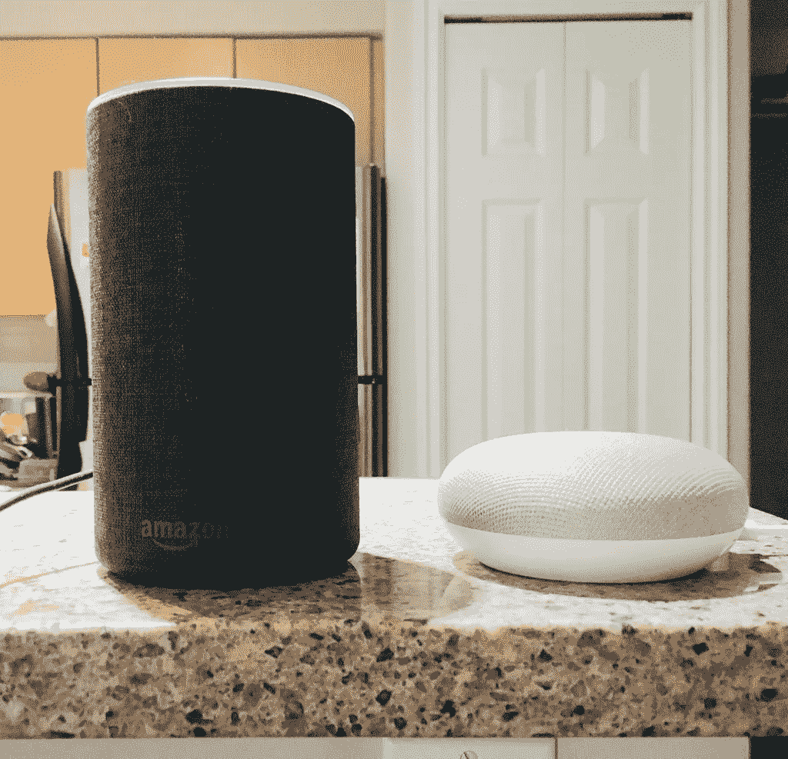

# 语音购物—必须解决的 3 个挑战

> 原文：<https://medium.datadriveninvestor.com/voice-shopping-3-challenges-that-have-to-be-solved-d49e9d9dc6f7?source=collection_archive---------5----------------------->

我们几乎每天都听说语音识别。我们已经看到技术如何改变我们的行为和购物方式。亚马逊 Echo、谷歌 Home 和其他智能音箱已经让美国和英国的购物价值达到了约 100 亿美元。在关于语音购物现象的最新预测中，我们已经注意到，仅 3 年后，美国和英国在 2022 年的销售额将达到 400 亿美元。这些数字令人震惊。在我看来，考虑到语音购物体验目前面临的挑战，这些数字过于乐观。但从我的经验来看，一旦挑战被设定，直到一些公司、创业公司或服务公司取得重大进展以解决它只是一个时间问题。

# 因此，让我们回顾一下让语音购物体验成为我们在日常购物活动中都会使用的体验的三大挑战:

1.  **发现** —人们不使用语音扬声器进行产品发现(就像他们在移动/桌面上那样)——这是一个严峻的挑战。

> **如果电子商务公司，特别是亚马逊，不能改进他们的推荐引擎，让用户获得灵感并浏览更多购物创意，语音购物的收入将会受到限制。**

解决这个问题的一个可选方法是建立一个(超级)智能人工智能引擎，它具有推荐系统，与我们分享的信息相关联，从我们的年龄和家庭状况，到我们的教育，社交网络，未来事件的日历，甚至我们的身体形状。这可以帮助语音购物系统更像一个语音推荐系统，向我们推荐不同的类别或每个类别的选定商品。例如，如果我计划在两周后参加一场婚礼，语音系统可以建议我购买一条适合我尺寸的新裤子，向我的移动设备、电视或我正在使用的任何相关设备发送一些图片，并通过说“是”为我订购该物品。这只是我们将声音和视觉联系起来的一种方法。我相信已经有很多想法和建议可以让这成为最佳体验，但我不知道什么是理想的解决方案。但我可以肯定的是，这个问题必须得到解决，一旦解决，就体验而言，这将是一个游戏规则的改变。

2.**搜索**——回顾最新研究，到 2020 年，大约 50%的搜索将是语音搜索，至少根据不同的报告是这样的。与移动或网络上的常规搜索相比，消费者在使用语音搜索时的搜索方式有所不同，主要区别在于，消费者往往非常善于表达，以便让语音设备返回匹配的结果。这意味着我们需要调整我们的网站或移动搜索应用程序来支持它。换句话说，我们再次需要人工智能——我们需要确保我们的 NLP(自然语言处理)算法将自然语言语法纳入文本内容。这将有助于提供更好的搜索结果。一个例子是，我们如何用这些产品的相关语音搜索词来丰富我们不同的产品页面，从而增加搜索查询与被搜索项目之间的匹配机会。

> **这个内容应该非常侧重于自然语言，以及我们在日常生活中到底是如何说话的。在许多情况下，这与如今购物网站上呈现的内容大相径庭。**

3.**隐私**——作为互联网用户、社交网络、脸书、Instagram 等等，我们知道为了改善我们自己的在线个人体验，我们正在放弃某种程度的隐私。网购也是一样。

> **然而，在我们的家里或汽车上安装一个语音设备，理论上可以记录个人对话、会议和任何其他人可以使用的数据，这是一个不容易接受的概念。**

如果公司希望增加语音设备的使用，特别是语音购物，他们需要拿出一个智能的解决方案，只保留消费者行为的相关数据，或者从数据中学习，而不保存在任何其他地方。是的，这个挑战很难，但正如我提到的其他两个挑战，我认为在大多数消费者接受这样的设备成为他们日常习惯的一部分之前，这是一个明确的必须。

语音购物很刺激。我相信它会以一种我们甚至无法想象的方式改变未来。但是，为了实现这样一场革命，它必须在实现产品发现的方式上取得重大进展，搜索引擎必须支持它，同时用常规语言丰富产品页面，隐私问题必须得到重视。