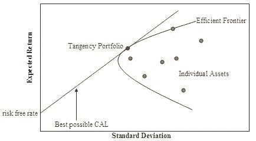
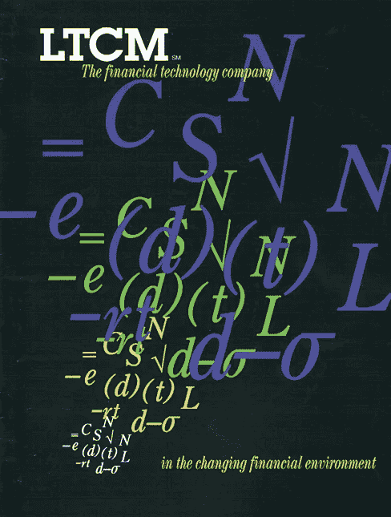
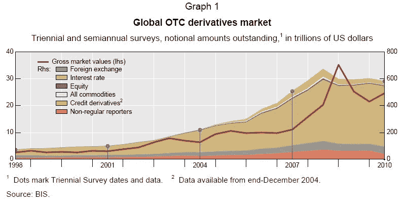
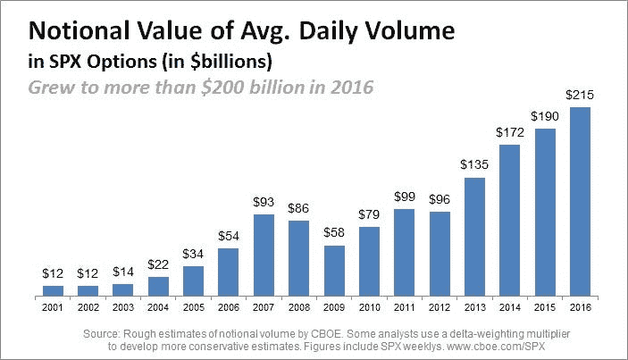
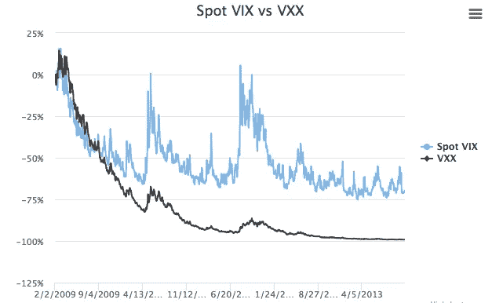
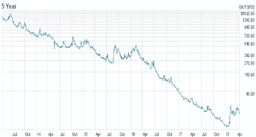
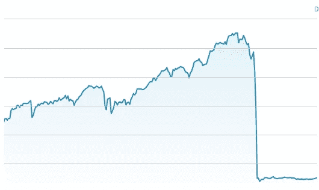
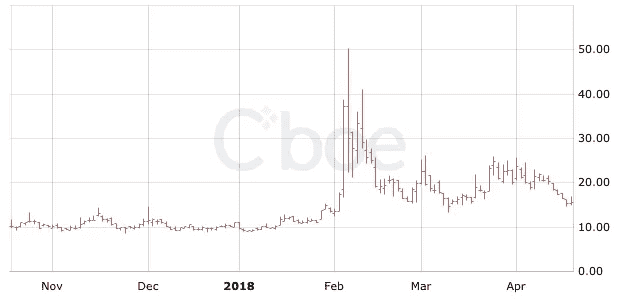

# 波动性:变得比狗聪明的尾巴——一篇数据驱动的视觉文章

> 原文：<https://medium.datadriveninvestor.com/volatility-the-tail-that-became-smarter-than-the-dog-a-visual-essay-8399741f5a99?source=collection_archive---------4----------------------->

在 1990 年的电影《盗亦有道》中，最令人难忘的一幕是亨利·希尔(雷·利奥塔饰)和汤米·德维托(乔·佩西饰)之间的紧张对话，佩西问道:“怎么好笑？”

这种不安的感觉与投资者在股票市场上看着自己的投资组合迅速升值和贬值时的感受没有什么不同。《佩西》获得奥斯卡奖的表演虽然无法衡量，但却是一个反复无常的角色的缩影。

与其他金融概念不同，波动性可以让你对数学或金融一无所知，但仍能非常清晰地理解它。事实上，如果你投资于市场或你的日常生活，你就能*感受到这一点。*

波动性的概念既熟悉又抽象，然而在金融市场中，它也获得了物理存在。多年来，波动性已经从风险的代表演变为一种活跃的交易工具，演变为对它所衡量的市场的实际影响(摇着尾巴的狗)。

下面是这种演变如何发生以及波动性如何增长的简要时间表。

# 20 世纪 50 年代:数学进入金融界

随着道琼斯指数飙升至 500 点，人们开始对投资感到兴奋(今天是 24，000 点，2018 年 3 月 2 日，道琼斯指数上涨了 500 多点)。

同时，未来的诺贝尔奖获得者 Markowitz 在他的[现代投资组合理论](https://www.investopedia.com/terms/m/modernportfoliotheory.asp)中引入了波动性作为风险的代表。根据历史走势，一只股票波动越大，它的风险就越大。

通过分散投资，你可以在同样的风险下获得更好的回报，或者以更低的风险获得同样的回报。因此，投资组合经理将不得不考虑不同的组件将如何一起工作。

投资不再仅仅是挑选正确的股票，而是寻找股票和其他资产的组合，将投资组合置于难以捉摸的“有效边界”。

Source: Wikipedia

就风险调整回报而言，有效边界将优于所有其他组合。

如果是一个骑自行车的人，同样的努力，这个组合会跑得一样快或更快:

这个新想法被证明是如此成功，以至于它永远改变了我们对待股票市场的方式。

# 1973 年:布莱克·斯科尔斯·默顿模型将理论变为实践

Source: Global Finance Magazine

三位学者介绍了一种用基于波动性的公式为期权定价的方法，该公式来自用于粒子物理学的布朗运动。

波动性是这个公式的一个关键组成部分。然而，这不再是观察到的波动，而是展望未来。换句话说，它从可测量的、历史性的东西演变成前瞻性的、假设性的东西。它被称为隐含波动率，但我将使用“未来波动率”只是为了这篇文章的目的。

该模型是理论和实践的完美结合，为随后的期权交易和衍生品的繁荣提供了理论基础。

同样是布莱克和斯科尔斯后来成为了一家新公司的董事，这家公司于 1994 年成立，将他们引入世界的前沿数学方法应用于金融:LTCM

1997 年，他们获得了诺贝尔奖。

1998 年，LTCM 股市暴跌。

然而，这并没有阻止衍生品市场继续惊人的增长。

# 1992 年:VIX 的波动变得明显

隐含波动率对投资者是有用的，因为它给了他们一种衡量市场环境的方法，但在芝加哥期权交易所(CBOE)推出 VIX 之前，跟踪隐含波动率并不容易。

突然波动出现了，像一把光剑。

VIX 经常被提及，并赢得了“恐惧指数”的绰号。然而，这仅仅是一个指数，一个计算。

没有投资者可以交易的“纯”波动性合约。

# 2004 年:波动性可以通过 VIX 期货交易

直到有一个不是金融出身的人问高盛是否可以做到。这个人就是新晋亿万富翁马克·库班，他显然不介意风险。

投资银行总能找到办法，VIX 期货就是由桑迪·拉特雷在高盛开发的。

换句话说，对未来波动性的*衍生工具现在是可用的。在一个不同的世界，VIX 期货可能有点像这样:*

但在金融界，这是一个巨大的成功:

2008 年金融危机减缓了衍生品的增长，但这只是暂停。事实上，VIX 即将迎来另一个重大发展。

# 2009 年:人人共享的 VIX

随着 VIX 交易所交易票据(etn)的推出，任何人都可以像交易基金和股票一样，利用 VXX 等产品交易基础证券。被称为“VIX 之路”的产品可以大规模销售。

这是个好主意吗？现在我们只需要花一点时间来考虑这些产品是如何工作的。

1.  期货不是现货，所以跟踪误差很大。

2.VXX 的表现不如 VIX，因为期货价格高于现货价格，所以这是一个高买低卖的例子

VXX performance

反过来，这一特性促使人们创造出反 VIX 产品，如 XIV，该产品在崩溃前表现良好。

XIV performance

3.崩溃的原因是，与股票市场的几个百分点相比，波动性本质上可以在一天内变化 100%。当 VIX 在 2018 年 2 月飙升时，它消灭了 XIV。

# 2018:变得比狗还聪明的尾巴

> 为什么狗会摇尾巴？
> 因为狗比它的尾巴聪明。
> 如果尾巴聪明一点，尾巴会摇狗。

随着 VIX 交易活动的增加，做市商最终不得不在股票市场上进行动态对冲。这就是波动性本身如何开始推动市场的。或者用 VIX 期货投资者自己在 2018 年 2 月发表在英国《金融时报》一篇文章中的话来说。

> 如果以前是尾巴摇狗，你不会注意到它。周一发生的事情是尾巴抓住狗，让它在房间里荡来荡去。

这种新的市场机制促使卡尔·伊坎(Carl Icahn)等一些业内资深人士怀疑，这是否是有史以来观察到的最不稳定的市场(回答:不完全是，但感觉还是有些变化)。

# 未来的波动前景如何？

最近的发展与之前的*波动相关的*危机、LTCM 或 2008 年的全球金融危机相比相形见绌。然而，这可能是市场上第一个由*波动引发的*效应的例子。随着波动性尾部变得越来越容易接近，它也变得越来越复杂——或者说越来越聪明——对市场的影响也越来越大。

2008 年全球金融危机后，金融工程和创新不得不后退一步。现在，银行重新盈利，金融也以创新的方式回归([比特币期货已经推出](https://www.cnbc.com/2017/12/17/worlds-largest-futures-exchange-set-to-launch-bitcoin-futures-sunday-night.html)，还有关于比特币波动性的讨论)。也有越来越多的关于监管的讨论，但不是来自主要参与者。

从旁观者的角度来看，这可能是令人兴奋的。