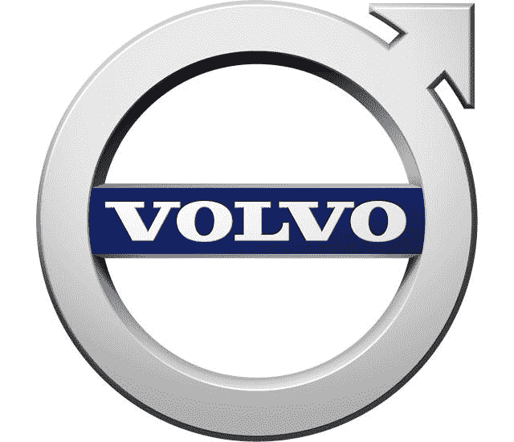

# 沃尔沃预计电动汽车利润率将很快赶上传统汽车销量

> 原文：<https://medium.datadriveninvestor.com/volvo-seeing-ev-profit-margins-matching-conventional-vehicle-sales-soon-15bf6ac7af6d?source=collection_archive---------20----------------------->

## 多快？继续读下去，你可能现在就想买一辆电动汽车。

如果说除了自动驾驶技术，汽车行业还有什么在快速发展，那就是这个:*电动汽车*。伊芙。混合技术。一些人可能会说这是未来的潮流，因为许多人仍然喜欢车辆的控制和所有权，但有更多的动力，这对环境更好，更精简，更具成本效益。当然，沃尔沃也这么认为，但当他们看到电动汽车在整个汽车行业的市场份额时，你不会相信:

# 沃尔沃预计，未来十年内，电动汽车的利润率将超过传统汽车

那很快就来了。毫无疑问，内燃机现在变得越来越慢，所以我们正在寻找一种快速发展的创新。事实上，全球汽车制造商将在未来五到十年内看到**3000 亿美元的支出激增**，但最初会有一些更高的零部件成本。

 [## 准备在 2019 年改变世界的技术-数据驱动的投资者

### 很难想象一项技术会像去年的区块链一样受到如此多的关注，但是……

www.datadriveninvestor.com](https://www.datadriveninvestor.com/2019/01/17/the-technologies-poised-to-change-the-world-in-2019/) 

特别是，沃尔沃将投资其年收入的 5%，约为每年$1B，不仅用于资助电动汽车的开发，还用于资助[自动驾驶技术](https://vigyaa.com/@pierre/daimler-ag-and-bmw-team-up-to-tackle-self-driving-technology-d6a8e06b/)。不过，要为逐步发展做好准备——因为与传统制造相比，电动汽车的生产并不划算。其他因素，如驾驶电动汽车的长期成本节约——汽油费、维修费等——肯定会抵消最新技术的更高价格，这也会降低传统销售的利润率。

这就是为什么沃尔沃心中有一个具体的日期。是的，在十年之内，但是你想知道沃尔沃什么时候能看到传统汽车销售的利润率吗？

# 沃尔沃预计到 2025 年

你可以预期至少有 50%的消费者会购买汽车。其中一半(或更多)可能是永久。这将是汽车技术、工业和零售的新时代。想象一下这对石油工业，汽油工业会有什么影响。加油站将不得不发展。我们在这里谈论的是一个全新的金融生态系统。

你对 EV 有什么看法？好还是坏？ [**注册一个免费的 VIGYAA 账户**](https://vigyaa.com/accounts/login/) 和 [**查看数据驱动投资者了解更多见解！**](http://datadriveninvestor.com)