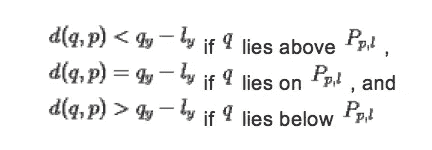
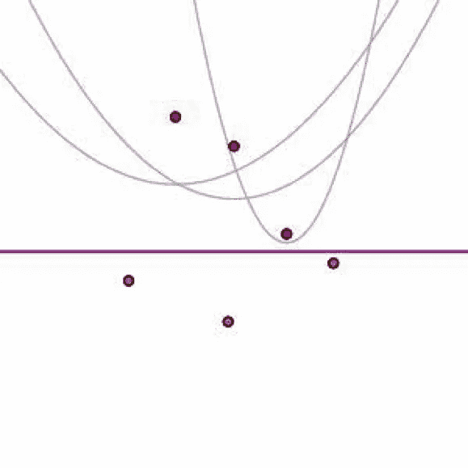
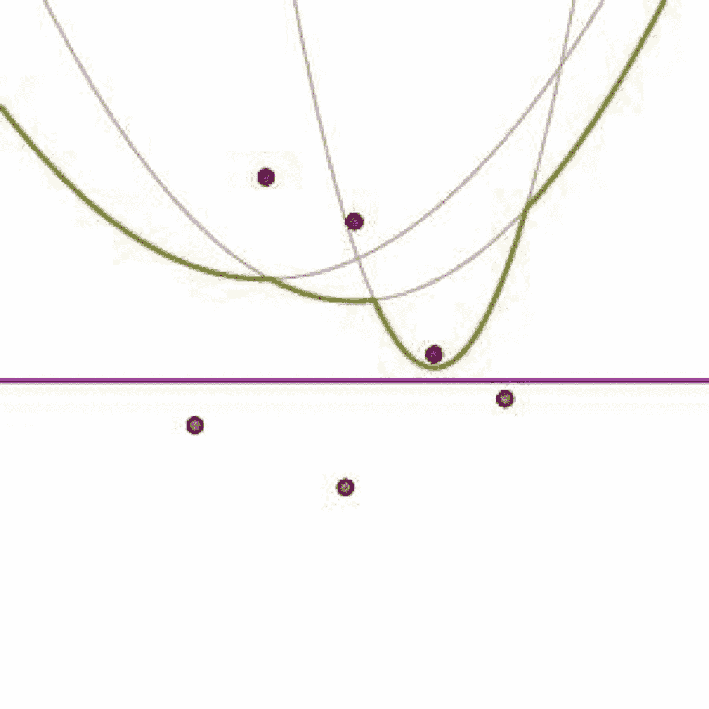
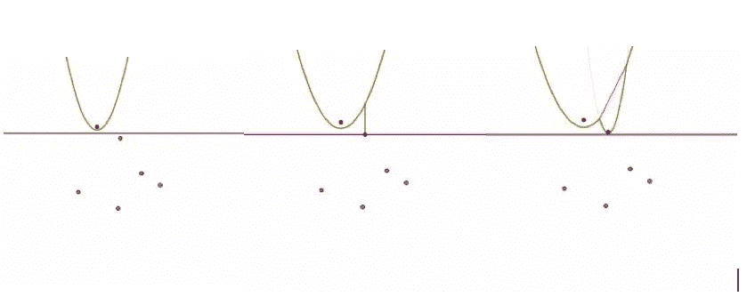

# Voronoi 图

> 原文：<https://medium.datadriveninvestor.com/voronoi-diagrams-929c55a0443a?source=collection_archive---------4----------------------->

voronoi 图基本上是一个平面，其基于到预先指定的点的距离被划分成多个区域。我们将会看到如何从算法的角度构建 voronoi 图。voronoi 图具有以下属性:

1.  Voronoi 图是一个平面图，其中每个顶点的度数为 3。
2.  对于“n”个位置，最多有“n”个面 2n-5 个顶点，最多有 3n-6 条边。
3.  无界 voronoi 单元中的位置对应于凸包上的顶点。
4.  voronoi 边落在两个相邻站点的垂直平分线上。

**施工**

使用财富算法或扫描线算法来完成构造。这具有 O(nlogn)的时间复杂度和 O(n)的空间复杂度。

形成的抛物线可以认为是把平面分成两个区域，一个区域由靠近‘p’的点组成，另一个区域由靠近‘l’的线组成。设点‘q’有坐标(qx，qy)，到‘p’的距离是 d(q，p)。扫描线的纵坐标是“ly”。所以“q”和“l”之间的距离是 q *y* -l *y* 。

我们得到以下条件:

随着扫描线在平面上向下移动，任何时候我们都只考虑位于扫描线和抛物线上方的位置。下面给出一个例子:

海滩线是由最低的抛物线弧形成的曲线。它是由最低的抛物线弧组成的 x 单调曲线。即任何一条垂直线都会经过几条抛物线；垂直线穿过海滩线的点是这样的最低点。请注意，组成海滩线的每条弧都与扫描线上方的一个场地相关联。

例如，如果一个点位于海滩线之上，它必须比 *l* 更靠近 *l* 之上的一个位置。这意味着该点位于扫描线已经通过的站点的 Voronoi 单元中。因此，海滩线上方的 Voronoi 图由扫描线上方的站点确定。

现在，让我们确定海滩线何时通过某个任意点*q。*假设 *q* 与任何其他点一样靠近地点 P*l*；即 d(q，p *l* ) < d(q，p *i* )对于所有其他站点 P*I .**q*位于 P *p，l* 上的条件可以表示为 d(q，p *l* ) = q *y-l* y，因此 d(q，p *i*

这意味着当 *q* 出现在 P *pl，l，*上时，它不能在另一条抛物线 P *pi，l* 之上。因此，当 *q* 出现在抛物线 P *pl，l，*上时，它在海滩线上。让我们总结一下这个重要的观察结果:

当一个点出现在海滩线上时，它位于与其最近的点相关联的抛物线弧上。海滩线上位于两条抛物线弧上的点称为断点。应用我们的观察显示断点是最近的两个位点。换句话说，断点位于 Voronoi 图的边上。这意味着当扫描线在平面上向下移动时，断点将扫出 Voronoi 图的边缘。因此，要构建 Voronoi 图，我们只需跟踪断点。

**寻找边缘**

因此，为了构建 Voronoi 图的边缘，我们需要在扫描线沿平面向下移动时跟踪相应的断点对。这样做的第一步是检测何时构造一对断点。如下图所示，当新弧线添加到海滩线时，就会发生这种情况。

Sequence of images depicting breakpoints

换句话说，当扫描线经过新的位置时，对应于 Voronoi 图中的边的一对断点出现在海滩线上。我们将这种情况称为现场事件。

随着扫描线向下移动，**断点沿着芙诺以图**的边缘连续移动，直到它们到达图的顶点。当沿着海滩线的一个抛物线弧消失时，就会发生这种情况。

当抛物线弧收缩到点 *q* 时，该点 *q* 位于三条抛物线上:第**条包含消失的弧，两条抛物线包含两边的弧。**这意味着 *q* 与对应于这些抛物线的三个点等距，因此，这三个点位于以 *q 为圆心的圆上。*因此，当扫描线穿过该圆的底部时，我们找到顶点 *q* 。

如果扫描线遇到的下一个事件是一个站点事件，我们只需按照相应的抛物线弧出现在海滩线上的顺序将新站点插入到我们的站点列表中。然后我们记录下我们在图中遇到了一条新的边。

如果扫描线遇到的下一个事件是圆形事件，我们记录下我们在图中遇到了一个顶点，并且该顶点是对应于两个断点的边的端点。我们还记录了对应于由 circle 事件产生的新断点的新边。

**扫描线状态**

定义海滩线的有序抛物线弧序列；每个都由场地(和扫掠线)定义

1.断点由两个位置(和扫描线)定义

2.由于海滩线是 x 单调的，我们可以**在 x 坐标上的平衡二叉查找树中存储状态。**

3.我们将断点和抛物线弧按照 x 值的递增顺序存储在平衡二叉查找树中。

**事件点**

更具体地说，有两种类型的事件:

1.当扫掠线到达新的位置时(在这种情况下，新的抛物线被添加到海滩线上)

2.当断点到达它跟踪的边的末端时(在这种情况下，现有的抛物线弧从海滩线消失)

**圈子事件**

在一次循环活动中，

1.一条抛物线弧从海滩消失了

2.两个相邻的断点会合在一起

3.voronoi 顶点被发现为与两个已知 voronoi 边关联的顶点

4.开始跟踪新的断点

5.扫掠线将到达一个空圆的底部，该空圆穿过海滩线上具有连续抛物线弧的三个地点。

**假警报**

1.  中断 3 个连续抛物线弧的圆形事件。

2.当事件圈的圈可能不是空的时，甚至会引起错误警报

3.最多有 2n-5 个圈事件。

4.一个事件在 O(logn)中处理，有 n 个事件站点。

因此，可以在 O(nlogn)时间内计算 n 个点的 Voronoi 图。

**参考链接:**

 [## 美国数学学会

### 我们的使命是促进数学研究、学术和教育的兴趣。

www.ams.org](http://www.ams.org/samplings/feature-column/fcarc-voronoi)