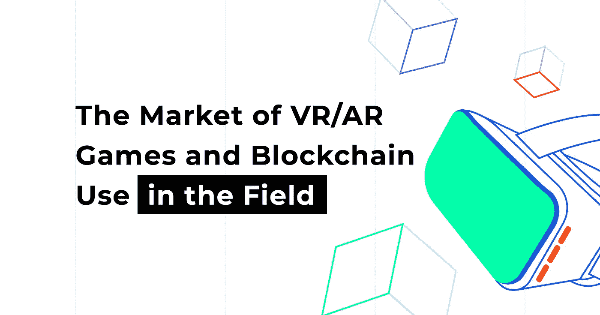
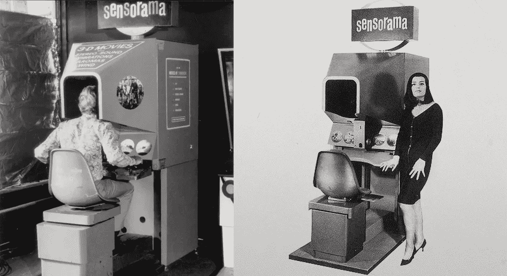
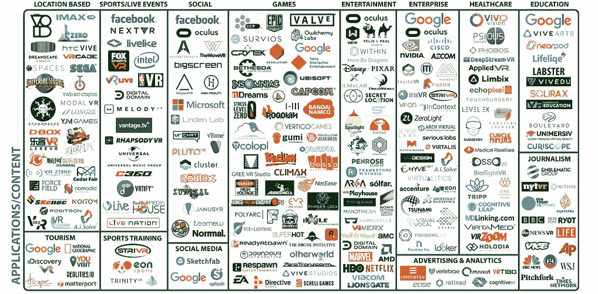
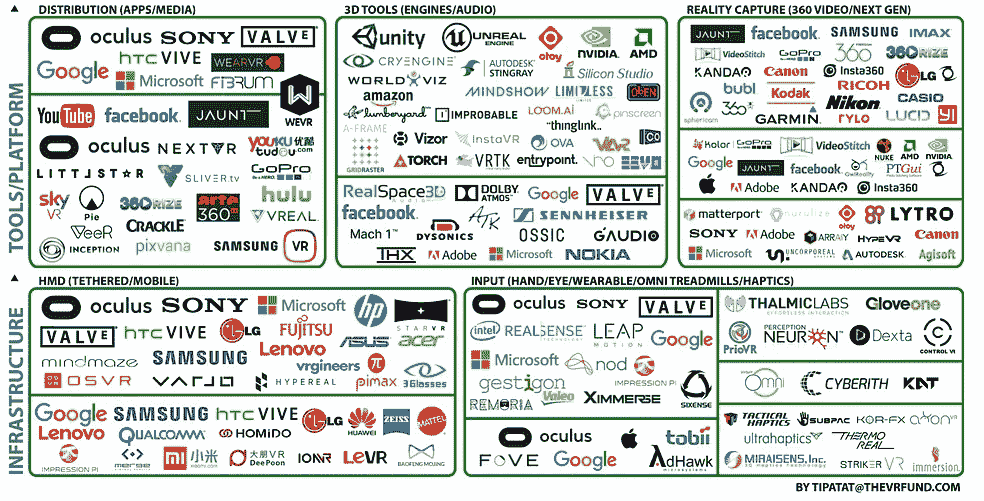
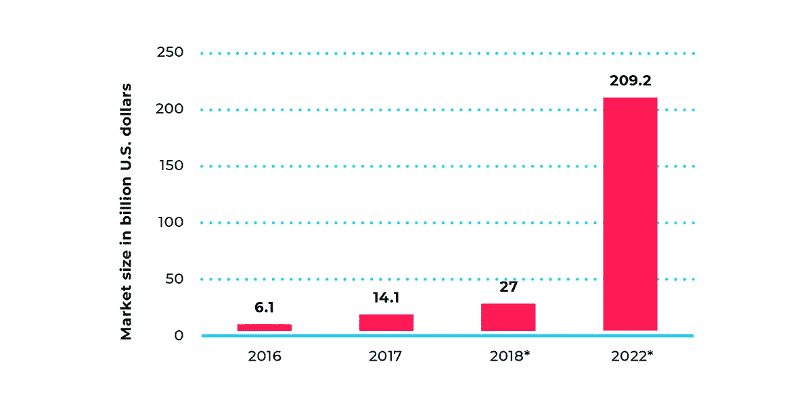
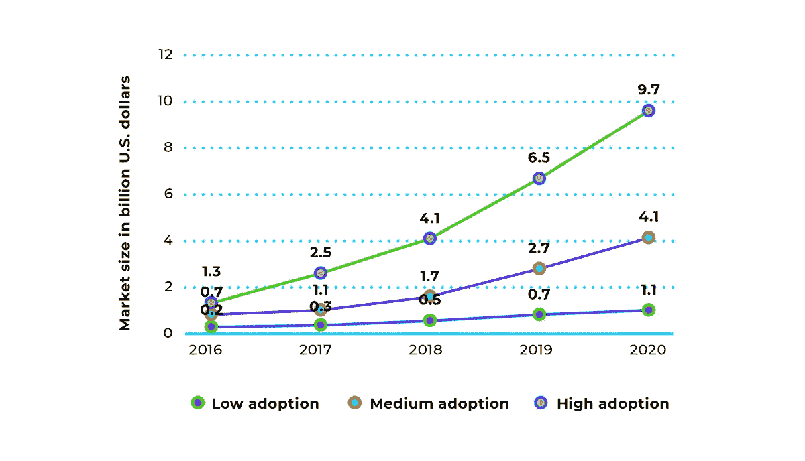
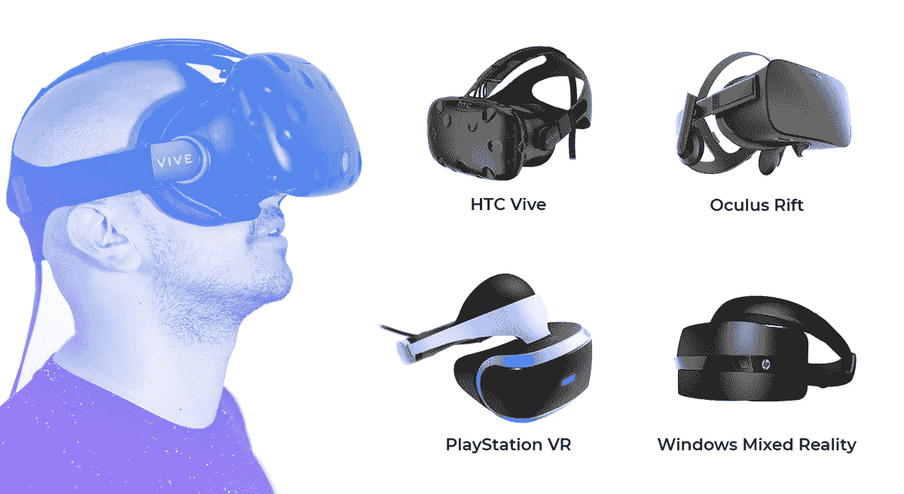
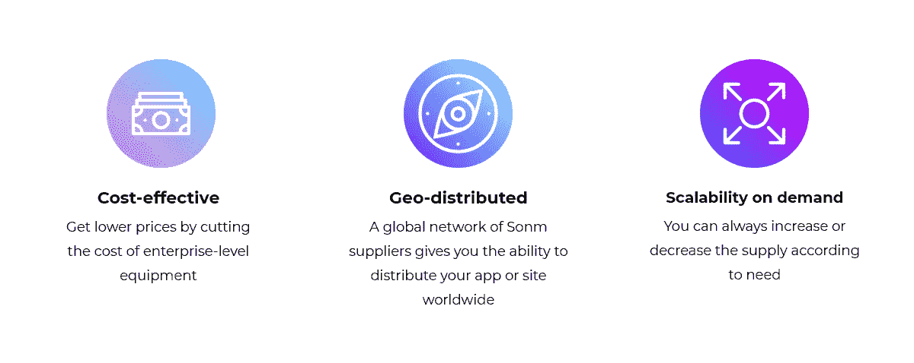
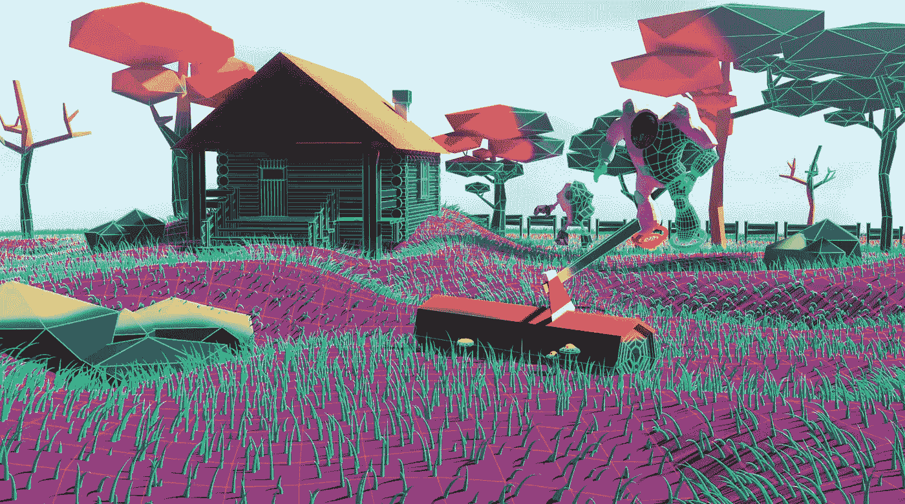
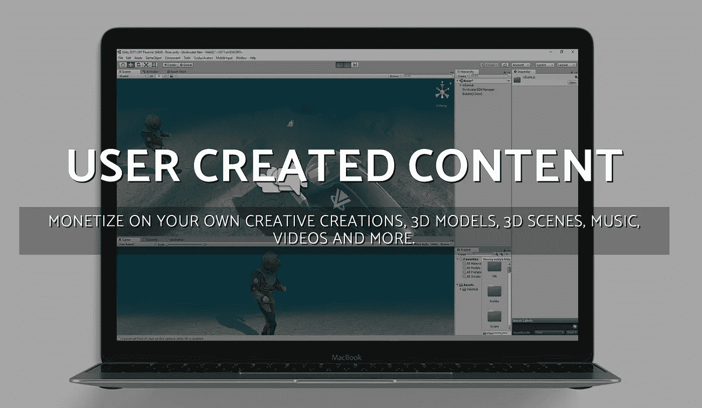

# VR 和 AR 游戏、分布式计算和增强的功能

> 原文：<https://medium.datadriveninvestor.com/vr-and-ar-games-distributed-computing-and-increased-capabilities-b9fe222d9fe5?source=collection_archive---------2----------------------->

**虚拟和增强现实发展简史**

虚拟现实(VR)和增强现实(AR)技术几年来一直在激发世界各地游戏玩家的想象力:坐在家里的 PC 或智能手机上沉浸在一个新的宇宙中是令人难以置信的兴奋。这个行业的第一次发展出现在上个世纪中叶，当时 VR 的先驱 Morton Heilig 推出了第一个虚拟模拟器“Sensorama”。海利格认为他的发明是艺术进化的逻辑结果。

> 令人惊讶的事实是，这些新设备清楚地展示了绘画、摄影和电影共同揭示的部分效果——描绘了视觉世界的所有荣耀，即人眼感知的方式。

*莫顿·海利格《未来电影》，1955 年*

*Sensorama machine designed by Morton Heilig*

第一个便携式虚拟现实设备出现在 60 年代，用于军事目的。至于虚拟现实游戏，第一次开发是在 1993 年，由世嘉公司，一家为 80 年代和 90 年代的人所熟知的公司。不幸的是，这次发布是失败的:Genesis 主机导致头晕恶心，所以取消了销售，VR 游戏行业又暂停了 10 年。

虚拟现实技术在 2012 年大受欢迎，当时 Oculus 发起了一项 Kickstarter 活动，资助生产一款虚拟现实头盔。三年后，第一款 VR 头盔 Oculus Rift CV1 开始销售，导致大量资金流向该行业。

**投资及市场概况**

根据虚拟现实基金的报告，2017 年该行业的总投资额超过 23 亿美元，VR 行业的公司数量达到 450 家。

*Companies involved in VR development in the second half of 2017, according to the VR Fund report*

据**Statista.com**预测，2020 年 VR 和 AR 市场的总量将比 2017 年增长 14 倍以上。

*Source: statista.com*

该服务还预测了 2016 年至 2020 年期间 VR 和 AR 设备销量变化的各种场景。即使在最坏的情况下，销售量也有望在 4 年内增长 5 倍。

*Source: statista.com*

根据 OrbisResearch.com 在 2017 年发表的题为“增强现实(AR)的游戏市场——截至 2023 年的全球驱动因素、限制、机遇、趋势和预测”的报告，微软、谷歌、苹果、索尼、任天堂、Niantic、Cast AR 和 Gamar 是 AR 行业最大的参与者。

据 [Think Mobiles](https://thinkmobiles.com/) 报道，最受欢迎的 ar 游戏是 Pokemon GO，它甚至在吉尼斯世界纪录中被提及。人们认为 Pokemon GO 是 Quake 2000 的现代化版本，在那里可以使用带有传感器和摄像头的特殊 VR 头盔来追逐现实中的怪物。这种头盔相当昂贵，对游戏的普及产生了负面影响。

现在 VR 行业以 HTC Vive、Oculus Rift、PlayStation VR、Windows 混合现实等便携产品为代表，VR 技术已经被整合到《《我的世界》》、《辐射 4》、《TES:天际》等热门游戏中。

*VR sets existing on the market in 2018*

# VR 和 AR 行业的主要发展问题

尽管 AR 和 VR 行业发展迅速，资本不断增长，但开发者需要解决许多主要问题。

VR 头盔的高成本，图像和像素化的真实感不足，焦深不可调，计算能力不足——所有这些因素都对该技术的普及产生了负面影响。

Pokemon GO 开发商 Niantic 的服务器在游戏刚推出时容量严重不足，导致用户投诉。这个问题本来可以用 SONM 这样的分散式计算机来解决。

根据 Gartner Analytics 的数据，2017 年制造了超过 2.625 亿台计算设备，包括台式电脑和笔记本电脑。全世界有超过十亿台个人电脑，这个数字大大超过了所有数据中心的计算设备和超级计算机的总数。

游戏开发商的主要支出是从数据中心租用计算能力。反过来，普通用户(矿工)的电脑闲置几个月。SONM 的主要想法是利用一个特殊的市场将这些资源货币化，个人电脑用户可以在这个市场上租赁他们的计算能力。

*Source: sonm.com*

因此，SONM 有许多优势:

> *低成本*

由于使用消费级电脑而没有数据中心的维护费用，租用计算能力更便宜。

> *更好的地理覆盖*

一些城市甚至国家没有数据中心，但是矿工和个人电脑随处可见。

> *大量显卡*

通常，显卡用于在 PC 上进行渲染，但现在还有其他用途——机器学习、服务器渲染——可以用于 VR 或 AR 领域的现代游戏。

# 将区块链用于 VR 和 AR 游戏

2017 年，**分散土地**项目最初在 35 秒内筹集了 2400 万美元。开发始于 2015 年，当时推出了概念证明:使用区块链技术记录的虚拟房地产所有权证书。虚拟不动产被表示为网格，每个像素包含标识像素的所有者和颜色的元数据。

*Source: Decentraland Blog*

2016 年底，土地虚拟世界的开发开始了，在这里你可以购买、出售或租赁土地。每个地块都有自己唯一的坐标(x，y ),包含关于所有者的信息以及存储在 BitTorrent 和 Kademlia DHT 网络中的内容描述文件的链接。所有新的地块都与现有地块相邻，因此，分散土地创造了一个连续的虚拟世界。此外，分散土地计划建立第一个虚拟大都市，创世纪城。

分散土地属于用户:他们创造内容，拥有自己的财产，过“他们的生活”，这是这个项目与其他类似项目的显著区别。

这一领域的另一个项目是**vibe hub**——一个面向音乐家、游戏玩家和教育专家的虚拟社交平台。这家初创公司使用智能合同系统在平台参与者之间达成协议，例如当表演者需要摄像师录制片段，学生需要语法课时。该项目还创建了名人的全息图，并将他们放在虚拟世界中。

*Source: VibeHub*

货币化是通过基于平台的独特商品的创造和随后的销售产生的。

VR/AR 行业的其他开发者有 [**虚拟宇宙**](https://www.vutoken.io/)[**密码空间**](http://thecryptospace.com/)**等，但他们的项目只有模糊的前景。**

# **摘要**

**毫无疑问，VR 和 AR 技术是未来。不断增长的市场资本，获得计算能力的替代解决方案，新兴的新技术——这些都对游戏市场的平衡产生了巨大的影响。区块链技术尚未广泛应用，但 VR 和 AR 技术的扩展可能很快会改变这种情况。**

**你有什么要补充的吗？留下评论，分享你的观点——我很乐意回答你。**