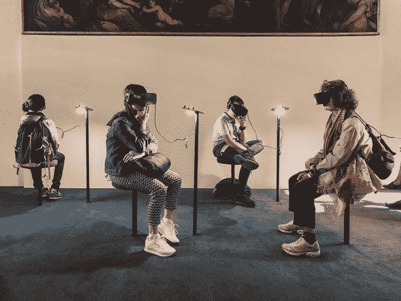
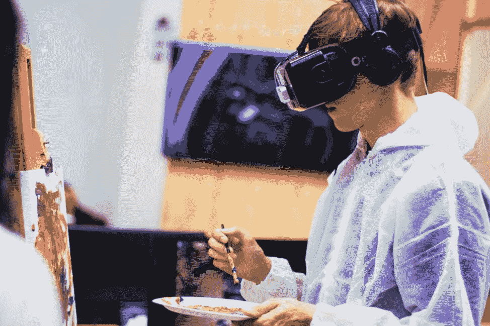

# VR 试探性地窥视社交网络

> 原文：<https://medium.datadriveninvestor.com/vr-tentatively-peers-into-social-networks-100340a4541d?source=collection_archive---------10----------------------->

## 虚拟现实可能会改变在线社区的面貌

Photo by Lucrezia Carnelos on unsplash

在数字时代，网络社区让不同的人为了共同的目标和事业走到一起。医疗领域的医生-患者和同行支持在这些群体中名列前茅——在生命受到威胁时尤为突出。

虚拟现实还具有支持社交媒体社区的潜力，正如虚拟现实的最大支持者之一[查克·韦伯斯特博士](https://twitter.com/wareFLO)所倡导的那样。称他为混血儿。[用他的话说](https://altvr.com/community-spotlight-health-systems-chat-with-chuck-webster/)，他是“一个上过医学院的工业工程师”

“工业工程师研究系统——就我而言，是医疗保健系统——并应用各种技巧和技术来改进这些系统，”他说。“从某种意义上来说，工业工程是一个工作流学位。几十年来，我一直参与设计软件来改善工作流程:效率、效果和体验。工作流就是故事。”

通过韦伯斯特的倡导、专业知识和对 VR 的热爱，他想给志同道合的人一个在社交 VR 中讨论健康和技术相关话题的机会。这自然会让他与医疗保健提供商进行在线联系，这些提供商希望将他们的社交网络连接在一起，以实现事情的发生。

 [## 人工智能和虚拟现实的融合-你能期待什么|数据驱动的投资者

### 在技术领域，融合是合乎逻辑的一步。就在几十年前，你可能需要一个专门的…

www.datadriveninvestor.com](https://www.datadriveninvestor.com/2018/08/30/the-convergence-of-ai-rv-what-you-can-expect/) 

“我们的共同目标是理解医疗保健系统、子系统和超级系统，”韦伯斯特说。“一个相关的目标是探索社交虚拟现实作为一个新的社交媒体平台，以及它如何补充 Twitter 和 tweet 聊天等其他平台。”

来自韦伯斯特的一个短视频展示了他的动画智慧城市和智慧医疗连接。

韦伯斯特说:“最酷的事情是，当戴上虚拟现实耳机时，你会感觉就像你们一起出现在这个卡通景观中一样。”

他以非常规的方式传递信息，当然是针对传统的网络群体。

韦伯斯特说:“我还没有掌握这一点，但偶尔我会尝试在虚拟现实中参与推特聊天。”“我可以监控带标签的推文，但主要问题是缺乏键盘。所以，我必须用手持控制器在虚拟键盘上狩猎和啄击。这不是最优的。

“有帮助的一部分是交叉索引我在虚拟现实和其他社交媒体平台上遇到的人，”他说。“看起来平台之间的连接可能有助于建立新的社区。”

# 代际拓展

韦伯斯特在他的医生联系小组中列出了一些数字，这些医生开始掌握他们自己的非虚拟现实社交媒体网络，以及他们如何跨代联系。

海伦·马丹巴博士是菲律宾宿务市文森特·索托纪念医疗中心的产科 GYN 传染病专家。活跃在网上，她指出“社交媒体在菲律宾的高渗透率，那里有很多在线社区和社交网络。”

在研究生会议、医学协会会议和医学教育会议上，马丹巴看到了越来越多的 T2 千禧一代(T3)，他们出生于 1980 年至 2000 年之间。

 [## 激情爆发时，沟通会受到影响

### 论坛帮助人们聚集和解决冲突

medium.com](https://medium.com/datadriveninvestor/communication-suffers-when-passions-erupt-affa2e520268) 

“他们似乎与上一代有很大不同，因为他们出生在互联网技术领域，与老一辈相比，他们手头拥有不同的资源，”她说。“他们受到不同的激励。据说千禧一代会从事他们认为有意义的事业。

“千禧一代的职业生涯是一次[自我发现](http://pana.com.ph/decoding-millennials/)之旅，”马丹巴说。“从我教的千禧一代中，我了解到当你让他们参与可能改变社会的项目时，他们会利用他们拥有的资源创造奇迹，并完成工作。”

在线社区，尤其是脸书团体，非常有利于关注和行动。曾经这样的合集是[治疗癌症:希望诉炒作](https://www.facebook.com/groups/249248135482192/)。另一个脸书社区[靠近马丹巴:#TEACHCebu。](https://www.facebook.com/TEACHCebu/)

“最初由医学生和他们的教师组成，我们逐渐加入了当地政府部门的雇员、社会工作者、心理学家、缉毒人员——这个家庭在脸书仍在增长，”她说。“当很难找到面对面的交流时，在网上寻求支持是件好事。”

# 相互需要，相互支持

在线社区的形成源于共同的兴趣和激情。共同的需求越大，联系就越紧密。

“有时候，当你想保持联系，你可以组建一个脸书群，在那里发布额外的公告，”马丹巴说。“这使得安排会议和未来约会变得更加容易。

她说，“尽管日程安排很紧——我们都很忙——不管我们经历了什么，我们都会在社交媒体群中互相帮助。”

在线社交网络通过有益于社区内外的信息交换来帮助实现共同的目标。

 [## 强大的网络不仅仅是一个梦想

### 对话会带来更多的联系

medium.com](https://medium.com/datadriveninvestor/powerful-networks-are-more-than-a-dream-61c666b9a1fe) 

“当人们响应那些加入的人时，这些社区变得更加有效，”马丹巴说。细木工们有一种归属感。这是一个共享的心智模型。当人们想法一致时，就更容易相互联系。

“一个社区的力量取决于其成员的热情和承诺，”她说。

马丹巴回忆起父母留给她的两个词:“manginlabot”，意思是“参与”和“义务”。

[**相关文章:脸书在驱逐白人民族主义和分离主义中面临种族主义的音乐。**](https://www.datadriveninvestor.com/2019/04/10/facebook-faces-the-music-of-racism/)

“作为社区的一部分，我们有义务参与影响我们的事务，如价值观、保护、发展和参与，”她说。

“社交媒体改变了我们相互交流的方式，”马丹巴说。“它打破了残疾、地理、经济和机会的障碍。当我们允许点击——在线参与——演变为面对面的行动计划时，社交网络可以让事情发生。”

工程师博士韦伯斯特引用维基百科将社交媒体网络——传统的或涉足虚拟现实的——比作沙龙:

沙龙是一群人聚集在一个鼓舞人心的主持人的屋檐下，一部分是为了相互娱乐，一部分是为了通过交谈提高品味和增加参与者的知识

**关于作者**

吉姆·卡扎曼是拉戈金融服务公司的经理，曾在空军和联邦政府的公共事务部门工作。你可以在[推特](https://twitter.com/JKatzaman?source=post_page---------------------------)、[脸书](https://www.facebook.com/jim.katzaman?source=post_page---------------------------)和 [LinkedIn](https://www.linkedin.com/in/jim-katzaman-33641b21/?source=post_page---------------------------) 上和他联系。

*原载于 2019 年 9 月 18 日*[*www.datadriveninvestor.com*](https://www.datadriveninvestor.com/2019/09/18/vr-tentatively-peers-into-social-networks/)T22。