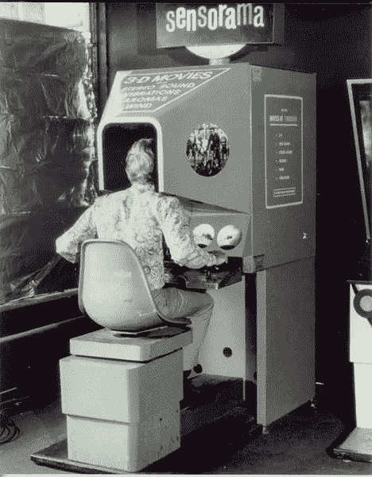

# VR 当时和现在(以及以后)

> 原文：<https://medium.datadriveninvestor.com/vr-then-and-now-and-later-788262440256?source=collection_archive---------37----------------------->

未来就是现在，VR 就在眼前，无处不在。我们生活在一个前几代科幻迷一直在等待的时代，它没有任何人希望的那么迷人。虚拟现实最容易实现的方式是，智能手机用户将手机放在由塑料或纸板(如谷歌纸板)制成的护目镜中，再放在更昂贵的设备上，如 Oculus、Vive 和索尼出售的设备。你可能已经知道了，但是你知道我们是怎么来到这里的吗，你知道我们实际上要去哪里吗？

# “你知道我们实际上要去哪里吗？”

虚拟现实的元素可以追溯到 19 世纪 60 年代，当时法国先锋派剧作家安托南·阿尔托认为幻觉和现实并非截然不同，并认为剧院观众应该放弃怀疑，将表演视为现实。第一台模拟设备是虚拟现实的先驱，直到 1920 年埃德温·林克开发出第一台飞行模拟器来训练新飞行员时才被发明出来。

第一个真正的电子虚拟现实设备是 Sensorama，由 Morton Heilig 在 20 世纪 50 年代中期发明。Sensorama 配备了立体声扬声器、立体 3d 显示器、风扇、气味发生器和振动椅。

第一台电子虚拟现实设备 Sensorama。

1960 年，莫顿·海利格发明了第一台 VR HMD(头戴显示器)。虽然头部跟踪在当时是不可能的——它将在第二年被发明出来——但它确实包括立体 3d 和带有立体声的宽视野。[20 世纪的剩余时间将会导致虚拟现实技术的更多创新和改进。](https://www.vrs.org.uk/virtual-reality/history.html)

# " 1960 年，莫顿·海利格发明了第一台虚拟现实 HMD(头戴显示器)."

所以我们今天在这里。你典型的虚拟现实装备能够进行全面的头部和手部跟踪，它们融合了无线连接和 Wi-Fi 等其他技术的创新。但是接下来要去哪里呢？毕竟，我们似乎正在使用虚拟现实进行视频游戏，但我们肯定可以做得更多。虚拟现实的下一步是空间和轨道基础设施。

# "虚拟现实的下一步是空间和轨道基础设施."

即使我们从未殖民过其他星球，近地空间也有很多用途。为了利用这一空间，我们需要扩大我们在低地球轨道(LEO)的基础设施。将人类送入太空既困难又昂贵，但这正是虚拟现实实现远程呈现的切入点。进入机器人 2 号。通过使用[可用的虚拟现实技术](https://robonaut.jsc.nasa.gov/r1/sub/telepresence.asp)，我们可以从地球表面实时远程控制这些机器人，确保没有血肉之躯的人类处于危险之中，同时也消除了对无关生命支持技术的需求。

*机器人(左图)将使我们能够在不离开地面的情况下建造太空*

VR 的另一个应用是训练。如前所述，虽然模拟器已经存在了几十年，但虚拟现实的持续改进和成本降低将使未来的工人更容易获得高度身临其境的培训体验，让他们为肮脏和危险的工作做好更充分的准备，这些工作给我们目前的工人带来了很大的压力。其中一些工作包括卫生工程师和急救人员。

# “虚拟现实培训将让我们的工人为肮脏和危险的工作做好准备。”

虚拟现实在我们的生活中有着超越娱乐的未来。VR 不会只是让我们去很远的地方参观，它会让我们在那里工作。这不仅仅让我们对其他环境和工作有所了解，它还会为我们提供培训。VR 已经在这里了，但这只是冰山一角。