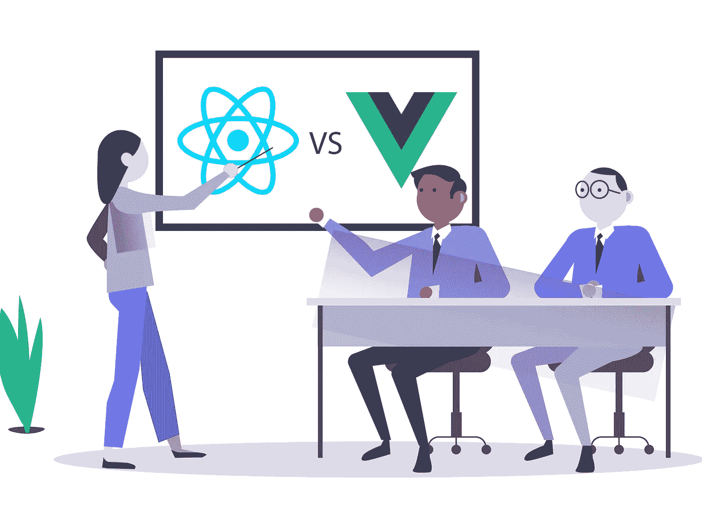
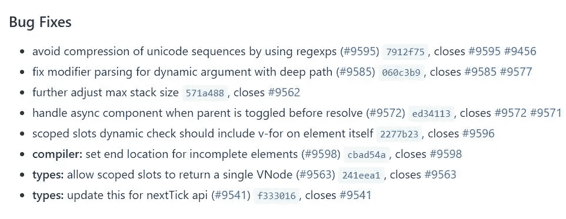

# vue vs React:2019 选什么

> 原文：<https://medium.datadriveninvestor.com/vue-vs-react-what-to-choose-in-2019-2e511857a8fb?source=collection_archive---------14----------------------->

几乎所有的公司都有相同的目标:尽可能快地创建最好的 web 解决方案。实际上，开发人员有许多 Java 库和框架可供使用，可以找到适合他们的。Vue.js 和 ReactJS 都是为前端开发快速获得动力的工具，但是它们都有各自的优缺点。让我们仔细看看它们，这样你就可以决定哪一个适合你。

 [## 2019 年最值得学习的编码语言——数据驱动的投资者

### 在我读大学的那几年，我跳过了很多次夜游去学习 Java，希望有一天它能帮助我在…

www.datadriveninvestor.com](https://www.datadriveninvestor.com/2019/02/21/best-coding-languages-to-learn-in-2019/) 

# Vue.js 与 React:概述

这两种工具在开发人员中很受欢迎，因为它们是开源的，可以用于创建复杂的用户界面。React 使用 DOM 与 HTML 文档进行交互，并且更多地使用声明式编程风格。基于组件的方法为您提供了创建复杂应用程序所需的灵活性。

Vue.js 是一个非常精简的框架，它建立在我们可以在 Angular 和 React 中找到的一些东西之上。它是一个非常进步的框架，也就是说，你可以一次迁移一个你正在开发的项目。Vue 可以从一个轻量级的库扩展到一个成熟的网络。此外，最近 Vue 的新版本 2.6.8 出来了，它消除了许多在以前版本中发现的错误，例如技术堆栈的可调最大值，不再压缩 Unicode 序列和许多其他错误。

资料来源:github.com/vuejs/vue/releases

# HTML 模板 vs JSX

这两个框架的区别之一是它们如何处理模板。Vue 使用单个文件组件，这是一种老式的方法，为 HTML 模板、样式和 JS 提供了单独的块。大多数前端开发人员习惯于看到这样的分离，并且在创建一个 [web 开发解决方案](https://skywell.software/web-development/)时可以快速学习。此外，它是非常可定制的:

*   使用 SCSS 进行范围界定
*   您可以在预处理器中编写代码
*   使用渲染功能或 JSX

决定是否使用 JSX 和模板是个人喜好的问题。JSX 可以为您提供更多的功能，而模板提供了关注点的分离，从而阻止您在视图中输入过多的逻辑。设计师和 HTML 开发人员可能不习惯 JSX，这可能是协作方面的一个问题。

# 状态管理

这个术语指的是跨 UI 组件传递信息的所有不同方式。随着系统的增长，it 管理如此大量的数据变得越来越困难。然而，状态管理是 React 应用程序的一大部分。有很多框架可以帮助你处理大规模的状态。它们提供了修改状态的单一方式，从而使调试更加容易。

使用 React 时，您需要依赖 Redux 等第三方解决方案进行状态管理，Vue 配备了自己的工具 Vuex。使用 Vuex，改变状态的唯一方法是通过处理函数，也称为突变。

# 更好的支持 Vue 还是反应？

这就是 React 明显胜出的地方。它拥有一个庞大的社区，这意味着开发者可以获得更多的课程和其他教育材料。然而，最重要的是它的图书馆是由脸书维护和支持的。React 社区的唯一缺点是它有些分散，这使得它很难找到常见问题的解决方案。

Vue 的社区明显变小了，但是在成长。它支持所有主要的 ide，但是在第三方库、开箱即用的工具和其他特性方面，它不能与 react 相提并论。

我们希望 Vue 和 React 之间的比较有助于决定哪一个更适合用于前端开发。最终，这都将归结为你的具体情况。几乎所有人都同意 React Native 是最好的跨平台解决方案。有大量的 React 开发人员可供选择，因为它有如此多的可用资源，您将能够找到任何问题的解决方案。

如果你想尝试一项最近闹得沸沸扬扬的新兴技术，你可以这样做，如果你喜欢，你可以将当前的项目迁移到 Vue。它有很好的文档，性能比 React 好。Vue 非常容易学习和设置，可以让你在几周内提供一个市场现成的解决方案。考虑到所有这些，真的没有什么不好的选择。

当然，React 和 Vue 之间还有许多其他的区别，但是我们希望我们在这里回顾的内容将为理解这些框架如何工作提供一个良好的基础。为新项目选择合适的平台时，通常会分析框架。我们希望这份材料能帮助我们做出选择。

*最初发表于*[*sky well . software*](https://skywell.software/blog/vue-vs-react-what-to-choose-in-2019/)*。*