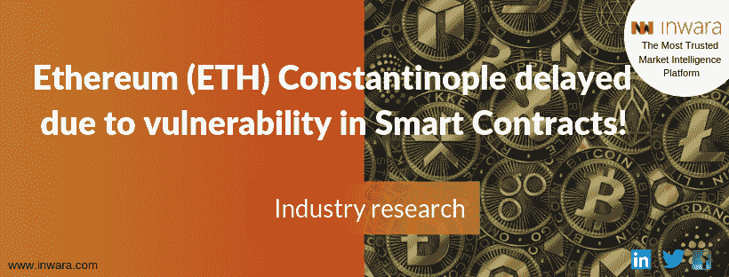
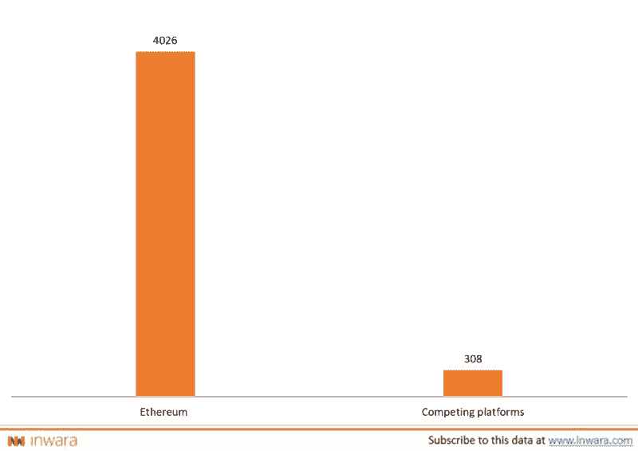

# 智能合约中以太坊(ETH)君士坦丁堡检测到漏洞！

> 原文：<https://medium.datadriveninvestor.com/vulnerability-detected-in-ethereums-eth-constantinople-in-smart-contracts-8138d8a4ef8b?source=collection_archive---------15----------------------->

## 新的全系统更新延迟

## 以太坊(ETH)君士坦丁堡 hardfork 延迟会影响交易者吗？

两周前，[以太坊的](https://www.ethereum.org/)社区被告知其新的全系统更新“君士坦丁堡”中的潜在漏洞。这些风险是由审计和安全监控公司[链家安全](https://chainsecurity.com/)发现的。该公司解释说，作为君士坦丁堡更新的结果，某些智能合同将容易受到重入攻击。完整的源代码以及攻击者合同可以在 ChainSecurity 的 [Github 账户](https://github.com/ChainSecurity/constantinople-reentrancy)上获得。

代码中的漏洞，通过模拟一个安全的金库共享服务，以一种意想不到的方式表现出来。攻击者将利用这一点，通过模拟共同接收资金的两个帐户，攻击者可以从其他用户的支付共享合同中抽取乙醚。

正如 ChainSecurity 在一篇博客文章中解释的那样,“双方可以共同接收资金，决定如何分割资金，如果他们同意，还可以获得一笔支出。攻击者将使用创建这样一个对，其中第一个地址是下面列出的攻击者合同，第二个地址是任何攻击者帐户。对于这一对，攻击者会存放一些钱”。

## 密码企业家和企业喜欢以太坊平台

以太坊是全球市值第三大的加密货币，是一个去中心化、开源的区块链网络，为开发者构建和推出去中心化软件提供了有利的环境。以太坊区块链不同于[比特币](https://bitcoin.org/)，因为它本质上专注于成为其他实体运行其去中心化软件的平台，而比特币的网络专注于区块链的一个单一应用，即点对点支付系统。

## 使用分散平台的区块链创业公司数量

[Source: InWara’s ICO+STO database](https://www.inwara.com/ethereum-eth-constantinople-delayed-yet-again-due-to-vulnerability-in-smart-contracts/?utm_source=ethddi&utm_medium=ethddi&utm_campaign=ethddi)

根据 [InWara 的 ICO+STO 数据库](https://www.inwara.com/?option=com_product&view=products&layout=productdetails&idn=3) **。**超过 4000 家区块链初创公司正在使用以太坊的平台，与使用其他竞争平台的 308 家初创公司相比，这是一个压倒性的数量。

## 以太坊的主要利益相关者决定推迟君士坦丁堡

以太坊的主要利益相关者决定，推迟新的全系统更新是目前最好的行动方案，而 ChainSecurity 和 [TrailOfBits](https://www.trailofbits.com/) 等安全研究人员则分析整个区块链。目前，研究人员还没有在网络上发现任何漏洞。

尽管一些合同受到影响的可能性很低。以 100%的置信度确定风险所需的时间长于君士坦丁堡更新可用的时间。以太坊因此决定出于“极度谨慎”而推迟更新。

# 以太坊的君士坦丁堡升级是什么？

## 你只需要知道以太坊的君士坦丁堡

君士坦丁堡是以太坊的全系统更新，包含了五个不同的以太坊改进方案(EIP)。新的更新预计是向后不兼容的，这意味着它不能使用同一程序的旧版本创建的数据。

一旦平台被更新，向后不兼容性固有地产生了完全重新开始的需要。这意味着节点——运行以太坊软件的计算机网络——可以与整个系统一起更新，也可以作为单独的区块链实体继续运行。

后者更通常被称为“硬分叉”，它们可以导致同一区块链的两个不同版本同时运行。有趣的是，以前的硬分叉已经催生了名为以太坊经典的竞争性加密的诞生。

*声明:内容来源于* [*InWara*](https://www.inwara.com/ethereum-eth-constantinople-delayed-yet-again-due-to-vulnerability-in-smart-contracts/?utm_source=ethddi&utm_medium=ethddi&utm_campaign=ethddi) *。这不是财务建议。InWara 不提升/降级任何公司/ICO。本信息或其他媒体中的观点、陈述、估计和预测仅属于作者个人。它们不一定反映 Inwara 或其任何附属公司(“Inwara”)的意见。Inwara 没有义务更新、修改或修正此消息或其他媒体，或以其他方式通知其接收者，如果此处陈述的任何事项或此处陈述的任何意见、预测、预测或估计发生变化或随后变得不准确。本邮件或其他媒体中提供的任何内容、信息和材料均按“原样”提供。Inwara 对其准确性、完整性或及时性，或收件人获得的结果不做任何明示或暗示的保证，并且不对任何收件人在此的任何不准确、错误或遗漏承担任何责任。在不限制上述规定的情况下，Inwara 对任何消息或媒体的接收方不承担任何责任，无论是在合同、侵权行为(包括疏忽)、担保、法规或其他方面，对于此类接收方因其或任何第三方决定的任何行动、意见、建议、预测、判决或任何其他结论或任何行动过程而遭受的任何损失或损害，无论是否基于此处包含的内容、信息或材料。有关更多详情，请访问* [*条款和条件。*](https://www.inwara.com/disclaimer)