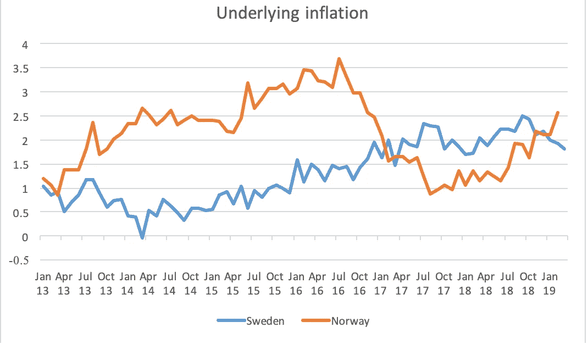
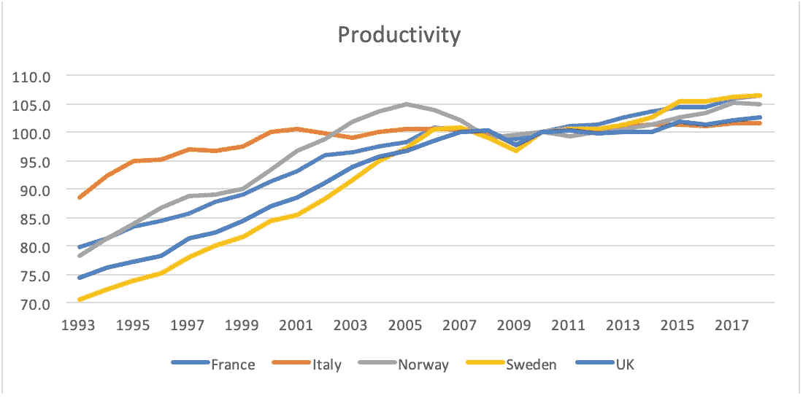

# 工资谈判和通货膨胀结果

> 原文：<https://medium.datadriveninvestor.com/wage-bargaining-and-inflation-outcomes-6a1a515b6cf4?source=collection_archive---------2----------------------->

*提要:2008 年金融危机后，各国一直在努力将通胀率控制在接近 2.0%的目标水平。挪威和瑞典偏离了这一趋势，因为中央工资谈判确保了更快的复苏和通胀向央行目标的趋同。因此，政府将需要提高生产率的政策，如工资补贴或激励中央工资谈判，以确保持续的家庭需求支持潜在的通胀压力。*

随着这个世界变得越来越相互关联，贸易在损害通胀的情况下增长，因为更大的竞争给价格带来了更大的下行压力。这一趋势因互联网而加剧，互联网使各国和各大洲的生产商能够争夺消费者的需求。

 [## 为什么包容性财富指数比 GDP 更能衡量社会进步？-数据驱动…

### 你不需要成为一个经济奇才或金融大师就能知道 GDP 的定义。即使你从未拿过 ECON 奖…

www.datadriveninvestor.com](https://www.datadriveninvestor.com/2019/03/08/why-inclusive-wealth-index-is-a-better-measure-of-societal-progress-than-gdp/) 

***劳动力市场上较弱的消费者议价能力并没有帮助***

由于劳动力市场消费者议价能力减弱，货币政策难以实现通胀目标，油价已成为大多数发达经济体通胀结果的重要驱动因素。21 世纪初，随着工会在英国等国家越来越少出现，企业利润和劳动收入之间的差距越来越大。

Source: Norges Bank and Riksbank

这种差异不能只归咎于英国，因为不稳定的工作和零工时合同给工资带来了新的下行压力。这对央行来说尤其具有挑战性，因为货币政策和资产购买难以将通胀率降至 2.0%。挪威和瑞典的情况并非如此，这两个国家的通胀率达到了央行设定的目标，并在欧洲央行之前开始了加息周期。

***紧缩对消费需求影响不大***

金融危机之后，失业率上升，生产率下降，经济活动收缩。然而，创纪录的低利率并没有刺激资本流入实体经济，而是流入风险更高的资产。因此，信贷宽松措施和财政刺激，或者在英国的情况下，“紧缩要么缓解了危机的影响，要么通过削弱消费者需求加剧了危机的影响。

***负利率和经济增长不太可能持续实现通胀目标***

如果负利率在某种程度上通过不同的资产所有权结构解释了不同年龄组之间收入和财富结果的差异；我们必须开始思考传播机制，它们如何以及是否起作用。创纪录的低利率旨在支持经济活动和 2.0%的通胀率。尽管这助长了资产价格的上涨，但向实体经济放贷充其量也只是微不足道。由于边际就业增长，大多数欧盟国家的通胀率仍远低于 1.5%，最近才达到 1.7%。财政刺激、信贷宽松和创纪录的低失业率将通胀率推高至 1.5%以上。

***美国可能是一个试金石！***

类似的传导机制减弱的趋势在美国也很普遍，美国创纪录的低失业率(1.6%)和低工资(1.6%)无助于将通胀率保持在央行设定的 2%的目标水平。在美国经济即将以潜在水平或接近潜在水平增长之际，令人惊讶的是，通货膨胀率仍然低得令人担忧。尽管大多数发达经济体在金融危机后努力将通货膨胀率控制在接近目标水平，但一些国家的通货膨胀率以更快的速度接近目标水平。

***北欧国家的工资谈判和通货膨胀***

金融危机后，瑞典和挪威的通胀大幅下降，但工资协议支撑了通胀结果，两国央行都上调了利率，而欧洲央行则暗示，如有必要，将出台更多刺激措施。诚然，瑞典有两轮工资谈判，首先是在工会和雇主之间，然后是个人协议。这些协议涵盖奖金计划，奖金计划长期以来一直是员工收入的一部分，以个人能力和发展驱动的评估为基础的计划。这导致了训练有素、薪酬丰厚的员工，这也解释了瑞典和挪威生产率和通胀的快速复苏，这两个国家比主要发达经济体更早接近 2.0%的目标。

Source: [OECD](https://data.oecd.org/lprdty/gdp-per-hour-worked.htm)

与此同时，挪威在工会和雇主之间以及雇员和组织之间进行了一轮两级谈判。谈判涉及零售、金融、私有化行业和市政府(伊里·梅特，2015)。与此同时，出口导向型行业的谈判同意在国际竞争的基础上提高工资。该行业更高的工资并不是为了降低出口行业的竞争力，而是为了支持家庭需求。除此之外，这两个国家都比他们的欧洲同行更有生产力，如图所示，挪威近年来落后于法国。

***劳动力市场的紧张在没有更强的工人议价能力的情况下是毫无意义的。***

依赖全球大宗商品价格作为通胀锚，不仅表明当前的货币政策机制几乎没有影响。由于需求受到低实际工资增长的抑制，孤立的紧缩劳动力市场不再能够支撑通胀。对于寻求保持经济活动与通胀之间联系的央行来说，这是一个两难的选择，由于传导机制不稳定，这种联系在很大程度上是不存在的。

***政府 vs 市场机制！***

政府通过纳税人出资的减税和基础设施支出来投资经济是没有用的；他们应该投资提高劳动力市场的技能，以确保生产率推动工资增长。这可以采取工资补贴和对新员工减税的形式，以确保各行业的知识转移，并激励对人力资本的长期投资。与此同时，QE 可以更有针对性地 [*(正如我在这里所说的*](https://medium.com/swlh/quantitative-easing-for-climate-change-43bb3bddd161) )，以激励贷款和资本流入经济中更具生产力的部门，而不是简单地通过公司债券增加金融系统的杠杆。

当前的财政政策错位了，其好处充其量也只是昙花一现，或者基本上不存在，因为缺乏核心工资谈判意味着员工发展基本上不存在，生产率也是如此。这将解释一些经济体失业率下降、就业和劳动力参与率创纪录、但通胀结果低于目标的趋势。

***中央银行与生产力。***

尽管央行的任务仅限于支持经济活动和 2.0%的通胀率，但货币政策应该激励生产率，而不是通过消除金融系统的债务来延长金融周期。后者将阻止经济以更快的速度复苏，并加剧结构性障碍的影响，如老龄化社会、生产率下降和金融化。比如，金融危机后，央行应该转而寻求购买最终将支持生产率、降低未来货币政策成本的部门的债务和资产。

由于政府在不久的将来不太可能出台以生产率和工资为中心的政策，中央工资谈判可能会支撑需求压力，从而支撑潜在的通胀压力。尽管大多数国家失业率较低，但后者在很大程度上并不存在，这应该会激励政府采取提高生产率的政策，或者允许市场与集体谈判抗衡。

**参考文献。**

1.  工人参与。欧盟；通向欧洲工人参与问题的大门。可用[此处](1)%09https:/www.worker-participation.eu/National-Industrial-Relations/Countries/Norway/Collective-Bargaining)
2.  挪威劳动和社会事务部副总干事 Eli Mette Jarbo。(2015 年 9 月)此处提供。