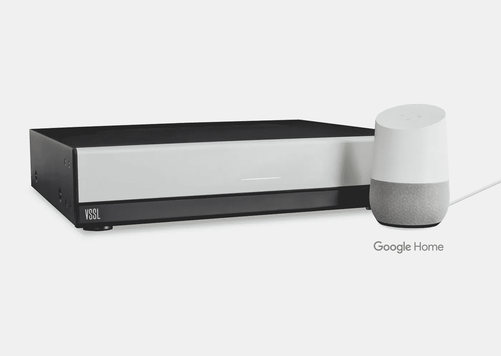
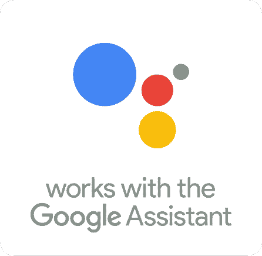
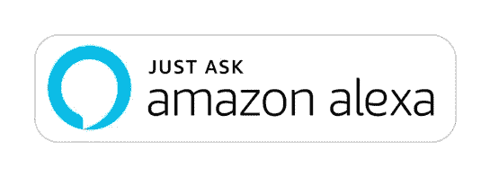

# 等等……谷歌是智能家居的新苹果吗？

> 原文：<https://medium.datadriveninvestor.com/wait-is-google-the-new-apple-of-smart-home-9e97e87725a7?source=collection_archive---------17----------------------->

一位业内人士探讨了谷歌和亚马逊如何处理他们的第三方设备生态系统，以及它如何影响他们的受欢迎程度。

I argue that Google is similar to Apple and Amazon is similar to Android when it comes to the smart home ecosystem.

我参与创建了一家名为 VSSL 的公司。我们为定制安装的扬声器建立了一个音频系统，虽然你不会想到，但我们几乎是一个移动配件(现在不是每个都是电子的吗？).

如今，音乐的主要来源是 Spotify、Pandora、Apple Music、Deezer 等应用程序。所有这些应用都在手机上运行，大多数用户在手机上听他们所有的音乐。一项研究表明，68%的智能手机用户每天使用他们的设备播放音乐([参考文献](https://www.digitalmusicnews.com/2016/03/11/parks-associates-68-of-u-s-smartphone-owners-listen-to-streaming-music-daily/))。太多了！

我们设计了我们的系统，以使从智能手机上听音乐的体验尽可能流畅，并成为谷歌 Chromecast 内置、苹果 Airplay、Spotify Connect 和亚马逊 Alexa(差不多了)的采纳者。这些来自大型科技公司的协议原生集成到智能手机和音乐应用程序中。

A shameless plug for my product, the [VSSL](http://vssl.com) A.6 which works with the Google Assistant.

深入了解这些大型科技公司的文化，以及它们如何对待合作伙伴，是一件有趣的事情。

# **与谷歌合作**

谷歌对智能家居的做法最令人惊讶的是它是多么封闭。他们对其技术合作伙伴和实施谷歌助手和 Chromecast 技术的公司的要求非常严格。我和朋友、同事把这称为苹果嫉妒。似乎谷歌一直想站在另一边，现在这是他们的机会。谷歌现在以用户体验的名义保持对他们的助手/家庭生态系统的严格控制。

谷歌对待你就像它是一种特权，与谷歌合作，并在他们的生态系统。作为一个小公司，很难引起他们的业务开发人员的注意，你也从来没有机会与真正的工程师接触。谷歌充当权威，不太接受反馈。它们在很大程度上决定了我们能做什么和不能做什么，一直到我们应用程序的细节。

我在谷歌工作的总体感觉是“慢慢来”、“把事情做好”和“一丝不苟”。我敢说，似乎有一种害怕出错的恐惧。与我们一起工作的人没有太大的权力，他们只是信使，“事情就是这样。”

即使在一年前的季度收益电话会议上，桑德尔·皮帅听起来也非常自信，不急，而且把 UX 搞对了。

> ”此外，他表示，要让语音搜索成为用户的绝佳体验，还有很多工作要做——谷歌在自然语言处理等领域的“多年进步”是一个优势。
> 
> “我对未来的发展感到非常放心。”
> 
> (引自 [Recode](https://www.recode.net/2017/1/26/14406318/google-voice-search-sundar-pichai-earnings-call) )

# **与亚马逊合作**

相比之下，亚马逊感觉像是一股新鲜空气，但他们也有自己的挑战。

最大的区别是亚马逊把你当成他们的顾客。他们非常积极，乐于助人。他们会指派工作人员专门与您的公司合作，甚至让您接触工程团队，以帮助您满足您的需求。他们非常渴望和你一起工作。

亚马逊对采用他们技术的不同方法也更加开放。它们给你足够的创新空间，让你成为自己产品和用户界面的权威。

有一种“动作快，创新”的压倒性感觉。他们也不怕失败，也不怕在前进的道路上有一些失误，因为他们有决心把事情做好。例如，亚马逊的外观一直乏善可陈，为什么我们需要一个内置 Alexa 的微波炉？亚马逊吃透了构建-测量-学习的循环。

与亚马逊合作的一个问题是他们自己的技术团队和第三方技术之间的冲突。Alexa 的所有核心功能都是由一个独立的团队秘密开发的。发布后，它被交给第三方团队进行改编，并提供给其生态系统中的设备合作伙伴。

这就是为什么像 Sonos 这样的大公司在亚马逊 Echo 音箱上提供对讲功能后，几乎整整一年都没有在他们的 Alexa 音箱上提供对讲功能。

# **这是什么意思？谁会赢？**

很难知道哪种方法是正确的。你不能责怪谷歌在试图让智能家居变得正确的过程中行动缓慢且一丝不苟。虽然亚马逊的速度在他们的失败快，学习快方法是值得一看的。

我认为亚马逊的 Alexa 在他们的大型生态系统中具有如此优势的原因之一是因为他们更容易在设备层面上工作。它们为您提供创新和快速行动的工具。谷歌在这方面需要努力。

整件事情的讽刺之处在于，这似乎是 iOS 与 Android 的又一次较量，但这一次谷歌站在了围栏的另一边，亚马逊感觉自己像是智能家居的新 Android。传统的开放生态系统在受欢迎程度上总是做得更好，Mac 与 PC 以及 iOS 与 Android。

毫无疑问，亚马逊将赢得这场流行游戏。真正的问题是，谷歌对市场的严密控制是否会像它对苹果那样带来更高的利润率和更多的盈利能力。

如果两年前我有一个水晶球，我会把我们的努力集中在亚马逊 Alexa 生态系统上。他们对我们的目标受众有更大的推动力，而且合作起来也更灵活。