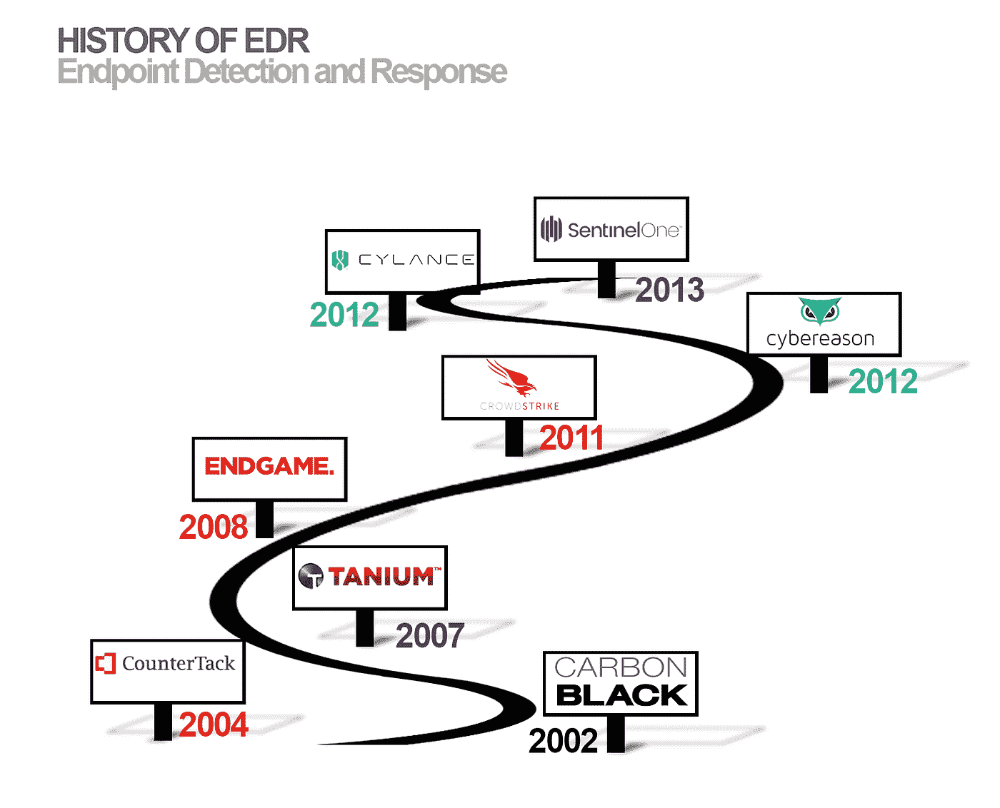

# 行走在帝王谷:EDR 的崛起和反病毒时代的终结

> 原文：<https://medium.datadriveninvestor.com/walking-among-the-valley-of-kings-edr-rising-and-the-end-of-the-antivirus-era-2a695da1840?source=collection_archive---------5----------------------->

1971 年，第一个已知的病毒开始感染由数字设备公司(DEC)制造的 PDP-10 大型计算机。为了删除被感染的文件，雷·汤姆林森开发了第一个已知的软件来追踪和删除被称为“死神”的病毒。随后在 1987 年，德国计算机安全专家 Bernd Robert Fix 提出了第一个记录在案的反病毒软件程序，用于清除旨在感染的维也纳病毒。DOS 操作系统中的. com 文件。后来，德国公司 [G Data Software AG](https://www.gdata-software.com/) 发布了第一个已知的用于 Atari ST 计算机的反病毒软件，随后不久 [McAfee，Inc .现在由英特尔](https://www.mcafee.com/en-us/index.html)所有，它在 1987 年成立后发布了第一个名为 Viruscan 的反病毒扫描程序。

在接下来的 15 年里，直到 2003 年，当我和世界各地的其他网络安全工程师不知疲倦地修复 SQL Slammer 蠕虫感染时，反病毒行业将迅速成熟。尽管在我们的终端上安装了防病毒软件，这些主机仍然会被感染，这强调了我一直认为这种传统的防病毒方法最终会过时的观点。这次蠕虫爆发需要我和几个同事留在附近的一家酒店，不分昼夜地清除主机上的感染，尽管安装了 Symantec Endpoint Protection，但这些主机仍会受到感染。赛门铁克技术支持团队的回应？去下载他们的个人清洁工具，赛门铁克橡皮擦。下载更新的 DAT 文件的持续努力仍然无法捕获每个变种，因此他们的解决方案是引导客户使用橡皮擦工具来清除受感染的主机。

 [## 网络安全非营利组织帮助中小企业打击网络犯罪-数据驱动的投资者

### 一个名为全球网络联盟(GCA)的非营利组织发誓要改善…

www.datadriveninvestor.com](https://www.datadriveninvestor.com/2019/02/22/cybersecurity-non-profit-to-help-smes-fight-against-cybercrime/) 

这只是我历史上许多事件响应事件中的一个，还有我执行的渗透测试，在这些测试中，我能够使用 [Metasploit Framework](https://www.metasploit.com/) 中的模块关闭特定的防病毒软件，将后门上传到用 veil-framework 构建的受损主机，而不被反病毒软件发现，等等。但是我的故事只是存在于反病毒软件失败的历史编年史中的数千个故事中的几个，可以追溯到 1994 年，当时我第一次开始学习如何在 EFNET 中的 IRC 频道上从黑客那里入侵(回到 IRC 是“东西”的时候)，使用我的 Procomm Plus 拨号器和 2400 波特调制解调器使用拨号帐户到同心互联网服务(CRIS)。

让我们快进到 2002 年，进入 EDR 的初创公司领域——那些试图颠覆传统的初创公司。足够巧合的是，就在 6 年后的 2008 年，当 Endgame 首次亮相时，一场名为“ [Race to Zero](https://www.zdnet.com/article/signature-based-antivirus-is-dead-get-over-it/) ”的年度 Defcon 安全会议上的黑客竞赛向世界证明，传统的反病毒软件现在确实已经死亡，参与者调整已知的病毒，试图挫败几个主要反病毒引擎的基于签名的黑名单，尽管一些反病毒软件供应商对举办这样的竞赛的想法感到遗憾。比赛的组织者简单地回应了反病毒行业，“我们只是指出了基于签名的反病毒软件的基本缺陷。”

从 2002 年开始对传统的反病毒公司施加向下的市场压力的竞争者将包括 2002 年成立的炭黑公司；Countertack，2004 年；塔尼乌姆，2007；残局，2008；Crowdstrike，2011；Cybereason，2012；Cylance，2012；和 SentinelOne 仅举几个例子。

那么是什么使 EDR 不同于传统的防病毒/EPP 解决方案呢？

*   **他们不使用签名或模式:** EDR 通常会使用机器学习(ML)模型来检测武器化文件和无文件恶意软件在执行前、执行中和执行后阶段对系统的威胁。在众多解决方案中执行这种分析的方法包括静态人工智能和行为人工智能，而不是在文件中寻找已知的模式，这使得逃避 EDR 解决方案更加困难。
*   背景历史 : EDR 能够将恶意软件感染中的一长串面包屑拼凑起来，在类似于虚拟故事书的整个活动线程中追溯到其起源过程，例如 [SentinelOne](http://www.sentinelone.com/) 提供的功能(研究报告待定)。这种方法支持了现在广泛持有的信念，即没有上下文的数据是无用的。
*   **扩展响应措施:**传统防病毒软件通常会删除文件或将其隔离，直到分析师对其进行进一步调查。另一方面，EDR 能够在不需要人工干预的情况下执行自主响应，甚至能够从网络中隔离主机、自动免疫端点，并且作为最终的安全措施，甚至可以将端点回滚到感染前的状态。
*   **进程的相互关系跟踪:** EDR 还能够跟踪所有进程及其相互关系，而不管它们活动了多长时间以及是什么导致了它们。EDR 能够检测文件、脚本、武器化文档、横向移动甚至无文件恶意软件中的恶意软件。
*   [**米特 ATT&CK**](https://attack.mitre.org/)**:**EDR 通常涵盖了米特 ATT & CK 模式的更广泛的范围，包括持久性、特权升级、防御规避、凭证访问、发现、横向移动、执行以及命令和控制。
*   **威胁追踪:** EDR 为分析师提供威胁追踪功能，利用机器学习和用户实体行为分析(UEBA)来通知分析师潜在风险。分析师可以利用 EDR 调查潜在风险，跟踪网络中的可疑行为。搜索团队使用 EDR 形成的假设可以将搜索工作集中在已知的漏洞、潜在的不良参与者或资产以及有价值的数据上。

这只是部分清单，但你明白我的意思。虽然并非所有 EDR 人都生而平等，但值得注意的是，随着沙丘路向这个市场注入更多风险资本，EDR 确实会留在这里。到 2025 年，全球 EDR 市场的市场估值为 59 亿美元，2018 年至 2025 年的 CAGR 增长率为 28.8%。

当然，也不乏证据表明，传统的防病毒解决方案确实正在过时，因为我与不同公司规模和不同市场的 CISOs 的讨论证明，预算正从传统的反病毒软件重新分配到 EDR，这是一个新的闪亮玩具，预示着恶意软件和勒索软件检测和响应的更光明的未来。简而言之，CISOs 很快厌倦了遗漏的勒索软件和恶意软件，他们认为 EDR 可以更有效地阻止它们，并要求他们的解决方案具有更自主的响应能力，不依赖于人类分析师，由于全球网络安全人才短缺，他们似乎无法雇用或保留[。](https://www.csoonline.com/article/3331983/the-cybersecurity-skills-shortage-is-getting-worse.html)

虽然许多传统的反病毒解决方案已经开始增加 EDR 功能，并声称它们覆盖了 ATT 和 CK 矩阵，但根据我采访的 CISOs 的说法，老牌公司仍然面临着越来越大的品牌问题。尽管这些公司拥有 ML 和自主响应能力，但市场认知仍然严重倾向于将它们视为传统的反病毒产品。这些公司将需要在新技术的市场教育方面投入大量资金，这些新技术不再包括仅使用签名的传统检测和响应方法。

虽然 EDR 的直系后代已经开始将他们的旗舰产品扩展到 EDR 和 CASB，试图应对市场需求，并将市场份额输给新生阶层，但 CISOs 将预算重新分配给 EDR 公司的购买模式证明，保守派必须*创新*和*教育*以保持相关性，否则将遭受作为短命国王被载入史册的后果。

我在艾特集团的下一份市场报告将涵盖整个 EDR 的情况，并对 EDR 的各个供应商以及解决方案之间的特性差异进行描述。如果你是 EDR 的供应商，并希望确保你在我即将发布的市场报告中得到介绍，请让你的分析师关系团队与我联系。

#骑士作家

**喜欢和 Reshare！**

像往常一样，如果你喜欢这篇文章，请点击“喜欢”来支持我，并与你自己的 feed 分享！这是你支持我和我继续研究的最好方式。如果任何人对这篇文章有任何补充或评论，请在评论区与下面的每个人分享！在我的主页[www.alissaknight.com](http://www.alissaknight.com/)、 [LinkedIn](http://www.linkedn.com/in/alissaknight) 上了解更多关于我的信息，在我的 [YouTube 频道](http://www.youtube.com/c/alissaknight)上观看我的视频博客，收听我每周的[播客片段](http://alissaknight.libysyn.com/)，或者在 Twitter 上关注我 [@alissaknight。](http://www.twitter.com/@alissaknight)

**关于我**

我是 [Aite Group](http://www.aitegroup.com/) 的高级分析师，通过评估行业趋势、创建细分分类、确定市场规模、准备预测和开发行业模型，对影响金融服务、医疗保健和金融科技行业的网络安全问题进行重点研究。我通过公正、客观和准确的研究和内容开发，为这些行业提供网络安全市场的联合和定制市场研究、竞争情报和咨询服务。根据我对当今影响这些行业的当代网络安全问题的研究，我撰写研究报告和白皮书，并提供咨询服务，包括询问、简报、咨询项目、研究结果演示以及预约演讲，我经常在每年的网络安全会议、研讨会和圆桌会议上发表主题演讲。