# 沃尔玛销售数据分析&用 R 语言多元线性回归进行销售预测

> 原文：<https://medium.datadriveninvestor.com/walmart-sales-data-analysis-sales-prediction-using-multiple-linear-regression-in-r-programming-adb14afd56fb?source=collection_archive---------0----------------------->


# **【1】简介**

> 预测公司未来的销售是战略规划最重要的方面之一。我想分析美国最大的公司之一的内部和外部因素如何影响他们未来的周销售额。该模块包含完整的数据分析，包括时间序列分析，识别表现最佳的商店，在多元线性回归的帮助下进行销售预测。
> 
> 收集的数据范围从 2010 年到 2012 年，全国各地的 45 家沃尔玛商店被纳入这项分析。值得注意的是，我们也有外部数据可用，如每个商场所在区域的 CPI、失业率和燃油价格，希望这些数据能帮助我们进行更详细的分析。

# **【2】数据集解释**

我可以访问来自 Kaggle.com 的关于公司的三个不同的数据集。这些数据集包含商店、部门、温度、失业等信息。我将更详细地解释每一个数据集及其每一个特性。
***【2.1】店铺:* -店铺**:店铺编号。范围从 1 到 45。
**-类型**:三种类型的商店‘A’、‘B’或‘C’。
- **大小**:设定一个店铺的大小，根据该店铺的商品数量计算，从 34000 到 210000。

***【2.2】销售:***
- **日期**:进行观察的那一周的日期。

- **Weekly_Sales** :当周记录的销售额。
- **店铺:**记录 1–45 的观察的店铺。
- **部门**:显示部门的 1-99 之一。
- **IsHoliday** :布尔值，表示是否放假一周。

***【2.3】特性:***

*   **温度**:该地区当周的温度。
    - **燃料价格**:当周该地区的燃料价格。
    - **降价 1:5** :表示降价的类型以及当周的可用数量。
    - **CPI:** 当周居民消费价格指数。
    - **失业率**:该店所在区域当周的失业率。


Markdowns

# **【3】合并数据**

我已经将三个文件合并成一个文件进行处理。我根据商店属性合并了 stores.csv 和 sales.csv 文件，其结果文件根据商店、日期和假日属性与 features.csv 文件合并。

> **>店铺<-read . CSV(" ~/stores . CSV ")**
> 
> **>查看(门店)**
> 
> **>门店 _ df<-门店**
> 
> **><-read . CSV(" ~/sales . CSV ")**
> 
> **>销售 _df < -销售**
> 
> **>test1<-read . CSV(" ~/features . CSV "，header = TRUE，check.names = TRUE)**
> 
> **>特性 _df < -测试 1**
> 
> **>pre _ final _ df<-merge(stores _ df，sales_df，by=c("Store"))**
> 
> **>头(预 _ 终 _df)**
> 
> **>final _ df<-merge(pre _ final _ df，features_df，by=c("Store "，" Date "，" IsHoliday"))**
> 
> **头>(最终 _df)**

# **【4】数据清理和预处理**

数据预处理是一种数据挖掘技术，涉及将原始数据转换成可理解的格式。真实世界的数据通常不完整、不一致和/或缺少某些行为或趋势，并且可能包含许多错误。数据预处理是解决这类问题的一种行之有效的方法。数据预处理为进一步处理准备原始数据。

[](https://www.datadriveninvestor.com/2020/02/26/surviving-in-a-digital-age-of-instability/) [## 在不稳定的数字时代生存|数据驱动的投资者

### 如果你是一名计算机科学家，你可能已经注意到新的框架不断出现。编程…

www.datadriveninvestor.com](https://www.datadriveninvestor.com/2020/02/26/surviving-in-a-digital-age-of-instability/) 

数据预处理用于数据库驱动的应用程序，如客户关系管理和基于规则的应用程序(如神经网络)。为了在分析数据时获得一致性，我们转换了所有的布尔值(TRUE=1，FALSE=0)。大多数情况下，运算符和函数会自动将值转换为正确的类型。那叫“类型转换”。

例如，alert 自动将任何值转换为字符串来显示它。数学运算将值转换成数字。

还有一些情况下，我们需要显式地转换一个值来纠正错误。我们已经将所有 NA 值替换为 0。

**#处理布尔值**

> **>final _ df $ is holiday[final _ df $ is holiday = = " true "]<-1**
> 
> **>final _ df $ is holiday[final _ df $ is holiday = = " false "]<-0**
> 
> **>头(final_df)**

**#处理“NA”值**

> **>final _ df[is . na(final _ df)]<-0**

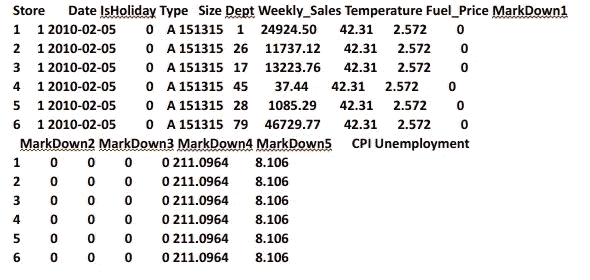

Dataset acquired after Data Preprocessing

# **【5】子集构造**

在这个过程中，我从合并数据创建的原始数据框中提取了对我们的特定分析有用的列。

> **>subset 1<-subset(final _ df $ Date，final_df$Weekly_Sales < 0):逻辑**
> 
> **>subset 2<-subset(final _ df，select= c("Size "，" Weekly_Sales "，" Temperature "，" Fuel_Price "，**
> 
> **“下调 1”、“下调 2”、“下调 3”、“下调 4”、“下调 5”、“CPI”、“失业”)):不符合逻辑**

# **【6】【销售】&【假日】列**之间的关联

**相关性**是一种双变量分析，用于测量两个变量之间的关联强度和关系方向。就关系的强度而言，相关系数的值在+1 和-1 之间变化。值为 1 表示两个变量之间的完美关联程度。随着相关系数值趋向于 0，两个变量之间的关系将变弱。关系的方向由系数的符号表示；加号表示正相关，减号表示负相关。通常，在统计学中，我们测量四种类型的相关性:皮尔逊相关性、肯德尔等级相关性和斯皮尔曼相关性。下面的软件可以让你很容易地进行关联。

***皮尔逊 r 相关:*** 皮尔逊 *r* 相关是最广泛使用的相关统计量，用来衡量线性相关变量之间的关系程度。下面的公式用于计算 Pearson *r* 相关性:
***Kendall 秩相关* :** Kendall 秩相关是一种非参数检验，衡量两个变量之间的依赖强度。如果我们考虑两个样本 a 和 b，其中每个样本的大小是 *n* ，我们知道与 a b 配对的总数是*n*(*n*-1)/2*。*

***斯皮尔曼等级相关* :** 斯皮尔曼等级相关是一种非参数检验，用于衡量两个变量之间的关联程度。Spearman 秩相关检验不包含任何关于数据分布的假设，并且当变量在至少有序的尺度上测量时，是适当的相关分析。

**#销售与节假日的关联**

> **>cor(final _ df $ Weekly _ Sales，final_df$IsHoliday，use="everything "，method="pearson")**

我还注意到一些周销售额包含**“负值”，在分析数据**后，我们得出结论，这些是指**前几周退回的产品**。

> **>subset 1<-subset(final _ df $ Date，final _ df $ Weekly _ Sales<0)**

*#约 1000 件商品被退回*

为了更好的预测，我们在所有降价中增加了**周平均降价**

> **>mean _ markdown 1<-mean(final _ df＄markdown 1)**
> 
> **>mean _ markdown 2<-mean(final _ df $ markdown 2)**
> 
> **>mean _ markdown 3<-mean(final _ df $ markdown 3)**
> 
> **>mean _ markdown 4<-mean(final _ df＄markdown 4)**
> 
> **>mean _ markdown 5<-mean(final _ df $ markdown 5)**
> 
> **>final _ markdown<-mean _ markdown 1+mean _ markdown 2+mean _ markdown 3+mean _ markdown 4+mean _ markdown 5**
> 
> **>平均 _ 最终 _ 降价**

**#平均最终降价:** [1] 1336.808

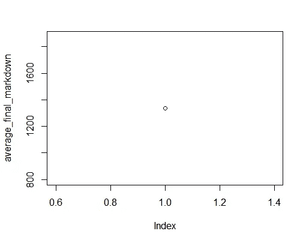

Average Final Markdown vs Index

# **【7】数据的宁滨**

将数据框中的所有数值数据离散化为长度或内容相等的分类箱，或者基于自动确定的聚类。在统计学中，数据宁滨是一种将多个连续值分类到较小数量的桶(箱)中的方法。每个桶定义一个数值区间。例如，如果有一个关于以家庭为基础的教育水平的变量，该变量通过范围在 0 到 19 之间的连续值来测量，如果该值落在该时段所覆盖的区间内，则数据宁滨会将每个值放入一个时段中。这篇文章展示了 R 中的数据宁滨以及可视化的箱柜。

**#数据的宁滨**

> **>库(classInt)**
> 
> **>bin _ data<-final _ df $ Weekly _ Sales**

**等宽**

> **>class intervals(bin _ data，5，style="equal")**

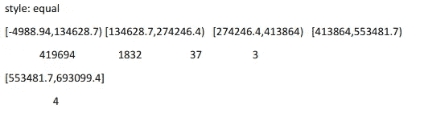

Equal Width Binning

**等频**

> **>class intervals(bin _ data，5，style="quantile")**

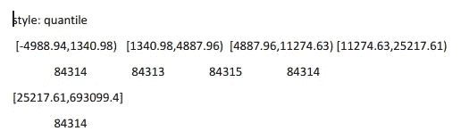

Equal Frequency Binning

# **【8】时间序列分析**

在固定时间间隔内测量的任何指标都构成一个时间序列。由于工业需要和相关性，特别是时间序列的预测，时间序列的分析在商业上很重要。

如果一个时间序列满足下列条件，则称它是平稳的。

1.  时间序列的平均值在一段时间内是恒定的，这意味着趋势分量是无效的。
2.  方差不会随着时间而增加。
3.  季节性影响很小。

这意味着它缺乏趋势或季节模式，这使得它看起来像一个随机的*白噪声*，而与观察到的时间间隔无关。

**#时间序列**

> **>fore _ data<-ts(final _ df $ Weekly _ Sales，start=2010，end=2012，frequency=12)**
> 
> **>剧情(fore_data)**

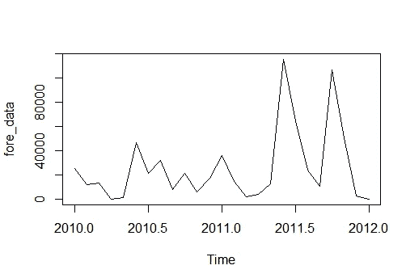

Time Series Analysis Graph

# **【9】霍尔特·温特斯**

Holt-winter 用于指数平滑，通过使用具有上升或下降趋势和季节性的“加法”或“乘法”模型进行短期预测。在霍尔特的模型中，平滑是通过β和γ参数来测量的。如果 beta 参数设置为 FALSE，该函数将执行指数平滑。gamma 参数用于季节性成分。如果 gamma 参数设置为 FALSE，则拟合季节性模型

当 gamma 值和 beta 值设置在 0 和 1 之间时，接近 0 的值指定在构建未来值的预测时将权重放在最近的观察值上。

**#霍尔特温特斯**

> **>【预测库】**
> 
> **>fore _ data<-ts(final _ df $ Weekly _ Sales，start=2010，end=2012，frequency=12)**
> 
> **>绘图(fore_data)**
> 
> **>HW<——霍尔特温特斯(fore_data)**
> 
> **>剧情(硬件)**

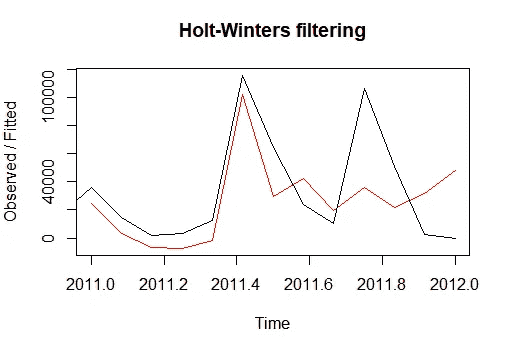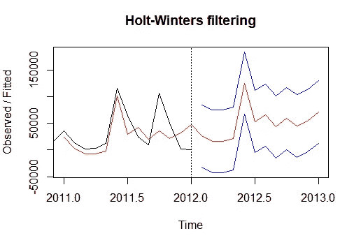

# **[10]使用 GGPLOT 进行可视化**

**Ggplot2** 是一个绘图包，使从数据框中的数据创建复杂的绘图变得简单。它提供了一个更加程序化的界面，用于指定要绘制的变量、变量的显示方式以及一般的可视化属性。因此，如果基础数据发生变化，或者如果我们决定从条形图更改为散点图，我们只需要进行最小的更改。这有助于以最少的调整和微调创建出版物质量的图。

> **>库(ggplot2)**
> 
> **>库(重塑)**

# **【11】使用 DPLYR 分组提取最佳表现商店**

Dplyr 是由 Hadley Wickham 和 Romain Francois 开发的数据处理软件包。它是为了快速、高度表达和开放地存储数据而构建的。它作为 tidyverse 元包的一部分安装，作为核心包，它是通过 library (tidyverse)加载的包之一。

dplyr 源于一个早期的包 plyr，它实现了数据分析(PDF)的“拆分-应用-组合”策略。plyr 涵盖了一系列不同的输入和输出(例如，数组、数据帧、列表)，而 dplyr 则像激光一样专注于数据帧，或者用 tidyverse 的话来说就是“tibbles”。dplyr 是来自 plyr 的 ddply()函数的包级处理，因为“数据帧输入，数据帧输出”被证明是非常重要的。

> **>库(dplyr)**
> 
> **>aggregate(final _ df $ Weekly _ Sales，by=list(Type=final_df$Type)，FUN=sum)**

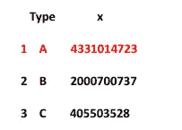

Best Performing Store marked in “Red”

# **【12】相关矩阵**

术语“相关性”是指数量之间的相互关系或关联。几乎在任何业务中，用一个量与其他量的关系来表示它是有用的。

**相关性度量的重要性**

*   相关性有助于从一个量预测另一个量
*   相关性可以(但通常不，正如我们将在下面的一些例子中看到的)表明因果关系的存在
*   相关性被用作许多其他建模技术的基本量和基础

> **>subset 2<-subset(final _ df，select= c("Size "，" Weekly_Sales "，" Temperature "，" Fuel_Price "，**
> 
> **“下调 1”、“下调 2”、“下调 3”、“下调 4”、“下调 5”、“CPI”、“失业”))**
> 
> **>RES<-cor(sub T2)**
> 
> **>头(res)**

# *【13】关联图*

**corrplot** 包是相关矩阵、置信区间的图形显示。它还包含一些算法来做矩阵重新排序。此外，corrplot 擅长细节，包括选择颜色、文本标签、颜色标签、布局等。相关矩阵可以根据相关系数重新排序。这对于识别矩阵中隐藏的结构和模式非常重要。

> **>库(corrplot)**
> 
> **> corrplot(res，type = "upper "，order = "hclust "，tl.col = "black "，tl.srt = 45)**


# **【14】热图**

**热图**是数据的图形表示，矩阵中包含的单个值用颜色表示。“热图”一词最初是由软件设计师科马克·金内在 1991 年创造并注册的，用来描述描绘金融市场信息的 2D 显示，尽管类似的绘图如阴影矩阵已经存在了一个多世纪。

> **>col<-colorRampPalette(c("蓝"、"白"、"红"))(20)**
> 
> **>热图(x = res，col = col，symm = TRUE )**

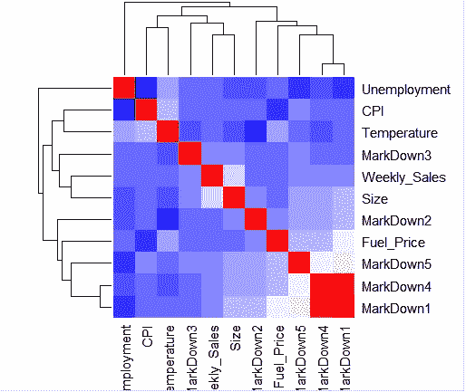

Heatmap between all factors

# **【15】性能分析**

用于性能和风险分析的计量经济函数集。该软件包旨在帮助从业人员和研究人员利用最新研究成果分析非正常回流。一般来说，它在常规规模的回报(而不是价格)数据上测试最多，但大多数函数也可以处理不规则的回报数据，越来越多的函数将在可能的情况下处理 P&L 或价格数据。

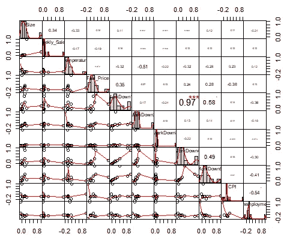

Performance Analysis

# **【16】销售预测使用:多元线性回归**

多元线性回归是线性回归分析最常见的形式。作为预测分析，多元线性回归用于解释一个连续因变量和两个或多个自变量之间的关系。独立变量可以是连续的，也可以是分类的(适当的虚拟编码)。

多元线性回归分析有 3 个主要用途。

首先，它可以用来确定自变量对因变量的影响强度。

第二，它可以用来预测变化的效果或影响。也就是说，多元线性回归分析有助于我们了解当我们改变自变量时，因变量会改变多少

第三，多元线性回归分析预测趋势和未来值。多元线性回归分析可用于获得点估计。

> **>输入< -final_df[，c("Weekly_Sales "，" Temperature "，" Fuel_Price "，" MarkDown1 "，" MarkDown2 "，" MarkDown3 "，" MarkDown4 "，" MarkDown5 "，" CPI "，"失业")]**
> 
> **>(输入头)**
> 
> **>模型< - lm(每周 _ 销售~温度+燃料 _ 价格+降价 1+降价 2+降价 3+降价 4+降价 5+CPI+失业，数据=输入)**
> 
> **>打印(型号)**

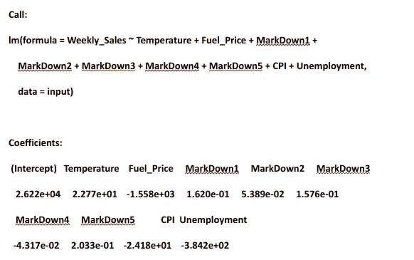

Walmart Multiple Linear Regression Model

> **>猫(" # # # # #系数值# # "，" \n")**
> 
> **> a < - coef(型号)【1】**
> 
> **>打印(一)**

**(截距)**

**26216.43**

— — -

> **>x 温度< -系数(型号)【2】**
> 
> **>XFuel _ Price<-coef(车型)【3】**
> 
> **>xmarkdown 1<-coef(型号)【4】**
> 
> **>xmarkdown 2<-coef(型号)【5】**
> 
> **>xmarkdown 3<-coef(型号)【6】**
> 
> **>xmarkdown 4<-coef(型号)【7】**
> 
> **>xmarkdown 5<-coef(型号)【8】**
> 
> **> XCPI < - coef(型号)【9】**
> 
> **>Xun employment<-coef(model)[10]**

— — — — -

> **>【打印温度】**

**温度**

**22.77048**

> **>打印(XFuel_Price)**

**燃料 _ 价格**

**-1558.433**

> **>打印(XMarkDown1)**

**降价 1**

**0.1619938**

> **>打印(XMarkDown2)**

**降价 2**

**0.05388858**

> **>打印(XMarkDown3)**

**降价 3**

**0.157646**

> **>打印(XMarkDown4)**

**降价 4**

**-0.04317213**

> **>打印(XMarkDown5)**

**降价 5**

**0.2032759**

> **>打印(XCPI)**

**CPI**

**-24.17757**

> **>打印(XUnemployment)**

**失业**

**-384.1941**

**#多元线性回归方程形成**

> **y = a+x temperature * x1+x fuel _ Price * x2+xmarkdown 1 * x3+xmarkdown 2 * x4+xmarkdown 3 * X5+xmarkdown 4 * X6+xmarkdown 5 * x7+XCPI * x8+Xun employment * x9**

我们可以通过在 x1 …中输入值来预测每周的销售额。x9 并获得周销售额的值:

例如:

> **y = a+x temperature * x1+x fuel _ Price * x2+xmarkdown 1 * x3+xmarkdown 2 * x4+xmarkdown 3 * X5+xmarkdown 4 * X6+xmarkdown 5 * x7+XCPI * x8+Xun employment * x9**

**取任意值预测:**

x1= 41.17

x2 = 2.562

x3 = 16305.11

x4 = 3551.41

x5=16.16

x6 = 3611.60

x7 = 1240.2

x8 = 220.806

x9 = 7.931

**#代入公式中的值**

> **>y = a+x temperature * 41.17+x fuel _ Price * 2.562+xmarkdown 1 * 16305.11+xmarkdown 2 * 3551.41+xmarkdown 3 * 16.16+xmarkdown 4 * 3611.60+xmarkdown 5 * 1240.2+XCPI * 220.806+Xun employment * 7.931**

**#这种情况下的周销售量为**

> **>打印(y)**

(截取)

**17707.02**

```
Thank You !
My LinkedIn : [Visit Me on LinkedIn](https://www.linkedin.com/in/arneesh-aima-49b516116/)
```

**访问专家视图—** [**订阅 DDI 英特尔**](https://datadriveninvestor.com/ddi-intel)