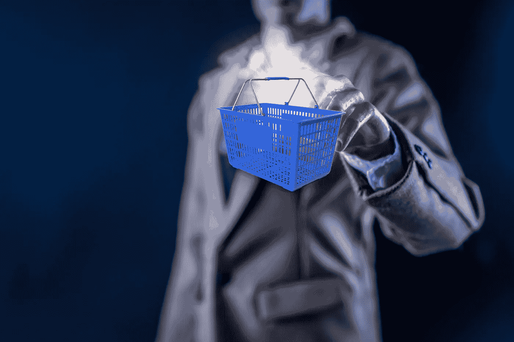

# 结合砖块、点击和声音的零售巨头沃尔玛

> 原文：<https://medium.datadriveninvestor.com/walmart-the-retail-giant-combining-bricks-clicks-voice-56c3744ded45?source=collection_archive---------9----------------------->

零售巨头沃尔玛不在 FANGs 或 GAFAs 之列，而是 THWAC 的一部分——塔吉特、家得宝、沃尔玛、亚马逊和好市多。沃尔玛也是美国的头号雇主，领先于亚马逊，这是一家电子商务巨头，还涉足云、送货、娱乐、支付、智能家居设备和实体店等其他业务。

零售巨头沃尔玛是 THWAC 部落的土生土长的人，实际上可以毕恭毕敬地站在 Bigtech 亚马逊和其他大型非金融公司旁边，这些公司正在使用金融科技技术发展生态系统和进行数字化转型。

 [## 分散金融的出现|数据驱动的投资者

### 当前的全球金融体系为拥有资源、知识和财富的人创造了巨大的财富

www.datadriveninvestor.com](https://www.datadriveninvestor.com/2019/03/14/the-emergence-of-decentralized-finance/) 

2018 年，沃尔玛的收入超过了 5000 亿美元，而亚马逊的收入还不到一半。然而，亚马逊在过去十年中实现了两位数的收入增长，增幅在 30%左右，而沃尔玛一直保持着一位数的收入增长(不超过 5%)。*【1】*

## **沃尔玛的智慧转型**

***沃尔玛为员工服务***

沃尔玛在 2016-2017 年投资 27 亿美元对员工进行再培训。

2017 年底，它向当时的 140 万名员工和员工(兼职人员)提供了一款免费的财务健康应用程序。 [Even](https://even.com/) 是一家总部位于奥克兰的金融科技公司，提供易于使用的预算解决方案(具有储蓄、投资和借贷功能)。截至 2018 年底，沃尔玛拥有 230 万名员工(包括员工)。最近的[报告显示](https://even.com/walmart)超过 30 万沃尔玛员工使用 Even 应用程序。

*甚至*还推出了 [Instapay](https://even.com/faq) 功能，允许员工根据你已经工作的时间，有资格预支高达 50%的薪水。沃尔玛对这些功能的使用进行补贴，每年免费使用几次。

**沃尔玛提供免费的财务健康工具，保护员工免受发薪日高利贷的侵害。**

***沃尔玛在支付方面不断创新——这是任何经济的核心***

请记住，沃尔玛的客户大多是低收入人群。低成本支付选择对他们日常生活的影响，比亚马逊的典型客户更大，后者处于中等富裕范围及以上。

沃尔玛于 2015 年开始与银行合作，提供各种更低成本和便利的支付选择。WalmartPay 于 2015 年推出，允许购物者在柜台用二维码支付。

沃尔玛一直在无畏地增加更多的支付选择。

据报道，[沃尔玛预付卡](https://www.walmartmoneycard.com/)在过去两年里为沃尔玛顾客节省了 20 亿美元(详情[在此](https://corporate.walmart.com/newsroom/2019/04/04/two-years-later-walmarts-prize-savings-helps-customers-save-2-billion))。这张预付卡是与[绿点](https://www.greendot.com/)和[共富](https://buildcommonwealth.org/)合作推出的。

绿点是全球市值最大的预付卡公司([纽约证券交易所](https://en.wikipedia.org/wiki/New_York_Stock_Exchange) : [GDOT](https://www.nyse.com/quote/XNYS:GDOT) )。

Common Wealth 是一家总部位于波士顿的公司，设计和构建金融科技解决方案，为金融弱势人群解决挑战，并专注于消费者金融健康。

沃尔玛的汇款服务种类繁多，而且总是通过合作伙伴关系来扩大沃尔玛的客户群。

首先是早在 2014 年与 RIA financial 合作推出的 Walmart2Walmart 产品(W2W)。在 4000 家沃尔玛实体店中，使用沃尔玛应用程序的人可以转账(无需银行账户)，收款人可以在任何其他参与商店中提取现金。50 美元以下的汇款费用为 4 美元，51 美元至 1000 美元的汇款费用为 8 美元，1001 美元至 2500 美元的汇款费用为 16 美元。略低于西联，但实时。

下一个新增功能是通过与 MoneyGram 的合作向全世界汇款。 **Walmart2World 提供在任何 MoneyGram 提货服务。**

**通过 BlueBird2Walmart 账户, [Bluebird](https://www.bluebird.com/) 的账户持有人——一种美国支票和借记的替代方式——可以在网上汇款，在沃尔玛商店提取现金。**

上个月，Capital One [推出了具有高额返现功能的信用卡](https://www.cnbc.com/2019/09/18/capital-one-launches-two-new-cobranded-walmart-credit-cards.html)。

联名的 Capital One Walmart Rewards master Card 和自有品牌 Walmart Rewards Card。

与此同时，沃尔玛申请了一项加密货币专利，即用于其生态系统的沃尔玛硬币。很可能是美元支持的，有回报和利息收入。*【2】*

***沃尔玛在订购&配送*** 方面不断创新

沃尔玛增加了提货服务，报告显示，与 Target、Kroger 和 Whole Foods 相比，沃尔玛在这一领域处于领先地位。

沃尔玛的服务免费。它已经包括了 2000 家可供提货的商店(相比之下全食超市只有 22 家)，并计划到明年达到 3000 多家。

消费者数据显示，不仅平均订单量是路边取货的两倍，而且这项免费服务为沃尔玛带来了更富裕的新客户，他们的购物车中包括健康、美容和家居用品(50/50)。

[**【亚马逊、沃尔玛】&金融科技霸权的秘密战役:第二部**](https://integrated-receivables.highradius.com/amazon-walmart-the-secret-battle-for-fintech-supremacy-part-ii/)

考恩的研究呼吁很快建立一个 350 亿美元的路边市场。

> “路边是砖块接触点击的一种表现”

机会似乎仍然敞开着，沃尔玛是领导者。根据 Offers.com 的[杂货调查 2019](https://www.offers.com/blog/post/online-grocery-delivery-pickup-trends/) ，只有 20%的美国人使用过杂货提货服务，而且他们主要位于南部(得克萨斯州、佛罗里达州、阿肯色州……)。在使用杂货提货的人中，39%的人选择了沃尔玛的免费服务。

沃尔玛也在声音碰砖块市场进行创新。

三年前，2016 年 9 月，沃尔玛以 33 亿美元收购了在线零售商[Jet](https://jet.com/)。Jet 一直独立运营，但同时与沃尔玛创新服务合作。

例如，在沃尔玛商店很少或没有的大城市，Jet 的定位是为这些城市顾客服务。在纽约市，Jet 提供“城市杂货店体验”。对于杂货、日常必需品和其他物品，客户可以选择 3h 计划当天或次日送达。购物者可以添加定制的送货说明。

沃尔玛还与谷歌合作，提供声控购物。

只需说“嘿，谷歌，跟沃尔玛谈谈”，谷歌助理就会直接将商品添加到他们的沃尔玛购物车中。

*【1】*[*亚马逊 vs 沃尔玛——1999–2018*](https://mgmresearch.com/amazon-vs-walmart-revenues-and-profits-comparison-1999-2018/)收入和利润对比

*【2】*[*https://www . coin desk . com/Walmart-wants-to-patent-a-stable coin-that-looking-a-lot-like-Facebook-Libra*](https://www.coindesk.com/walmart-wants-to-patent-a-stablecoin-that-looks-a-lot-like-facebook-libra)

*[3]摘自考恩报告，引自《福布斯》文章* [*沃尔玛引领价值即将达到 350 亿美元的路边皮卡市场*](https://www.forbes.com/sites/pamdanziger/2019/04/07/walmart-is-in-the-lead-in-the-soon-to-be-35-billion-curbside-pickup-market/#194949be199e)

## 网址:[https://efipylarinou.com](https://efipylarinou.com)