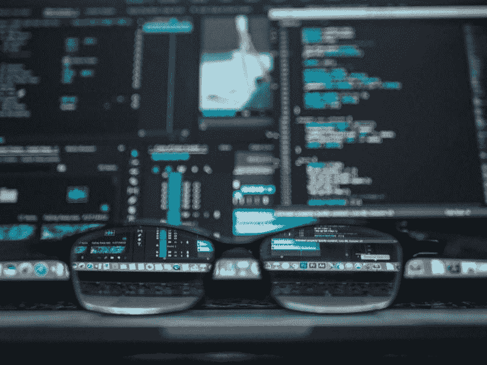

# 沃尔玛的人工智能客户监控引发道德问题——市场疯人院

> 原文：<https://medium.datadriveninvestor.com/walmarts-ai-customer-surveillance-raises-ethical-questions-market-mad-house-c08e16f33a2a?source=collection_archive---------6----------------------->

沃尔玛的人工智能客户监控正在开始，这引发了一系列道德问题。

为了解释这一点，人工智能(AI)和算法使用摄像机来识别长岛沃尔玛社区市场的客户行为模式。 *TechCrunch* [报道](https://techcrunch.com/2019/04/25/walmart-unveils-an-a-i-powered-store-of-the-future-now-open-to-the-public/) **沃尔玛(纽约证券交易所代码:WMT)** 将商店称为智能零售实验室(IRL)。

 [## 为什么数据将改变投资管理——数据驱动的投资者

### 有人称之为“新石油”虽然它与黑金没有什么相似之处，但它的不断商品化…

www.datadriveninvestor.com](https://www.datadriveninvestor.com/2019/01/25/why-data-will-transform-investment-management/) 

因此，购物者付费参与沃尔玛的行为科学实验。TechCrunch 声称沃尔玛的人工智能没有记录顾客购买的东西。然而，人工智能可以识别许多客户行为。

相反，人工智能会告诉沃尔玛的员工他们需要补充什么食物。此外，沃尔玛将在纽约莱维敦商店测试其他技术。很明显，智能零售实验室是几个实验之一，沃尔玛的人工智能智库/孵化器；[8 号店](https://www.storeno8.com/)，经营。

# 沃尔玛收集顾客数据

另一方面，沃尔玛正在收集大量关于顾客的数据。事实上， *TechCrunch* 声称 IRL 的电脑可以存储 1.6 兆兆字节或 160 万字节的消费者行为数据。

不幸的是，我们不知道沃尔玛在收集什么数据，这引发了道德问题。然而，8 号店正在利用这些数据建立一个他们称之为空间的虚拟购物平台。

例如，人工智能是否按照年龄、性别、种族、着装等对客户进行分类？这种分类可能导致种族主义和其他形式歧视的指控。

此外，沃尔玛可以指导人工智能检查人们的衣服或观察儿童。解释一下，衣着光鲜的顾客；有孩子的人可以买更多。

最后，人工智能可以指导保安将某些群体赶出商店。比如无家可归的人，或者年轻的黑人。显然，这种行为会导致诉讼。

# 沃尔玛会出售顾客数据吗？

如果沃尔玛出售消费者数据，将会出现更大的困境。

例如，沃尔玛可以向宝洁(纽约证券交易所代码:PG)出售洗衣区购物者的数据。然后[宝洁& Gamble](https://marketmadhouse.com/how-safe-is-procter-gamble/) 可以分析不买 Tide 的顾客的行为。

沃尔玛可以出售顾客数据；或者与供应商分享，因为潜在的价值。例如，Wibson [估计](https://medium.com/wibson/how-much-is-your-data-worth-at-least-240-per-year-likely-much-more-984e250c2ffa)普通人的个人数据价值每年 240 美元或更多。

因此，我无法想象像沃尔玛这样的零售商会拒绝像消费者行为数据这样的潜在收入来源。此外，我可以想象律师起诉，以获得集体诉讼收入的一部分。此外，政府会希望对这些收入征税。

# 谁拥有你的数据？

沃尔玛的人工智能数据收集提出了数据权利和数据所有权的问题。

例如，谁拥有你购物行为的数据；你还是沃尔玛？目前，沃尔玛声称拥有所有权，但越来越多的人认为这些数据属于个人。

值得注意的是，[欧盟通用数据保护条例](https://ec.europa.eu/commission/priorities/justice-and-fundamental-rights/data-protection/2018-reform-eu-data-protection-rules_en) (GDPR)是第一个控制企业数据使用的法律措施。我感觉这不会是最后一次。美国法律不太明确，但我认为律师们很快会主张消费者拥有关于他们行为的数据。法院将如何裁决数据所有权还不得而知。

# 消费者行为数据会有市场吗？

此外，还有区块链创业公司；像[勇敢](https://brave.com/)和[和谐](https://harmony.one/technology/)，旨在通过货币化来保护你的数据。

这些努力希望通过[令牌化](https://hackernoon.com/crypto-is-tokenizing-the-world-f0611f829b56?gi=559b770dc28d)创造一个个人数据的市场。例如，Brave 的长期目标是用**基本注意力令牌(BAT)** ERC20 加密货币为消费者的数据付费。

人们相信，通过让数据变得可量化和有价值，保护数据将变得更加容易。不幸的是， [Brave](https://marketmadhouse.com/bathing-in-the-basic-attention-token-bat-is-it-the-first-successful-utility-token/) 和 [Harmony](https://marketmadhouse.com/harmony-could-be-the-future-of-blockchain/) 专注于在线数据，但消费者行为是他们的下一个前沿领域。

然而，我怀疑他们中的一个将很快在其平台上添加行为数据。另一方面，行为数据平台；像勇者、[、JET8](https://marketmadhouse.com/jet8-a-social-currency-for-ethereum/) 和和谐号，还在开发中。事实上，和声还在绘图板上。这样它的开发者就可以整合实体零售。

# 公司已经在收集你的数据了

值得注意的是，公司已经在收集消费者的行为数据。例如，哥伦比亚广播公司[报道](https://www.cbsnews.com/news/carmakers-are-collecting-your-data-and-selling-it/)汽车制造商正在收集和出售司机的数据。此外，**福特**正在[建设](https://marketmadhouse.com/will-ford-motor-f-make-money-from-self-driving-cars/)运输移动云来收集司机的数据。

在这种情况下，消费者监督和数据收集将会增加。因此，我们很快就会看到关于消费者行为数据的政治和法律之争。特别是，当消费者意识到他们可以出售数据来赚钱时，他们会要求数据权。

*原载于 2019 年 4 月 26 日*[*https://marketmadhouse.com*](https://marketmadhouse.com/walmarts-ai-customer-surveillance-raises-ethical-questions/)*。*