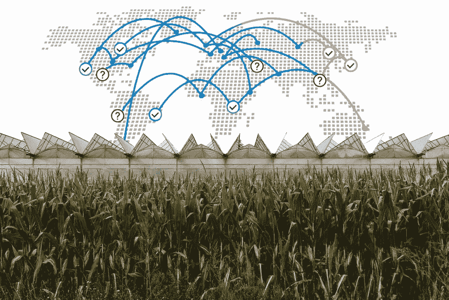
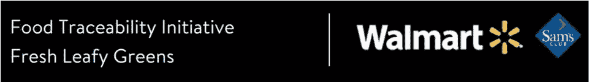

# 沃尔玛的区块链支持食品可追溯性计划

> 原文：<https://medium.datadriveninvestor.com/walmarts-blockchain-enabled-food-traceability-initiative-628b9df5febb?source=collection_archive---------4----------------------->

# 概观

在一封发给所有沃尔玛绿叶蔬菜供应商的[信](https://corporate.walmart.com/media-library/document/blockchain-supplier-letter-september-2018/_proxyDocument?id=00000166-088d-dc77-a7ff-4dff689f0001)中，沃尔玛宣布将启动一项基于区块链的食品可追溯倡议。这家全球最大的零售商告诉其供应商，他们需要在 2019 年 9 月前集成一个由 IBM 构建的区块链跟踪系统。基于区块链的食品可追溯系统已经问世好几年了。然而，这标志着顶级零售商首次使用这项技术。

# IBM 的区块链支持食品追溯系统

这封信没有涉及系统的细节，但是 IBM 的网站提供了一个我们可以从他们的解决方案中期待的概述。IBM Food Trust 建立在区块链的基础上。系统使用[总账；](https://www.hyperledger.org/)由 Linux 基金会开发的私有许可区块链。这使得所有被批准的网络参与者能够为更安全、更可持续的食品生态系统做出贡献。该系统允许交易实时数字化。这使得数据能够为整个供应链提供更有效的工作方式。从绿叶蔬菜种植者，到加工者、运输者、零售商(沃尔玛)、监管者，最后是最终消费者。

该解决方案允许授权用户立即访问食品供应链数据。从农场到商店，最终到消费者。任何一种食物的完整历史和位置。一旦上传到区块链，认证、测试数据和温度数据等附带信息在几秒钟内即可获得。

因为食物消耗每年都在增加。软件即服务系统确保了对不断扩大的食品体系的信任。该解决方案能够实现更安全的食品、更长的保质期、减少浪费、更快的可追溯性以及更好地访问共享信息。

# 沃尔玛引入这个系统有什么好处

## 食品安全

在给绿叶蔬菜供应商的信中，沃尔玛称这种食品不是 100%安全的。事实上，今年，美国经历了一次与长叶莴苣有关的大肠杆菌 O157:H7 的大规模多州爆发。总之，此次疫情导致 210 例确诊病例，96 人住院，5 人不幸死亡。通过在几秒钟而不是几周内安全地跟踪产品，它可以减少交叉污染、食源性疾病的传播、不必要的浪费和召回的经济负担。

## 食物新鲜度

处理绿叶蔬菜等农产品时。沃尔玛希望尽快将这些商品上架，同时确保新鲜度。区块链系统将允许对供应链数据进行前所未有的实时监控。有了这些数据，沃尔玛将能够提高新鲜度，延长保质期，减少产品损失。

## 减少浪费

主流媒体的一个热门话题是食物浪费。最大限度地延长货架寿命、优化供应链并提供快速服务以减少浪费，符合沃尔玛的最大利益。如果沃尔玛被视为打击食物浪费，那么它将在未来证明该业务在这个日益严重的问题。

## 可持续性

与减少浪费类似，可持续农业正成为一个日益突出的问题。借助新的区块链系统，沃尔玛将能够识别低效率，确保商品质量，跟踪产品的真实性，并认证整个供应链的来源。

# 总结想法

沃尔玛决定使用 IBM 的区块链支持的食品可追溯系统，这是采用区块链技术的又一步。显然，这种采用是为了避免处理加密货币，如 [WaltonChain](https://jameslaney.com/waltonchain-connecting-iot-blockchain/) 、VeChain 和 TE-Food。这可能是出于立法等多种原因，也可能是为了避免与初创企业打交道，而偏向于老牌 SaaS 企业。然而，每个对加密和区块链感兴趣的人都应该密切关注，因为这最终可能成为零售食品可追溯性的规范。

下面让我知道你的想法！查看更多区块链相关内容[点击这里](https://Jameslaney.com)。