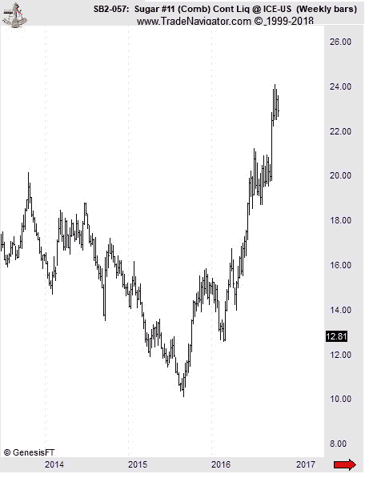
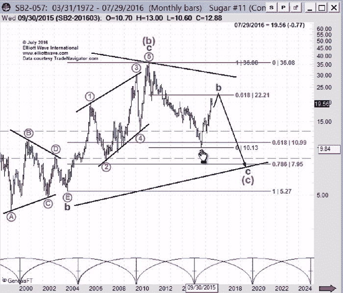
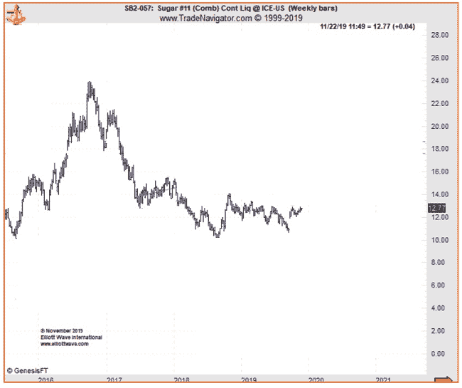

# 想要识别市场趋势吗？了解艾略特波浪分析的工作原理

> 原文：<https://medium.datadriveninvestor.com/want-to-identify-market-trends-see-how-elliott-wave-analysis-works-5d0438e0b344?source=collection_archive---------8----------------------->

不出所料，全球最大的大宗商品市场之一出现多年来的下跌。

一种我们称之为“土耳其”的大鸟的名字来自英国人，他们认为这种鸟是从土耳其飞来的。事实上，火鸡来自北美。然而，没有人会在感恩节餐桌上听到的问题听起来像是，“谁想要北美肉汁？”

这个故事类似于另一个误解！这在矛盾的事实面前也是如此；也就是一种流行的金融理论，被称为“基本面市场分析”这一普遍信念背后的概念描述如下:

> 金融市场的价格由外部事件或“基本面”决定，这可能意味着破坏作物的天气状况、政治动荡、收入报告、作物数据、供求数据等等。

 [## 为什么包容性财富指数比 GDP 更能衡量社会进步？|数据驱动…

### 你不需要成为一个经济奇才或金融大师就能知道 GDP 的定义。即使你从未拿过 ECON 奖…

www.datadriveninvestor.com](https://www.datadriveninvestor.com/2019/03/08/why-inclusive-wealth-index-is-a-better-measure-of-societal-progress-than-gdp/) 

这一理论和“土耳其”这个名字一样古老，而且也被普遍接受！

然而，我们在 Elliott Wave International 的朋友正从鸟儿飞翔的高度，以一种完全不同的方式解读市场行为。所有艾略特的“圣经”是弗罗斯特和普雷希特的书《艾略特波浪原则是理解市场的关键》(缩写为 EWP)，该书提供了这一开创性的反建议:

> “有时，市场似乎反映了外部条件和事件，但在其他情况下，它与大多数人认为的因果条件完全无关。原因是市场有自己的规律。它不是由人们在日常生活实验中习惯的外部因果关系所刺激的。
> “价格运动不是新闻产品。"

那么市场遵循的是什么“自己的规律”？EWP 是这样描述的:

> “市场发展是由波浪塑造的。波是定向运动的模式。每个模式都有自己的需求和趋势。波动原理是唯一也为预测提供规则和规范的分析方法。”

为了理解埃利奥特在现实市场中的波动分析，让我们看看最近波动的商品市场:糖。
图表显示了 2015 年至 2016 年期间糖价的大幅上涨，涨幅约为 80%，这使得糖获得了“美国交易所交易的最佳产品”的称号(2016 年 10 月 3 日求阿尔法)

在 2016 年 9 月中旬的峰值，糖价创下了四年来的新高。此外，由于一系列看涨的“原教旨主义者”，如需求增长、供应限制和巴西干旱，所有基本面迹象都表明糖价表现疲软。

*   “常年吃糖的熊变成了公牛。第二年的短缺可能会将这种甜味商品推得更高。”8 月 15 日寻找阿尔法
*   “由于供应问题，糖价创下四年来的新高。价格进入了增长最活跃的阶段。”10 月 4 日。日经亚洲评论
*   “糖多头的甜蜜市场。今年早些时候导致价格上涨的基本面因素基本上没有改变。”9 月 16 日金融时报

然而-糖价非但没有出现越来越高的趋势，反而在两年的熊市中暴跌，在 2018 年 9 月下旬跌势停止之前，价格跌至十年来的最低水平。

值得注意的是，糖的销售与基本情况完全相反。然而，普莱斯遵循了艾略特的波浪脚本。
2016 年 7 月 21 日，Elliott Wave International 大宗商品市场首席分析师杰弗里·肯尼迪(Jeffrey Kennedy)在服务月度大宗商品报告中指出，糖将经历两个主要阶段的长期熊市。杰弗里解释道:

> “b 波目前正在形成。如果这种增长持续到今年 9 月甚至 10 月，达到 22.89，我不会感到惊讶。
> “一旦 b 波结束，我预计价格将大幅下跌，并持续数年，价格将远低于 2015 年形成的低点 10.13。"

下图显示了发生的情况。9 月中旬，糖的价格超过了杰夫的既定目标，随后是两年的熊市，价格发生了 180 度的逆转，成为 2018 年的“最糟糕的商品”。

大多数时候，市场上的价格运动是按照埃利奥特的五种主要波动模式中的一种形成的。自该书于 1978 年出版以来，艾略特波浪国际公司首次免费出版了艾略特波浪原理——理解市场的关键——因此投资者可以专注于市场预测，而不必关注新闻。