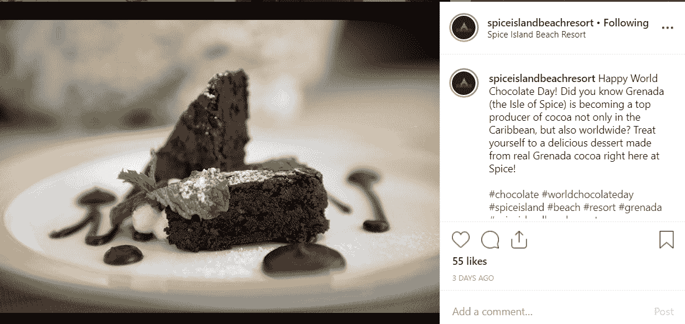

# 想让您的旅游业务在重要的地方大放异彩吗？然后重点关注这 3 个平台

> 原文：<https://medium.datadriveninvestor.com/want-to-make-your-travel-business-shine-where-it-matters-then-focus-on-these-3-platforms-31958fc0ce56?source=collection_archive---------16----------------------->

旅游业是全球第二大增长最快的行业，这意味着竞争非常激烈，旅游品牌需要在游戏中处于领先地位，才能将潜在客户转化为实际客户。

如果你想知道如何在这样一个拥挤的环境中发展你的业务，首先要在你的理想客户寻找你并希望与你互动的地方非常清楚地传达你的独特价值。

 [## 社交媒体收听让您随时了解|数据驱动型投资者

### 虽然社交媒体倾听是一种顶级趋势，但它应该是每个现代营销策略的一部分。保持和谐…

www.datadriveninvestor.com](https://www.datadriveninvestor.com/2019/02/26/social-media-listening-keeps-you-plugged-in/) 

我们最近讨论了[如何阐明你的信息](https://www.globalislandgirl.com/blog/2019/6/30/3-tips-to-clarify-your-brand-messaging-and-make-your-business-stand-out)以真正脱颖而出，但随着社交媒体平台、预订网站、评论网站、博客和其他地方的广泛多样性，你的理想受众正在寻找你，很容易不知所措，不知道该将精力集中在哪里。

不要惊慌，深呼吸。在本文中，我们将讨论 3 个平台，在这些平台上，你需要集中你的品牌意识和营销努力，以使你的旅游业务脱颖而出，并将你的受众转化为付费客户！让我们从显而易见的开始。

# 你的网站

把你的网站想象成你的画布，用它最明亮、最神奇的光芒讲述你的商业故事。与其他平台不同，你可以随心所欲地定制它的外观和整体感觉，这样它才能真正反映你的品牌。

今天，你的网站不太可能成为你的潜在客户第一次了解你时首先登陆的地方。在旅游行业尤其如此，像 [Tripadvisor](http://tripadvisor.com/) 、 [Kayak](http://kayak.com/) 和 [Booking](https://booking.com/) 这样的网站倾向于主导搜索引擎。

因此，请记住，当人们已经被你的业务所吸引时，他们会访问你的网站，他们想知道更多，以决定是否应该选择你而不是其他人。你的任务是让他们留在那里，建立联系，并让他们做出决定。

这也是你深入了解你的产品和服务、讲述你自己的故事、让你的观众对你的产品感到敬畏、以及回答人们最迫切的问题的机会。

通过吸引潜在顾客的感官和最深层的欲望，引导他们体验完整的旅行体验。确保使用高质量的图片、有力的文字来真正体现您独特的附加值，以及突出您解决客户特定问题的最令人惊叹的功能的视频内容。

例如，如果你可以根据特定的饮食限制来定制餐馆的菜单，那就明确地说明这一点，并展示美味的素食餐的图片。如果您是一家家庭友好型酒店，请制作一段视频，展示一家人在您的设施中享受时光的场景。如果你是一个低成本和有趣的旅游经营者，也许可以展示年轻大学生参加你最受欢迎的活动的照片。你明白了。

非常清楚地向人们展示你的经历的样子和感觉，这样他们可以更好地了解你。

额外提示:你还应该考虑的一件事是展示你的一些员工，因为这会让你的业务更人性化，并与你的潜在客户建立更多信任，我们会觉得他们知道谁会在旅行中照顾他们。

# 照片墙

旅行是一种感官体验，在很大程度上依赖于视觉吸引力，这就是 Instagram 对你的旅行业务如此重要的原因。

在这里，您可以通过高质量的照片、视频和图片向观众展示您的旅行体验是多么不可思议，让他们对您提供的东西感到兴奋。你的话也很重要，不要只是使用漂亮的图片，却什么也不说。想出有趣的标题。教育，2。娱乐，3。或者与你的观众互动。理想情况下，你会做到这三点。

注意到[香料岛海滩度假村](https://www.spiceislandbeachresort.com/)在这方面做得有多好了吗？集教育、娱乐和参与于一身。

你的品牌声誉也在发挥作用，这取决于你如何回应 Instagram 上的评论和私信。

我们今年有一个客户，当我们接手时，他的 Instagram 页面上有超过 20 条未读消息，其中大多数都是非常重要的线索(比如有人想在全国电视节目中展示他们，或者有几个人想在他们的网站上举行婚礼！).确保你关注评论和信息，并回复每一条。你的品牌声誉岌岌可危。

现在，你们中的一些人可能想彻底抛弃 Instagram，认为千禧一代与你们的业务无关。然而，我想挑战你的这个想法，因为两个简单的事实:到 2020 年，千禧一代将占旅行支出的 50%，一项研究显示，T2 40%的千禧一代根据他们的“instagramable”选择旅行目的地，或者一个地方在 Instagram 上看起来有多好。

(是的，我这一代人致力于视觉美学……我有时也觉得这很奇怪，但事实就是如此。)

从商业角度来看，千禧一代代表着旅游业的大量资金，所以在解雇他们之前要明智地选择。

更明智的做法是适应新趋势，现在就开始吸引这一代人，而 Instagram 是一个很好的地方。所以，开始收集你最好的视觉效果，建立一个极具吸引力的 Instagram 页面，让人们愿意和你一起花他们的旅行费用。

*额外提示:使用 Instagram Story Highlight 功能展示你的品牌最重要、最令人惊叹的特点。*

# 预订和查看网站

去年，我们的代理公司开始与加勒比海的一家餐厅合作，当我告诉店主她的生意在 Tripadvisor 上有负面评价时，她难以置信地看着我。她说他们没有在 Tripadvisor 上注册，所以这没有任何意义。

快讯:你不需要注册一个评论网站来获得关于你的企业的评论。具体来说，在 Tripadvisor 上，任何人都可以创建一个关于你公司的列表，如果你不像我的客户那样查看它，你会发现自己有数百个你甚至没有意识到的评论。不太好。

我注意到许多企业实际上害怕这些类型的网站，因为他们害怕这会破坏他们的声誉。我明白，发现自己因为犯了或没犯的错误或糟糕表现而暴露在数百万互联网用户面前是很可怕的(我知道，有些客户是不可能满足的，总是会有一些负面的话要说)。然而，最糟糕的事情可能是你保持沉默，成为差评的受害者。

相反，重新掌控你的品牌形象，积极主动。自己设置个人资料，添加最佳图片和描述。突出使您的酒店格外特别的具体特征。回应评论，无论好坏。尤其是那些不好的。

不要，我重复一遍，当有人通过负面评价向你喊话时，不要保持沉默。相反，控制伤害，道歉，采取行动帮助他们原谅你，并向未来的读者表明你真的在乎，你愿意接受反馈，你正在寻求改善你的服务。

当人们对你写下令人惊叹的评价时，确保你培养这种关系，并在他们下次来访时，通过一份特殊的感谢礼物或折扣让他们知道他们受到了赞赏。一句简单的谢谢也是值得赞赏的，但当涉及到花时间给出积极反馈的客户时，我往往会走极端。

额外提示:鼓励人们给你留下积极的评价，尤其是当你看到他们喜欢和你在一起的经历时。与负面评价相比，旅行者常常需要一点额外的动力来写正面评价。想办法在顾客要结账时给他们一个温柔的提醒，或者在他们离开后给他们发一封跟进邮件。

通过关注这 3 个平台，并使它们处于最佳状态，你将能够吸引更多的人有机地进入你的企业，并开始看到你的销售额上升！

如果你不确定从哪里开始，我们在[环球女孩旅行社的团队可以帮助](https://florence-turiaf.squarespace.com/agency)，所以请随时联系。