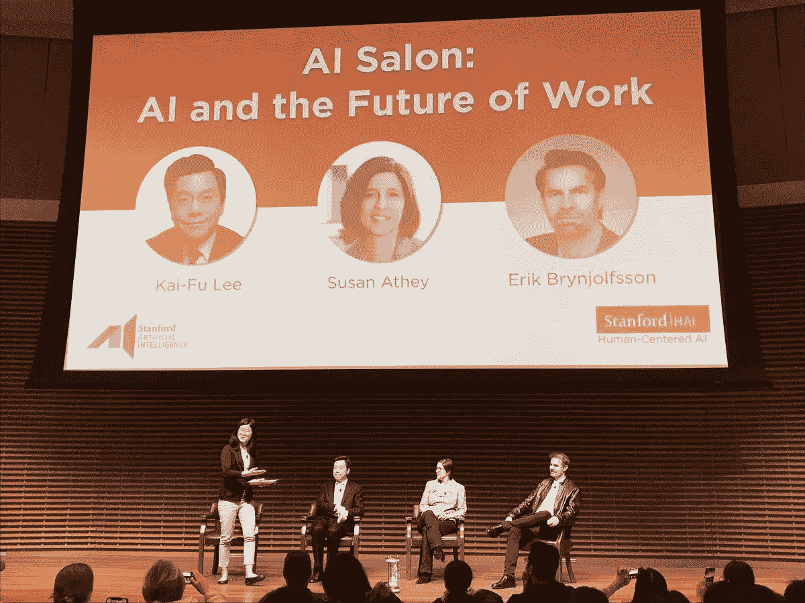
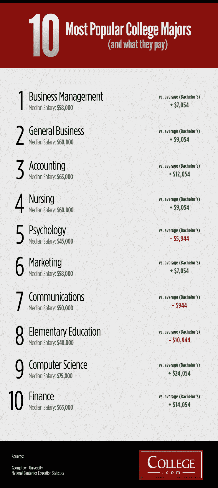

# 想保护自己的事业免受 AI 的侵害？

> 原文：<https://medium.datadriveninvestor.com/want-to-protect-your-career-against-ai-af933c7df39f?source=collection_archive---------46----------------------->

寻找需要创造力和同情心的领域

在斯坦福大学的一个周五下午，数百人涌入礼堂，听三位领先的人工智能(AI)专家讲述未来的工作:李开复、苏珊·艾希和埃里克·布林约尔松。

主讲人李开复博士是一个严肃的人。他给人的印象是深思熟虑、善于思考，当你得知他战胜了癌症时，这就说得通了。他和小组的其他成员透露，人工智能已经变得非常擅长所谓的特定智能，或者学习如何做一件常规事情的能力，比如玩游戏或在生产线上完成一个特定的过程。然而，人工智能领域未能实现的是机器展示一般智能的能力，或人类天生的广泛认知能力。

这对普通工人来说意味着什么？嗯，这意味着人工智能将在 5 到 15 年内在被认为是重复、常规和优化的领域取代人类。然而，复杂行业，如首席执行官、M&A 专家、经济学家，以及创造性领域，如专栏作家、科学家和艺术家，只要没有开发出通用智能，就不会受到人工智能的威胁。

这意味着为增长做好准备的劳动部门是那些既需要同情心又需要创造力的部门。李博士给出的几个例子包括婚礼策划人、老年护理员、美容顾问、教师、导游、礼宾员、社会工作者和公关主任。这些领域将需要人类的热情和创造力，人工智能将成为一种工具，通过执行分析来增强它们的性能。不需要创造力和同情心的领域，如卡车司机和洗碗工等蓝领工作，以及放射科医生和法律助理等审查发现的白领工作，可能会被机器取代。

对社会有什么影响？

首先，工人再培训计划和高等教育必须专注于由创造力和同情心主导的领域，或者非常规工作。好消息是，如下图所示，这已经在大学生选择大学专业的过程中发生了。

在工人再培训方面，一些公司，如亚马逊，将有大量工人被机器取代，正在为针对人工智能的工作课程提供津贴，亚马逊为 1.2 万美元。

第二，需要就工资问题进行严肃的讨论。事实是，失业的工人，尤其是来自制造业的工人，在服务业的收入会减少。在简斯维尔，作者艾米·戈德斯坦描述了威斯康星州一家关闭的通用汽车工厂的下岗工人。在过去，他们每小时挣 28 美元，并保证有养老金，那些留在黑鹰技术学院(Blackhawk Technical College)的人，通常在联邦基金的支持下，会以时薪的一半重新进入劳动力市场。此外，他们将有更艰苦的工作条件，爬电线杆或担任女狱警。

李博士也强调了这种工资贬值，他举例说，一名老年护理员的时薪约为 19 美元，而重型机器操作员的时薪为 28 美元。

有几种方法可以解决这种工资下降的问题，包括提高最低工资，提供普遍的基本收入，或为目前由志愿者(如家庭学校教师，热线志愿者，老年伴侣)做的工作付费。

第三个社会影响是需要支持独立工作者。零工经济中有几个需要创造力和同情心的工作。你将被要求为几个客户服务，而不是从一个固定的雇主那里接受稳定的工作。几个例子包括美容师，服装顾问，婚礼策划，平面设计师。我的许多其他作品关注独立工作者目前面临的挑战，包括确保便携式福利和[按时收到付款](https://medium.com/@alissaorlando1/getting-paid-11ca031d9b93)。

所以好消息是机器人不会统治我们所有人——至少在未来 15 年内不会。坏消息是，由于新的人工智能技术，将有大量工人失业，超过 70%。作为一个社会，我们必须决定如何在不压低工资的情况下，支持工人向创造性和富有同情心的行业转型。