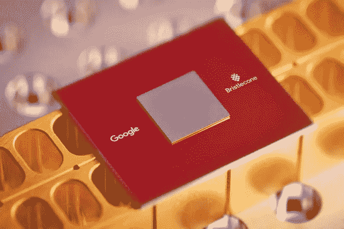
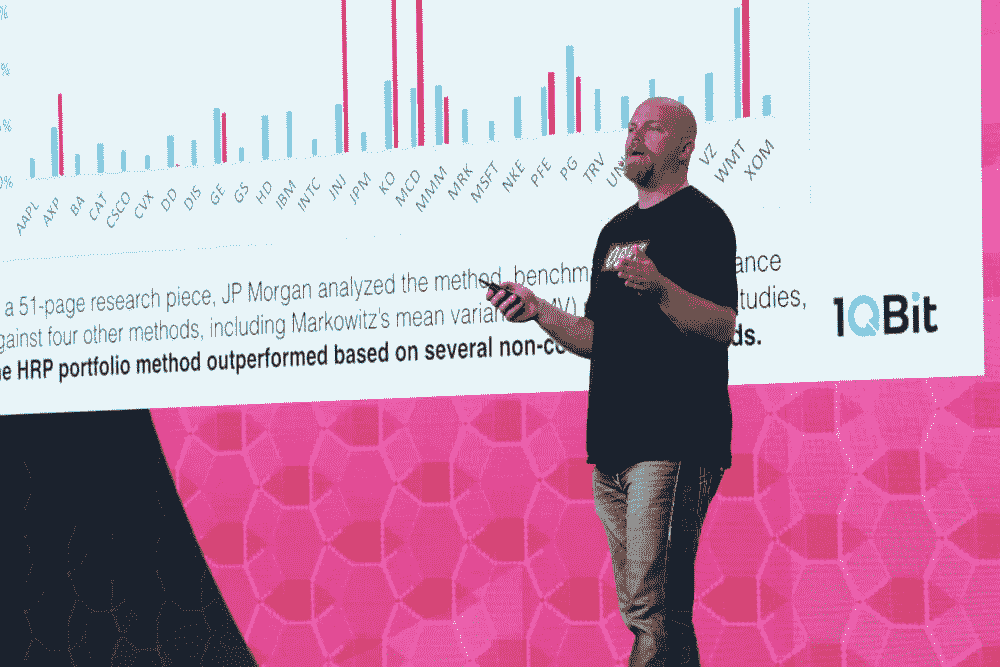

# 《生死通缉令》——探索“量子霸权”

> 原文：<https://medium.datadriveninvestor.com/wanted-dead-and-alive-the-quest-for-quantum-supremacy-6a1b9e0a0344?source=collection_archive---------5----------------------->

Photo credit: [Google](https://research.googleblog.com/2018/03/a-preview-of-bristlecone-googles-new.html)

量子计算终于开始发挥作用了。“经典”计算使用“比特”——信息编码为 1 或 0，而量子计算利用量子理论，在非常小的尺度上，事物可以是 1 或 0，或者同时是 1 和 0 的多个状态。

自然，这样的概念很难让人理解。理论物理学家理查德·费曼被认为说过“如果你认为你理解量子力学，你就不理解量子力学”。所以不用说，如果这是来自量子计算的教父，那么它不容易理解…

谷歌最近宣布了他们的“ [Bristlecone](https://www.technologyreview.com/the-download/610423/google-has-built-the-worlds-most-advanced-quantum-chip) ”量子芯片，有 72 个量子位，或称“量子位”。有人认为，有了“多面手”量子计算机，50 个量子位以上的芯片可能能够在某些特定任务上胜过经典量子计算机。所以，这个芯片，以及 IBM 的 50 个芯片能否做到这一点，还没有定论。

首创的 D-Wave，是世界上第一家量子计算公司，拥有 2000 量子位的芯片；然而，他们的芯片是以寻找全局最大值和最小值为唯一目标的，而不是多面手芯片。

Photo credit: [Science Alert](https://www.sciencealert.com/google-s-quantum-announcement-overshadowed-by-something-even-bigger)

# **量子初级读本**

以下是对什么是量子计算的一些关键理解:

*   *叠加*:当某物可以同时存在两种状态时；允许计算 1 和 0——因此，利用这一特性，计算能力会随着每增加一位而呈指数级增长。
*   *(量子)纠缠*:被爱因斯坦称为“超距幽灵作用”，其中两个(或两组)粒子可以相互作用，这样通过简单地观察一个粒子的状态，我们就可以知道另一个粒子的状态。我将把这个定义留在这里，因为它有点“超凡脱俗”…更多信息，你可以从这里的[开始](https://simple.wikipedia.org/wiki/Quantum_entanglement)。
*   *相干性和“噪声”*:考虑到事物同时表现为两种事物的易变性质，对量子位的最轻微影响都会导致“噪声”和“退相干”，使得量子位在计算中产生误差。因此，芯片通常会被冷却到比深空还冷的温度，所有其他干扰都会被排除。随着量子位数量的增加，退相干的风险也会增加；因此，这是一个质量与数量的问题——当你阅读下一个标题时，请记住这一点！
*   棘手问题:那些没有“有效”算法来解决的问题。有些问题理论上不能用“经典”计算机解决，但是量子计算机可以。但是，如果你不能用“经典”计算机检查结果，你怎么知道一个问题是否已经被量子计算机解决了呢？…

1QBit’s Andrew Fursman at Singularity University’s Finance Summit. Photo Credit: [Singularity University](https://singularityhub.com/2017/06/08/quantum-computers-will-analyze-every-financial-model-at-once/andrew-fursman-speaking-singularity-university-exponential-finance-summit-quantum-computing/)

# 一个勇敢的新世界

这是一个非常令人兴奋的领域，越来越多的公司和机构正在进行 R&D 和商业化。我们的投资对象 [1QBit](http://www.1qbit.com/) 就是这样一家正在稳步前进的公司，它与其他公司合作，以实现“量子就绪”。他们在材料领域与陶氏化学合作，在生物技术领域与 Biogen 合作，在其他高性能计算领域与富士通合作，并得到埃森哲等公司的支持，以帮助推广他们的能力。

正如这些天来大多数新兴技术一样，进展正以指数级的速度前进，在量子计算中，这是定义正在发生的事情。这对人类近期和未来的发展具有重大影响。