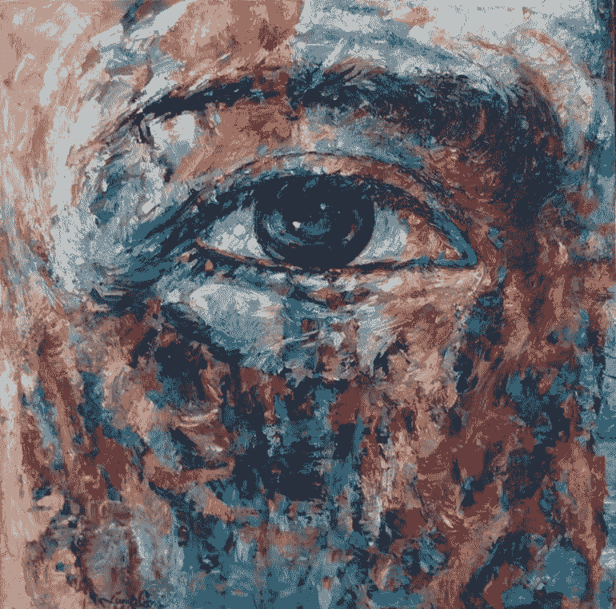
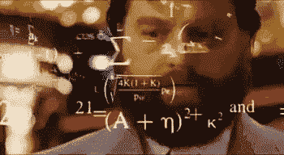
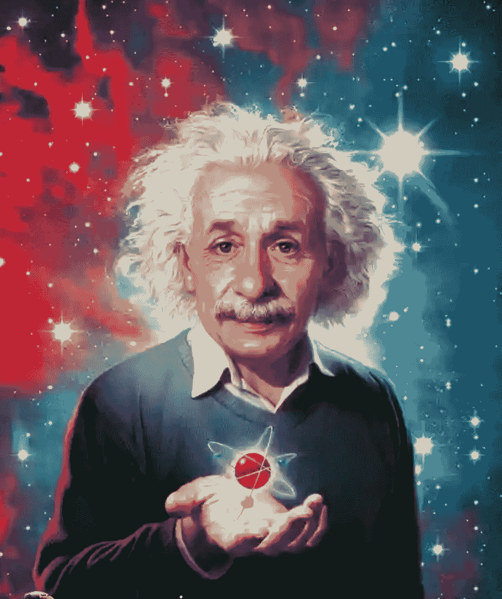

# 想要全知:人类的终极追求

> 原文：<https://medium.datadriveninvestor.com/wanting-omniscience-in-ai-260007d1af57?source=collection_archive---------5----------------------->

为什么没有全栈 AI 这种东西的故事，因为你不可能知道全部。

> 声明:这不会是你通常的文章。

人工智能是一个非常难以捉摸和有趣的领域，它揭示了计算机视觉分类网络可以以超人的准确度做些什么，或者语言模型可以生成或理解语义的精心制作的文本，这是令人着迷的，但实话实说，你不可能知道一切。

我已经和这个困境斗争了一段时间了。

我不确定我可以称之为发光物体综合症，因为人工智能的大多数子领域吸引了我的目光，我有一个有趣的项目，我相信它将为世界带来价值。目前，当你阅读这篇文章时，我正在从事一两个项目。只有在多年的焦虑发作、冒名顶替综合征、闪亮物体综合征、拖延症和盲目滚动新的人工智能项目、想法、论文和文章之后，这才成为可能。

> “在我们最黑暗的时刻，我们必须专注于看到光明”——亚里士多德

那是我 AI 之旅的最低谷，因为我卡住了。我被困在自己的脑袋里。

 [## 深度学习用 7 个步骤解释-更新|数据驱动的投资者

### 在深度学习的帮助下，自动驾驶汽车、Alexa、医学成像-小工具正在我们周围变得超级智能…

www.datadriveninvestor.com](https://www.datadriveninvestor.com/2019/01/23/deep-learning-explained-in-7-steps/) 

有一天对我来说很特别，那是我感觉自己心脏病发作的一天。这一切都发生在 2018 年，当时我正在漫不经心地狂看 Youtube 视频，我偶然看到了这个 2h **Fastai** part II 2018 视频讲座，主讲人是**杰瑞米·霍华德**(我的人工智能超级英雄)，尽管我们从未见过面，但我对他非常尊敬，然而他深深地影响了我，并帮助我成为一名更好的程序员和人工智能实践者。现在，回到这个故事，讲座是关于**图像分割**，我有这篇论文，我试图实施了几个月，但没有成功，只是看到 **Jeremy** 在几分钟内完成了它，就在这一刻我看到了我对人工智能的了解有多么少，在具体的深度学习方面， 我感觉到寒冷的寒意，然后我的胃打结，然后我的心脏开始剧烈跳动，我无法正常呼吸，事件发生后，我非常害怕，我想买一个智能手表，以便能够看到或预测这样的事件。 我一生中从未有过这种感觉。后来，我在谷歌上搜索症状，却发现这是一种恐慌症。

过了一段时间，在看了我的另一位导师 Patrick Bed David(另一位我非常尊敬的人)的视频后，我意识到我真正需要的是根据我真正喜欢和需要设计自己的课程，以便在这个广阔的领域取得成功。我需要转移我的注意力，真正找到我需要学习的领域中最重要和最基本的方面。所以我做了，我设计了一个长达一年的生活计划，包括 2019 年的所有事情和所有人。

> “不要老想着哪里出了问题。而是专注于下一步该做什么。把你的精力花在寻找答案上。”——[**丹尼斯·威特利**](https://www.brainyquote.com/authors/denis-waitley-quotes)

如果你曾经有过这种感觉，只要知道这是正常的，你可以更强更好地摆脱这种情况。

我通过后退几步找到了我的答案，这样我就可以向前加倍了。

# 这个计划

让我们详细了解一下我是如何做到这一点的:

1.  我选择了这一年我想上的课程和我感兴趣的主题，主课是 Fastai 18，主题是计算机视觉和文本生成网络的深度学习。
2.  我选择与该领域相关的技术书籍，这样我就可以沉浸其中，深入钻研，接触到构成一切的微小细节。我不想仅仅使用另一个黑盒方法、工具、框架或架构。我想知道为什么，并理解它的核心。
3.  我想出了一些项目，并以我所有的热情去追求它们，不管这个想法有多疯狂或离谱，也不管我达成这个想法的手段如何。你知道我在说什么，你在头脑风暴或做白日梦时产生的那些疯狂的明星般的想法，确切地说，那些想法有很大的力量，下次不要忽视它们，把它们写在某个地方，然后暂时搁置。伟大的想法会过早地消亡，因为我们试图对所有事情进行逻辑推理，1+ 1=2 这就是我们的想法，但它不需要这样，也不总是正确的。有时候 1+1 = 1，换个角度思考，跳出你舒适的框框，最伟大的事情就在那些界限之外，相信我。

随着时间的推移，这三件简单的事情结合在一起，最终形成了一系列我一直在追求的伟大而有趣的项目。它不需要成为最好的，并构成整个画面，但缓慢但肯定会形成一个。

> “千里之行，始于足下。”——老子

当然，并不是一切都按计划进行，甚至比计划的还要好，不知何故，情况出现了，你不得不随机应变，结果你得到的比你希望的多得多。

> 「求，就给你；寻找，你会找到；敲门，门就会为你打开。”——马太福音 7:7

我可以告诉你，随着 2019 年即将结束，我可以回顾并看到这一年出现的所有祝福伪装成障碍，实际上嘲笑过去的自己过于担心。

也许，我应该更深入地研究一个特定的主题，如计算机视觉，这些知识很容易推广到其他领域，而不是像我在这一年的大部分时间里那样试图肤浅地了解一切，幸运的是，我的责任计划和生活计划让我脚踏实地，对没有达到我设定的指标负责，所以我尽最大努力扭转局面。这是我在 2019 年所做的所有工作、项目和课程中最大的收获。我很幸运地说，我克服了它，并完成了我今年为自己制定的 90%以上的计划，这篇文章将这些指标推得更远，因为它承载了历史和情感。

这篇文章是写给你的，你现在正为达不到你的目标而挣扎和恐慌。只要知道这完全没问题，你可以后退两步，为 2020 年制定一个生活计划，列出你想实现的一切，也许可以添加具体的截止日期，然后花一些时间充电，享受与你所爱的人在一起的这段时间，因为 2020 年你将写下所有的错误，这将是你在人工智能领域的雷达上出现的一个亮点。

这是我从 2019 年得到的最大教训，我为你写了这篇文章。

这有点不同于往常，但我觉得我应该分享我的个人故事，因为有人甚至是你正在经历和我一样的经历，并且可以从知道如何克服它中受益。

你没什么可失去的，试试吧。

# 关于全知的一个注记

无所不知的状态。

credits to google images

我们人类仍然拥有地球上最聪明的生物的头衔，也许同意一些科学家的说法，是宇宙中唯一的智慧生物(尽管不会太久)，我们不是被设计来存储和处理我们周围的每一点信息的，*一个人不可能知道一切*。根据马克斯·泰格马克的《生活 3.0》(*推荐*)一书，从**我们通过我们的感觉系统每秒钟从环境中获取 1100 万比特**的信息，**我们每秒钟只有意识地处理 10-50 比特**的信息，而大部分信息被委托给潜意识任务处理者或干脆丢弃。

但是，即使我们能够知道这一切，理论上，也只是几分之一秒，因为不平衡和平衡定律不允许变量长时间保持平衡，因为信息被视为真实的环境会发生变化。只有少数规律是客观的、最终的和健全的，比如自然和宇宙的规律。

> **不平衡定律**与平衡定律。为了让任何事物进化到其下一个适当的存在水平——成长——它需要被刺激或拉伸出其平衡状态，进入**不平衡**状态，此时自然的力量参与创造新水平的新平衡状态。

也许我们未来的后代 AGI(人工通用智能)将拥有存储能力和处理能力，来揭示比我们更深刻的见解，开创信息处理的新时代。如果 AGI 递归地改进自己，使其超过所有人类的智力总和，能够将我们所知的技术带到一个远远超出人类理解的水平，那么它可能会帮助我们扩展或“挣脱”我们有机身体的限制，并上升到一个更高的理解水平。

虽然这种情况不会发生，但在获取、记忆和使用信息的过程中，无论是书籍、博客、模拟(对话等)、视频还是音频，都要小心谨慎，保持耐心，这一点至关重要。

你不可能无所不知，也不可能无所不知。

# 结论

*   对自己有耐心，慢慢来
*   如果不是专注于一件事，而是专注于几件事，你的专业知识就会延伸到其他领域。
*   制定一个计划。

非常感谢你，节日快乐，我祝你有一个更好的 2020 年，这一年你将有**出色的成长和娱乐**。

**推特** : @CanumaGdt

**领英**:[https://www.linkedin.com/in/prince-canuma-05814b121/](https://www.linkedin.com/in/prince-canuma-05814b121/)

**电子邮件**:prince.gdt@gmail.com