# 分类建模中的热身

> 原文：<https://medium.datadriveninvestor.com/warm-up-in-classification-modeling-dd4a4f100e8b?source=collection_archive---------2----------------------->

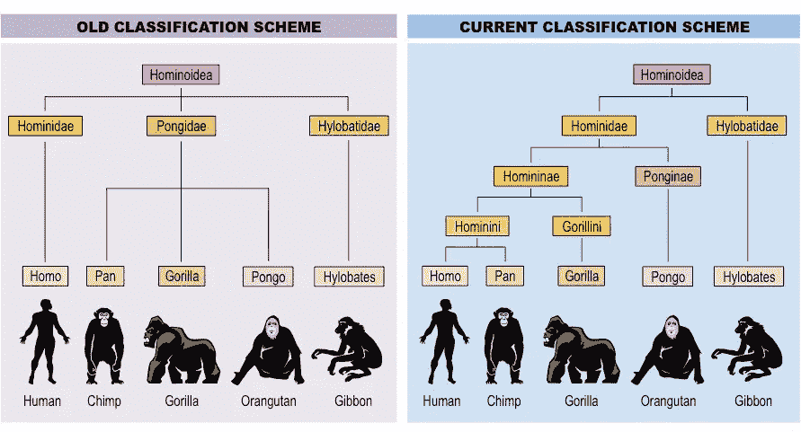

[http://www.okdrywall.co/](http://www.okdrywall.co/a-diagram-of-a-moose.html)

分类是与分类相关的**监督学习**过程，在**训练集**的基础上，识别一个新观察值属于一组类别中的哪一个。

# 逻辑回归(二元分类的线性分类器)

逻辑回归是使用逻辑模型从预测因子的线性组合中预测二元结果。与输出一组数值的线性回归不同，逻辑回归将输出给定输入属于特定类的概率。

当因变量为**二元、**时进行逻辑回归，可以是**离散或**连续。在**逻辑回归**中，响应(因变量)有有限数量的可能结果。

添加独立变量总是会增加模型的方差，使其趋向于**过度拟合。**

**在**建立逻辑回归模型之前，需要确保假设:

1.  因变量本质上应该是二元的。
2.  对于连续预测值，数据中没有异常值/极值。
3.  在结果的 logit 和每个预测因子之间存在线性关系。
4.  自变量之间没有多重共线性。

**需要注意的几个术语:**

1.  由于每个实验只能有 2 个可能的响应，因此，残差不会呈正态分布。
2.  独立变量(预测值)不必呈正态分布或具有相等的方差。

[https://www.biomedware.com/files/documentation/spacestat/Statistics/Multivariate_Modeling/Regression/Implementation_of_Logistic_GWR.htm](https://www.biomedware.com/files/documentation/spacestat/Statistics/Multivariate_Modeling/Regression/Implementation_of_Logistic_GWR.htm)

[https://www.saedsayad.com/logistic_regression.htm](https://www.saedsayad.com/logistic_regression.htm)

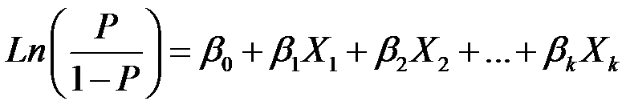

[https://www.theanalysisfactor.com/what-is-logit-function/](https://www.theanalysisfactor.com/what-is-logit-function/)

**为什么 logistic 回归模型的阈值是 0.5？**

由于最优化技术寻找最佳的 sigmoid 曲线，我们应用 MLE 来估计参数。标准是我们需要尽最大努力使每个标记为“1”的样本都有一个接近 1 的逻辑函数结果，对于标记“0”也是如此。

**估计最佳系数的方法？？？使用最大似然法**

有用链接:[http://cseweb.ucsd.edu/~elkan/250B/logreg.pdf](http://cseweb.ucsd.edu/~elkan/250B/logreg.pdf)

# 决策树分类

决策树通常用于[运筹学](https://en.wikipedia.org/wiki/Operations_research)，特别是决策分析，以帮助确定最有可能达到目标的策略，但也是机器学习中的一种流行工具。([https://en.wikipedia.org/wiki/Decision_tree](https://en.wikipedia.org/wiki/Decision_tree))

当我们人类在构建决策树时，规则是基于他们个人的逻辑和知识。从数据科学的角度来看，决策树规则的创建通常是通过算法学习来构建的。决策树的目标是基于数据的**同质性**进行拆分——将数据拆分成几个**‘纯’节点**。

构建决策树的算法通常以**自上而下的格式**工作，在每一步选择一个预测器来最好地分割项目集。在决策树中，每个**分支**可以被认为是测试的**结果，每个**叶**节点可以被认为是一个**类标签**，从根节点到叶节点的**路径**代表**分类规则**。**

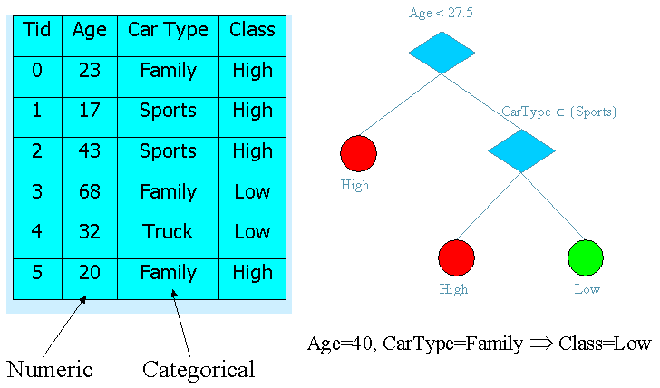

[https://web.fhnw.ch/personenseiten/taoufik.nouri/Data%20Mining/Course/Course3/DM-Part%203.htm](https://web.fhnw.ch/personenseiten/taoufik.nouri/Data%20Mining/Course/Course3/DM-Part%203.htm)

## **数学公式评估指标:**

1.  **熵(信息增益)** : 在每次分割时，我们想要**减少**熵，并且在分割之前和分割之后计算熵。如果它减少，则分割有效，并可能进入下一步，否则，尝试用另一个自变量分割或停止该分支。

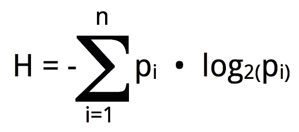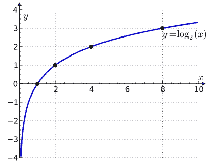

[https://en.wikipedia.org/wiki/Logarithm#/media/File:Binary_logarithm_plot_with_ticks.svg](https://en.wikipedia.org/wiki/Logarithm#/media/File:Binary_logarithm_plot_with_ticks.svg)

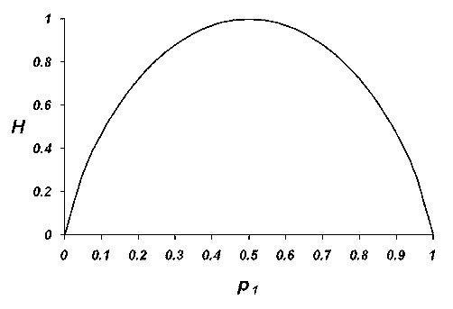

[http://www.talkorigins.org/faqs/information/shannon.html](http://www.talkorigins.org/faqs/information/shannon.html)

好的拆分会带来一个类的显著大概率和其他类的小概率。更具体地，如果 p1 是多数类概率，则 log(p1)接近于 0，p1*log(p1)接近于 0。此外，假设 p2 是少数类概率，那么 p2*log(p2)也接近于 0，因为 p2 接近于 0。= >最低熵值表示阶段中的最佳分割。

然而，有些情况表明熵评估可能不起作用，因为它侧重于测量为探索性分析而处理的信息中的随机性，例如:

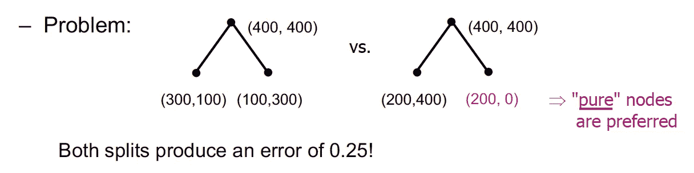

因为决策树的目标是得到‘纯’节点，我们可能需要考虑计算**基尼指数来表示纯度的程度**。

**2。基尼指数(杂质)**:目标是测量子节点中的**不平等**，以**最小化错误分类**。

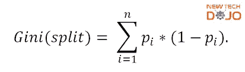

[https://www.newtechdojo.com/learn-decision-tree-algorithm-using-excel/](https://www.newtechdojo.com/learn-decision-tree-algorithm-using-excel/)

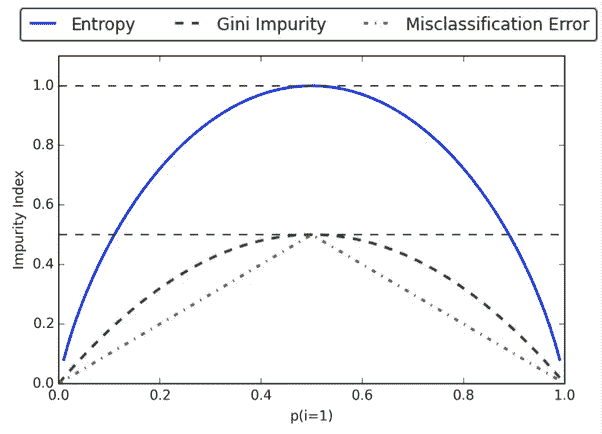

[https://www.quora.com/What-are-the-advantages-of-different-Decision-Trees-Algorithms](https://www.quora.com/What-are-the-advantages-of-different-Decision-Trees-Algorithms)

较低的 Ginni 索引值导致具有较好“纯”节点的较好分割。通过引用熵的问题:

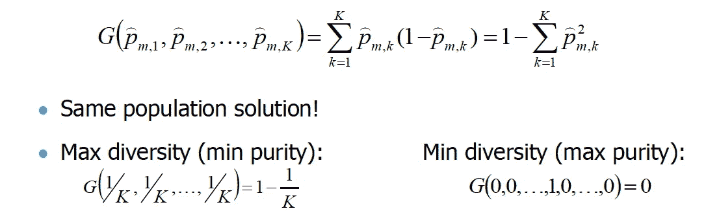

## 逻辑游戏:

1.  在每次分割中，将所有预测值视为可能的分割属性。对于每个预测因子，将数据拆分成几个拆分点，然后通过评估基尼指数(杂质)或熵(信息增益)的改善程度，为每个特定的预测因子(自变量)选择最佳的拆分点。重复选择每个预测值的最佳分割点，然后通过评估同一水平上所有“最佳”分割点的基尼指数(杂质)或熵(信息增益)的改善来选择最终的最佳分割点。
2.  重复步骤 1，递归地将树分割成子树，直到我们满足下面的一些停止标准。

**停止标准:**

1.  我们可以设置一个**阈值**作为**最大纯度(最小多样性程度)**，当节点 Gini 指数值达到阈值时停止分裂，因为 Ginni 指数值越小越好。
2.  我们可以设置一个**阈值**作为每个叶子的**最小输入数，当父节点达到阈值时，树停止分裂。**
3.  我们可以设置一个**阈值**作为树可以前进的**最大深度**，当它到达树中的特定深度时，树停止分裂。
4.  所有记录的预测值都相同。

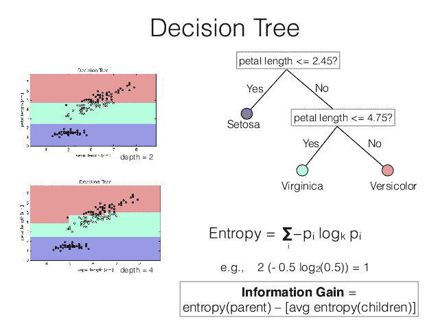

[https://pt.slideshare.net/SebastianRaschka/nextgen-talk-022015/24-Decision_TreeEntropy_depth_4petal_length](https://pt.slideshare.net/SebastianRaschka/nextgen-talk-022015/24-Decision_TreeEntropy_depth_4petal_length)

# 随机森林分类

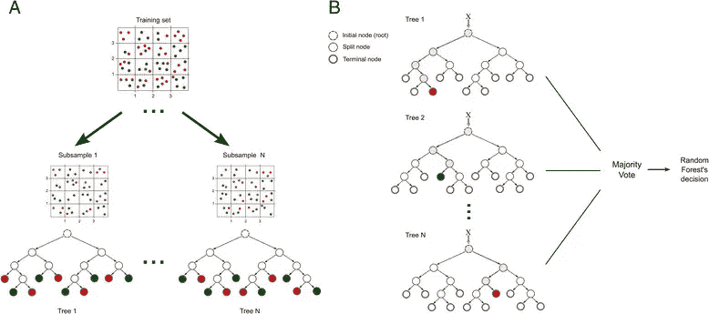

[https://www.researchgate.net/figure/Random-forest-model-Example-of-training-and-classification-processes-using-random_fig5_280533599](https://www.researchgate.net/figure/Random-forest-model-Example-of-training-and-classification-processes-using-random_fig5_280533599)

因为决策树使用来自相同数据的不同训练集和测试集，并且没有回调调整，所以它们往往具有很高的方差。因此，随机森林算法看起来更健壮，因为它在训练时通过 **bagging 方法**在许多 bootstrap 样本(带替换的重采样)上构建了大量决策树，并使用跨越决策树的预测的**多数票做出最终预测。**

## 优势

*   **防止过度拟合**:通过将多数投票作为预测响应，过度拟合的风险显著降低。

## **劣势**

*   它更加复杂，因此在运行时的复杂性上更加昂贵。
*   很难解释或想象这个模型。

# k-最近邻分类(KNN)

[https://www.python-course.eu/k_nearest_neighbor_classifier.php](https://www.python-course.eu/k_nearest_neighbor_classifier.php)

在 KNN 分类中，输出是一个**类成员**，该对象通过其邻居的多数投票被分类(K 是一个**正整数**，通常很小)。如果 K= 1，那么该对象被简单地分配给该单个最近邻的类。

由于 KNN 算法的目的是**根据最近距离**找到邻居，所以理解计算距离的方法很重要。

[https://www.saedsayad.com/k_nearest_neighbors.htm](https://www.saedsayad.com/k_nearest_neighbors.htm)

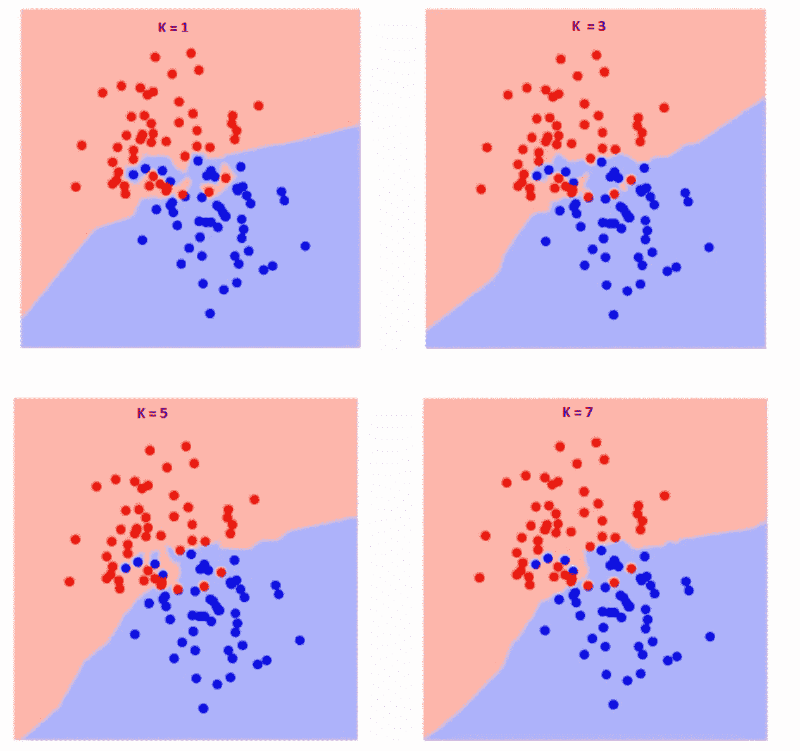

[https://www.analyticsvidhya.com/blog/2018/03/introduction-k-neighbours-algorithm-clustering/](https://www.analyticsvidhya.com/blog/2018/03/introduction-k-neighbours-algorithm-clustering/)

正如我们所看到的，当我们增加 k 时，不同类的边界变得更平滑。

*   大 K =简单模型=拟合不足=低方差和高偏差
*   小 K =复杂模型=过度拟合=高方差和低偏差

为了获得最佳 K 值，我们需要查看不同 K 值上的训练错误率和验证错误率的变化。

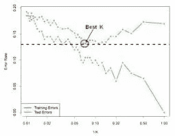

[https://gerardnico.com/data_mining/knn](https://gerardnico.com/data_mining/knn)

# 朴素贝叶斯分类

在机器学习中，**朴素贝叶斯分类器**是一族简单的 [**概率分类器**](https://en.wikipedia.org/wiki/Probabilistic_classifier)**基于应用 [**贝叶斯定理**](https://en.wikipedia.org/wiki/Bayes%27_theorem) 与强(朴素)[**独立性**](https://en.wikipedia.org/wiki/Statistical_independence) **假设**之间的特征。([https://en.wikipedia.org/wiki/Naive_Bayes_classifier](https://en.wikipedia.org/wiki/Naive_Bayes_classifier))**

**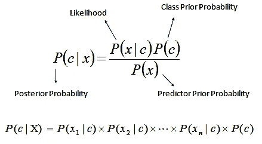**

**[https://mlalgorithm.wordpress.com/2016/06/11/naive-bayes-classification/](https://mlalgorithm.wordpress.com/2016/06/11/naive-bayes-classification/)**

**简而言之，朴素贝叶斯分类器假设一个类中特定特征的存在与任何其他特征的存在无关。**

****逻辑发挥:****

1.  **将**训练数据集**转换成**频率表**。**
2.  **通过找到**类先验概率**、**似然度**和**预测值先验概率**，创建一个似然度表。**
3.  **使用贝叶斯方程**计算每个类别**的后验概率 **。具有最高后验概率**的**类是预测**的**结果。****

****优点****

1.  **在测试数据集中**预测**简单快速，在多类分类中也表现良好。**
2.  **在假设**每个预测器**独立的情况下，与逻辑回归等其他模型相比，朴素贝叶斯分类器表现更好，并且需要更少的训练数据。**

****缺点****

1.  **如果有一个分类预测器在训练集中没有这样的类别，但在测试集中有，则模型将分配 0 概率，并且不能进行预测。 [**拉普拉斯平滑**](https://en.wikipedia.org/wiki/Additive_smoothing) 是克服这种情况的方法之一。**
2.  **在现实生活中，我们几乎不可能得到一组完全独立的预测值。**

# ****评估指标****

## **混淆矩阵**

**在我们继续度量评估我们的分类模型之前，我们需要理解**混淆矩阵**。**

**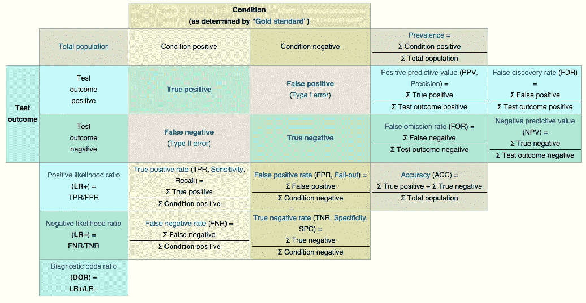**

**[https://en.wikipedia.org/wiki/Confusion_matrix](https://en.wikipedia.org/wiki/Confusion_matrix)**

## ****重要条款****

****准确性**是关于真实性的，它是对两种类型的观测误差的**统计偏差**的度量。因此，**高精度**要求**高精度和高召回率**(灵敏度)。当目标变量**在**数据中分类**接近平衡**时，精确度是一个很好的衡量标准。**

**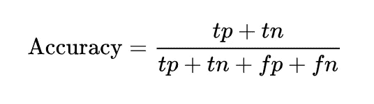**

**[https://en.wikipedia.org/wiki/Precision_and_recall](https://en.wikipedia.org/wiki/Precision_and_recall)**

****精度**是对**随机误差的测量。换句话说，**它用**表示模型捕捉到的阳性案例的百分比实际上是阳性的。** A **高精度**要求**低 I 型误差**。**

****回忆(敏感度)**是对**敏感度**的衡量。换句话说，它用**表示正确定义的实际阳性的百分比**。一个**高召回**要求**低二型错误**。**

**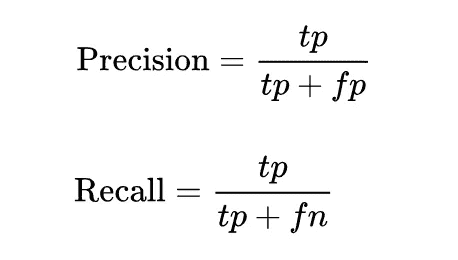**

**[https://en.wikipedia.org/wiki/Precision_and_recall](https://en.wikipedia.org/wiki/Precision_and_recall)**

****F1 分数**(范围从 0 到 1)是精度和召回的**调和平均值，越接近 1 表示型号越多。****

**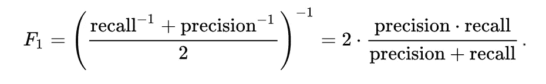**

**[https://en.wikipedia.org/wiki/Precision_and_recall](https://en.wikipedia.org/wiki/Precision_and_recall)**

## **AUC-ROC**

**AUC-ROC 可视化是评估**分类模型性能**的指标之一。一个好的业绩分类模型在 AUC-ROC 可视化中会有一条**非常凹的曲线**。**

**AUC (曲线下的**rea)**的**最佳分数等于 1** ，因为在 2D 平面中，x 轴是从 0 到 1 范围内的**假阳性率(特异性)**，y 轴是从 0 到 1 范围内的**真阳性率(回忆/灵敏度)**。 **AUC** 表示 x 轴 ROC(受试者工作特性)**曲线下的**面积。******

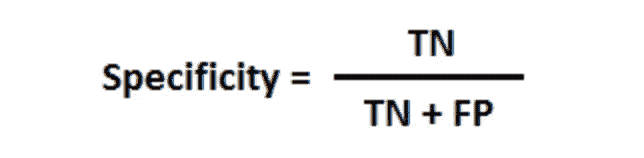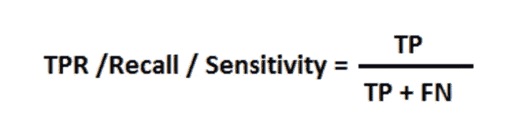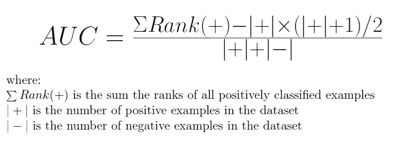

[https://staesthetic.wordpress.com/2014/04/14/gini-roc-auc-and-accuracy/](https://staesthetic.wordpress.com/2014/04/14/gini-roc-auc-and-accuracy/)

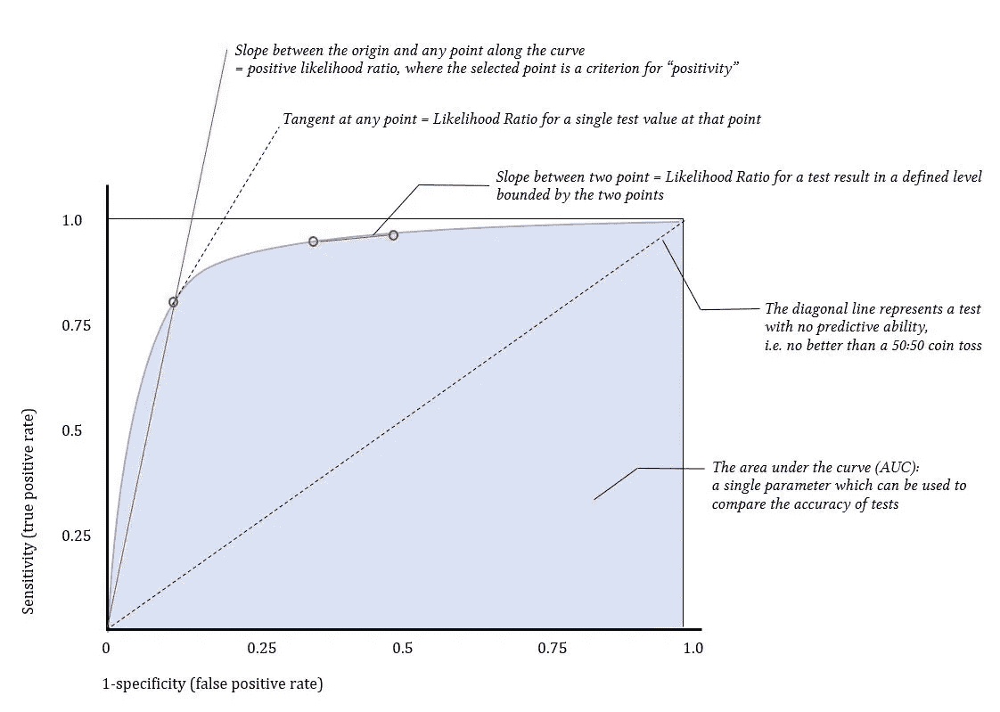

[https://derangedphysiology.com/main/cicm-primary-exam/required-reading/research-methods-and-statistics/Chapter%203.0.5/receiver-operating-characteristic-roc-curve](https://derangedphysiology.com/main/cicm-primary-exam/required-reading/research-methods-and-statistics/Chapter%203.0.5/receiver-operating-characteristic-roc-curve)

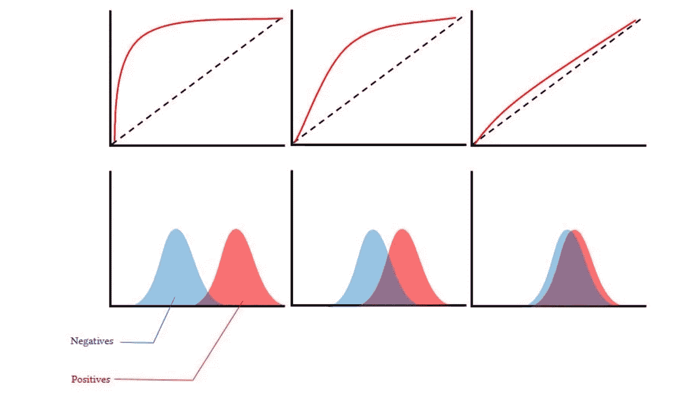

[https://derangedphysiology.com/main/cicm-primary-exam/required-reading/research-methods-and-statistics/Chapter%203.0.5/receiver-operating-characteristic-roc-curve](https://derangedphysiology.com/main/cicm-primary-exam/required-reading/research-methods-and-statistics/Chapter%203.0.5/receiver-operating-characteristic-roc-curve)

## k 倍交叉验证

交叉验证是一种通过多次重采样来防止模型偏差和模型方差的方法。

K 倍交叉验证是指将数据集克隆 K 次，随机选择约 **20%的样本**作为每一倍样本的**固定测试集**，然后随机选择固定测试集之外 **15%的样本**作为**验证集**，剩余的**样本**作为**训练集**进行建模。

K-fold 交叉验证的**目的**是试图**比较每个 fold 中验证集和训练集之间的性能差异**(准确度、精确度、召回率或 AUC-ROC)，以查看某些 fold 中是否有任何显著差异。如果**没有显著的性能差异**，恭喜你，你的模型性能相当不错。如果模型性能中存在**一些显著差异**，这意味着分类模型是**过拟合或欠拟合**，并且在测试集中的性能应该不是那么好。

[https://www.datarobot.com/wiki/cross-validation/](https://www.datarobot.com/wiki/cross-validation/)

***如果有人发现我的错误，并在私信或评论区为我评论出来就好了！如果你认为我的工作很好，请给我轻轻的掌声。:)***

***感谢阅读，快乐阅读！***