# 在回归分析中热身

> 原文：<https://medium.datadriveninvestor.com/warm-up-in-regression-analysis-ed330cf08a6e?source=collection_archive---------6----------------------->

# **为什么要回归分析？**

回归分析是一种统计过程，用于估计自变量(预测值)和因变量(响应值)之间的关系。它有助于理解当任何一个自变量变化，而其他自变量保持不变时，因变量是如何变化的。

# 一些概述…

N ->数据点的数量

k ->对应于特定参数的权重(W)的数量

模型函数-> **Y=f(X，W)**

如果 **N < k** ，由于系统未定，不能进行回归分析。

若 **N=k** ，若 f 是线性的，X 是线性无关的，则有唯一解，若 f 是非线性的，则无穷多或无解。

如果 **N > k** ，有足够的信息用于最佳拟合模型，自由度为 N-k。

# 线性回归

线性回归是一种统计技术，根据自变量(预测值)预测因变量(响应)

回归分析的目标是使用总体中的样本来估计总体的特性。模型中的系数是对实际总体参数的估计，所以我们希望系数尽可能的好。

**在**建立线性回归模型之前，需要确保假设:

1.  线性:数学关系的性质，可以用直线来表示。
2.  同方差性:误差项在独立变量的所有水平上的均值为 0 且有限方差相等。
3.  多元正态性:假设残差是正态分布的。
4.  误差的独立性:残差彼此不相关。
5.  缺乏多重共线性:没有一个自变量与另一个自变量完全相关。

两种线性回归模型:**简单线性回归**，和**多元线性回归**。

**a)** 如果只有一个自变量(预测因子/特征)，那么就是简单线性回归。

**b)** 如果有一个以上的自变量(预测因子/特征)，那么就是多元线性回归。

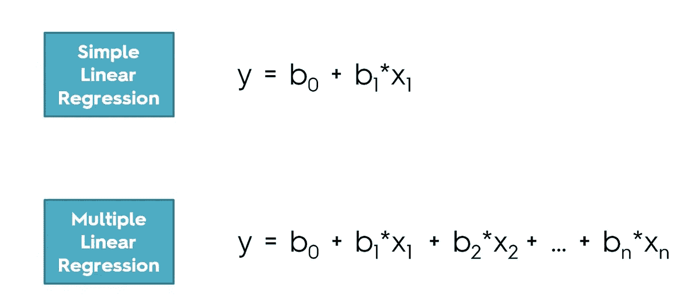

[https://www.udemy.com/machinelearning/learn/v4/t/lecture/5732730?start=0](https://www.udemy.com/machinelearning/learn/v4/t/lecture/5732730?start=0)

对于**分类变量，**,我们需要创建虚拟变量来转换分类变量的信息。(注意:我们总是需要省略一个虚拟变量，因为既然 n-1 个虚拟变量是已知的，那么我们将知道最后一个！)

# **多项式回归**

多项式回归将自变量和因变量之间的关系揭示为自变量中的 n 次多项式**。通常，多项式回归函数是非线性函数，它可以用离散或连续的特征来拟合。这是一种**防止线性回归的欠拟合问题**的方法，因为它增加了模型的复杂性。**

****

**[https://www.originlab.com/index.aspx?go=Products/Origin/DataAnalysis/CurveFitting](https://www.originlab.com/index.aspx?go=Products/Origin/DataAnalysis/CurveFitting)**

# **逻辑回归(用于分类的线性分类器)**

**逻辑回归是使用逻辑模型从预测因子的线性组合中预测二元结果。与输出一组数值的线性回归不同，逻辑回归将输出给定输入属于特定类的概率。**

**当因变量为**二元、**时进行逻辑回归，可以是**离散或**连续。在**逻辑回归**中，响应(因变量)有有限数量的可能结果。**

**添加独立变量总是会增加模型的方差，使其趋向于**过度拟合。****

****在**建立逻辑回归模型之前，需要确保假设:**

1.  **因变量(响应)本质上应该是二元的。**
2.  **数据中没有异常值。**
3.  **缺乏多重共线性:没有一个自变量与另一个自变量完全相关。**
4.  **需要确保输入数据可以分成两个有直线感知器边界的“区域”。**

**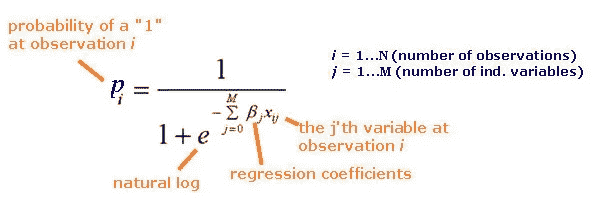**

**[https://www.biomedware.com/files/documentation/spacestat/Statistics/Multivariate_Modeling/Regression/Implementation_of_Logistic_GWR.htm](https://www.biomedware.com/files/documentation/spacestat/Statistics/Multivariate_Modeling/Regression/Implementation_of_Logistic_GWR.htm)**

****

**[https://www.saedsayad.com/logistic_regression.htm](https://www.saedsayad.com/logistic_regression.htm)**

****为什么 logistic 回归模型的阈值是 0.5？****

**由于最优化技术寻找最佳的 sigmoid 曲线，我们应用 MLE 来估计参数。标准是我们需要尽最大努力使每个标记为“1”的样本都有一个接近 1 的逻辑函数结果，对于标记“0”也是如此。**

# ****决策树回归****

**基于树的模型:它将数据分解成越来越小的子集，同时一个相关的决策树被增量开发。最终的结果是一棵有**个决策节点**和**个叶节点**的树。**

**如果目标变量是具有**无限可能结果**的连续数值，那么该决策树称为**回归树。****

**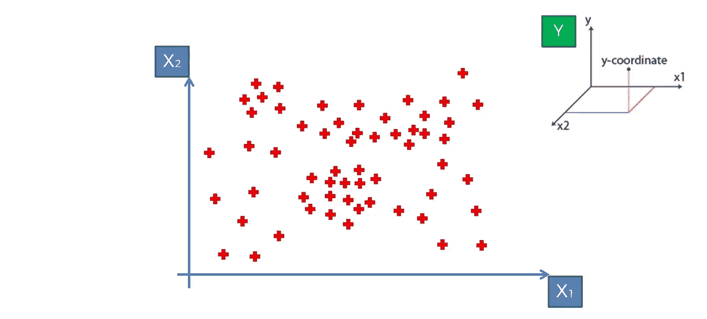**

**[https://www.udemy.com/machinelearning/learn/v4/t/lecture/5732730?start=0](https://www.udemy.com/machinelearning/learn/v4/t/lecture/5732730?start=0)**

****数学公式:****

**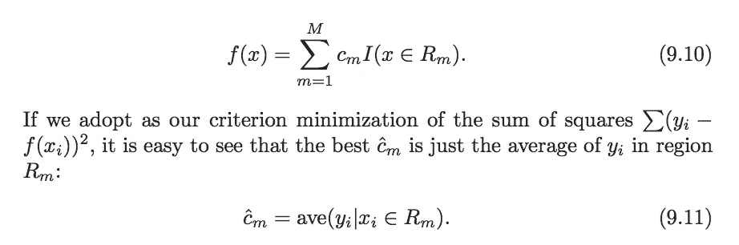**

**[https://web.stanford.edu/~hastie/Papers/ESLII.pdf](https://web.stanford.edu/~hastie/Papers/ESLII.pdf)**

**决策树的**逻辑**是**递归地将树分裂成二进制子树:****

1.  **在每次分割中，将所有预测值视为可能的分割属性。对于每个预测值，将数据拆分成若干个拆分点，然后通过评估误差平方和(SSE)为特定预测值(自变量)选择最佳拆分点(最低为最佳)。重复为每个预测值选择最佳分割点，然后通过评估同一级别所有预测值的所有“最佳”分割点的误差平方和来选择最终的最佳分割点。**
2.  **重复步骤 1，递归地将树分割成子树，直到我们满足下面的一些停止标准。**

****停止准则**:由于决策树可以一直分裂到每个节点只有一个元素。通常，这样的树是非常复杂的，并且导致具有高模型方差的过度拟合。因此，需要设置一个停止标准。**

1.  **我们可以设置一个**阈值**作为每片叶子的**最小输入数**，当父节点达到阈值时，树停止分裂。**
2.  **我们可以设置一个**阈值**作为树可以前进的**最大深度**，当它到达树中的特定深度时，树停止分裂。**
3.  **我们可以设置一个**阈值**作为**目标平方和误差**，当与它的父节点相比有一个大于阈值的大的下降时，树停止分裂。但是，根据贪婪算法，在坏的分割之后找到好的分割是可能的。(不健壮)**
4.  **所有记录的预测值都相同。**

**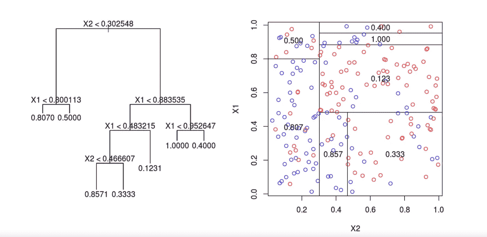**

**[https://www.datacamp.com/community/tutorials/decision-trees-R](https://www.datacamp.com/community/tutorials/decision-trees-R)**

**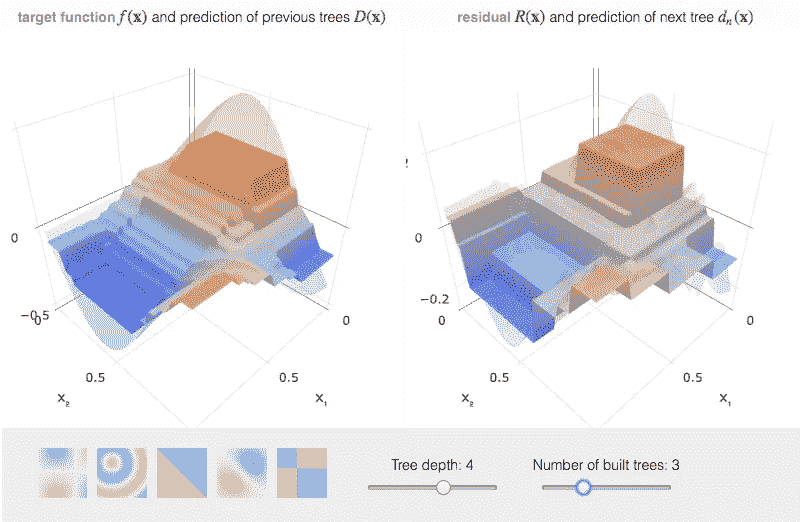**

**[http://arogozhnikov.github.io/2016/06/24/gradient_boosting_explained.html](http://arogozhnikov.github.io/2016/06/24/gradient_boosting_explained.html)**

****值得一提的是:**回归中决策树的‘区域’必须满足以下标准:**

**a)不相交(没有并行分裂感知器进入另一个分裂感知器)**

**b)覆盖整个空间(分裂感知器必须分裂整个涉及的空间)**

****优点:****

**a.易于理解和解释。**

**b.几乎不需要数据准备—标准化。**

**c.比其他方法更能反映人类的决策。**

****缺点:****

**a.训练数据的小变化会引起决策树的大变化。**

**b.实际的决策树学习算法是基于启发式的，例如[贪婪算法](https://en.wikipedia.org/wiki/Greedy_algorithm)，在每个节点做出局部最优决策。这种算法不能保证返回全局最优的决策树。**

# ****随机森林回归****

****随机森林**模型是在训练时通过 **bagging 方法**在许多 bootstrap 样本(带替换的重采样)上构建大量决策树，并使用跨树预测的**平均值**进行最终预测。**

**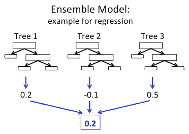**

**[https://databricks.com/blog/2015/01/21/random-forests-and-boosting-in-mllib.html](https://databricks.com/blog/2015/01/21/random-forests-and-boosting-in-mllib.html)**

****优点:****

**a)防止过度拟合:通过平均来自树的预测，显著降低过度拟合的风险，因此更准确。**

**b)在大型数据库上高效运行，它可以处理成千上万的输入变量，无需删除变量。**

# **支持向量回归机**

**SVR 是一种支持线性和非线性回归的支持向量机。**

**它由支持向量机(SVM)产生，仅依赖于训练数据的子集，因为用于建立模型的成本函数忽略了任何接近模型预测的绝对差值ε内的训练数据。**

**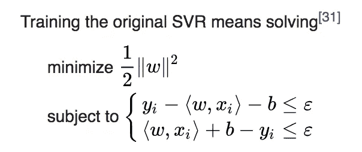**

**[https://en.wikipedia.org/wiki/Support_vector_machine](https://en.wikipedia.org/wiki/Support_vector_machine)**

**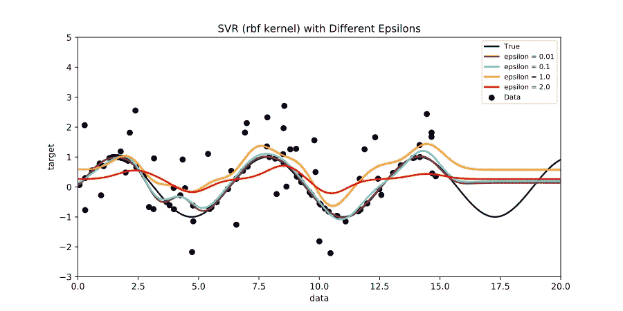**

**[https://upload.wikimedia.org/wikipedia/commons/7/7a/Svr_epsilons_demo.svg](https://upload.wikimedia.org/wikipedia/commons/7/7a/Svr_epsilons_demo.svg)**

**使用不同的阈值 *ε，*模型更平坦。随着 *ε* 的增加，预测对误差变得不太敏感。**

****

**[http://research.ncku.edu.tw/re/articles/e/20080620/images/080526035813E4MDyJ.gif](http://research.ncku.edu.tw/re/articles/e/20080620/images/080526035813E4MDyJ.gif)**

# **优化技术:**

1.  ****最大似然估计(更多细节将在最新帖子中发布)**:**

**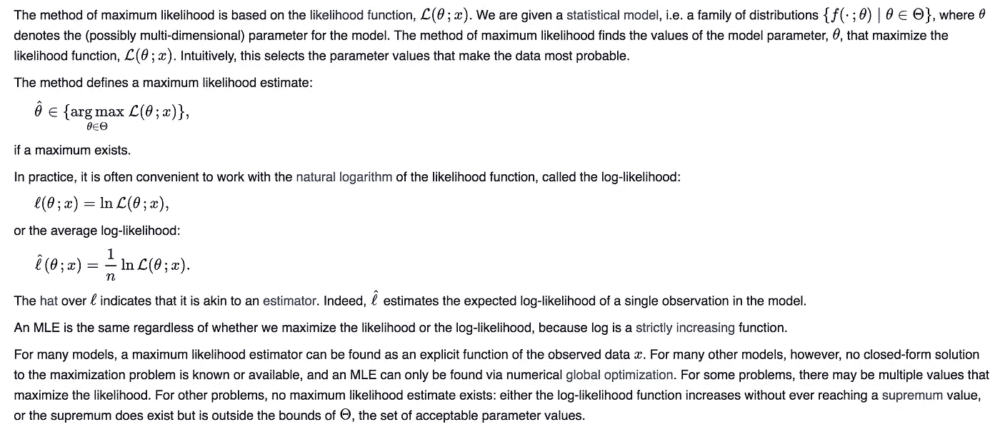**

**[https://en.wikipedia.org/wiki/Maximum_likelihood_estimation](https://en.wikipedia.org/wiki/Maximum_likelihood_estimation)**

**2.**最小二乘估计**:**

**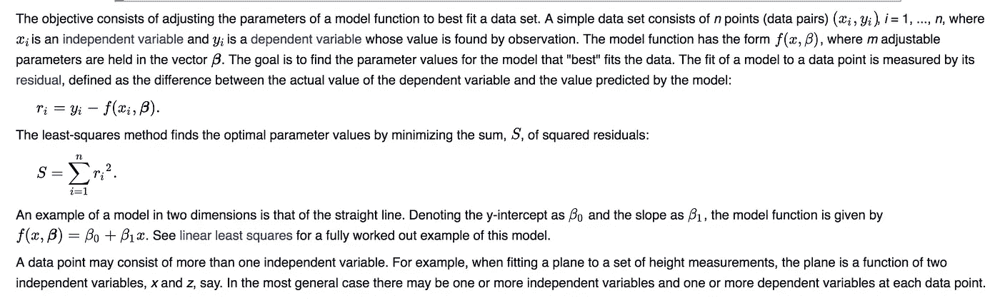**

**[https://en.wikipedia.org/wiki/Least_squares](https://en.wikipedia.org/wiki/Least_squares)**

# **回归模型评估指标…..！**

1.  ****RSME(均方根误差)**:表示预测值与观测值之差的样本标准差，又称残差。公式是:**

****

**2. **MAE (mean absolute error)** :表示预测值与实际值的绝对差值，也表示所有个体差异的权重相等。公式是:**

****

**RMSE 诉斯梅:**

**相似之处:它们的范围都是从 0 到 1，值越低表示结果越好。**

**差异:**

**a.MAE 直接取偏移量的平均值，RMSE 对实际值和预测值之间的较高差值的惩罚大于 MAE。**

**b.RMSE ≥ MAE，并且只有当实际值和预测值之间的所有差异为零时，它们才彼此相等。**

**c.RMSE 更实用，因为 RMSE 定义的损失函数是光滑可微的，在数学运算中更容易实现。**

****

**[https://en.wikipedia.org/wiki/Coefficient_of_determination](https://en.wikipedia.org/wiki/Coefficient_of_determination)**

**d.RMSE 更容易解决，但 MAE 对异常值更稳健。**

**3. **R 平方( *R* 2)** :表示自变量解释因变量方差的比例。换句话说，它衡量的是观察到的结果被模型复制的有多好。公式是:**

**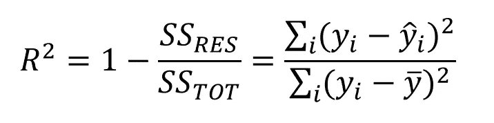**

**[https://en.wikipedia.org/wiki/Coefficient_of_determination](https://en.wikipedia.org/wiki/Coefficient_of_determination)**

**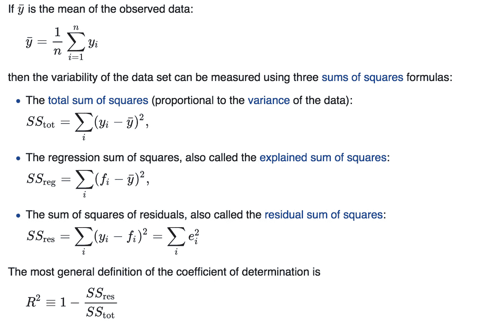**

**[https://en.wikipedia.org/wiki/Coefficient_of_determination](https://en.wikipedia.org/wiki/Coefficient_of_determination)**

**4.**调整后的 R 平方**:它测量自变量与曲线或直线以及 R2 拟合的程度，但根据模型中自变量的数量进行调整。公式是:**

****

**[https://en.wikipedia.org/wiki/Coefficient_of_determination](https://en.wikipedia.org/wiki/Coefficient_of_determination)**

**R2 诉美国调整后的 R2:**

**a.R2 随着更多自变量的加入而增加或保持不变，即使它们与因变量没有关系。**

**b.调整后的 R2 提供了对 R2 统计的调整，例如自变量与因变量具有强相关性时，调整后的 R2 会增加，但在添加变量与因变量不具有强相关性时会减少。**

# **回归评估指标的利弊:**

1.  **如果我们只关心模型的准确性，RMSE 是更好的选择。**
2.  **任何像 MAE 这样不取差的平方的指标对异常值都更稳健。**
3.  **当大误差特别不理想时，误差项度量的任何平方应该更有用。**

**如果有人发现我的错误，并在私信或评论区为我评论出来，那就太好了！如果你觉得我的工作不错，请轻轻给我掌声 ssss :)**

*****感谢阅读，快乐阅读！*****