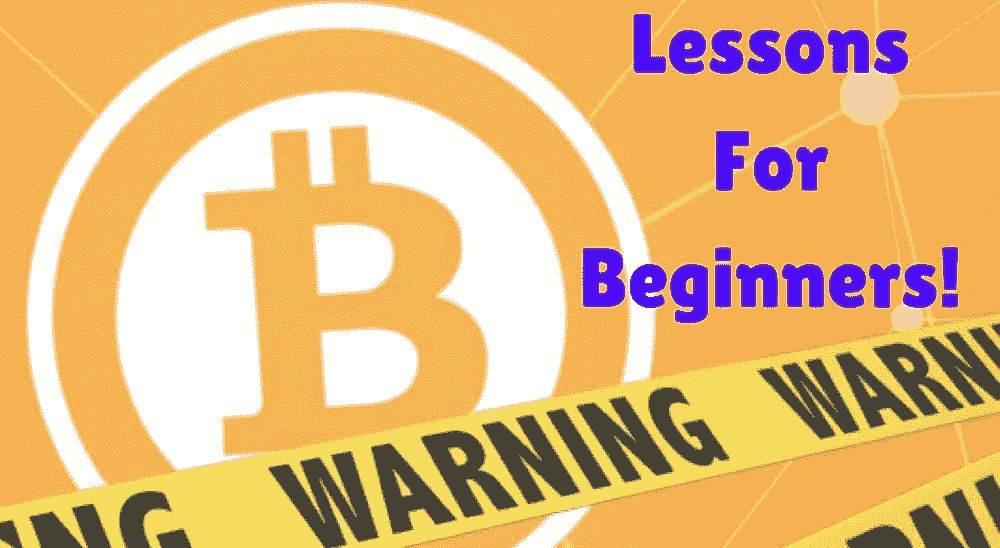

# 警告:不要把你的比特币留在交易所

> 原文：<https://medium.datadriveninvestor.com/warning-dont-leave-your-bitcoins-on-an-exchange-67bb3fd1d756?source=collection_archive---------9----------------------->

无论你选择投资哪种类型的加密货币，你都应该有一个规则来存储这些硬币。如果你想知道为了方便起见，你是否应该把硬币放在加密货币交易所的钱包里，这个问题的简单答案是否定的

永远不要把你的钱留在加密货币交易所。你会问为什么？因为这些存储区域可能会被侵入、掠夺、抢劫和窃取。如果你是这个游戏的新手，在没有真正熟悉加密货币的历史以及为其服务的交易所的情况下就加入进来，那么你可能还没有听说过 Bithumb 的故事。

Bithumb 是韩国一家主要的加密货币交易所，现在有报道称朝鲜黑客闯入了这家交易所。我们现在被告知，黑客不仅窃取了在交易所交易的用户的个人信息，还窃取了价值超过 8000 万美元的加密货币。

你要的那些钱他们是怎么弄到的？因为使用交易所的人把他们的硬币存放在那里。不要误解我们，有时不在交易所存储加密货币几乎是不可能的，特别是如果你试图快速进出交易。然而，如果你是一个长期玩家，并且知道你不会在一周左右的时间内卖出，那么请努力使用一些预防措施来保护你的钱。

你可能会问，我可以把我的加密货币安全地放在比特币基地或类似的地方吗？答案通常是否定的。比特币基地不久前遭到黑客攻击，主要原因是用户更喜欢便利而不是安全，因为像在线银行服务一样，这个存储区域只使用用户名和密码来保证安全。很明显，无论你认为你的密码有多好，它在密码世界里都是不够的。

像谷歌 2 因素认证是一个很好的方法，可以让你的账户更加安全。启用双因素身份验证时，您的身份验证增加了一层额外的安全性。这种身份验证协议首先使用密码，然后要求用户拥有一个可以接收密码的设备，该密码将被输入以解锁帐户。假设没有其他人会有这个设备，只有你能收到允许访问的信息。这是万无一失吗？不，众所周知，没有什么是万无一失的，但它肯定比只使用密码要好。

保护加密货币的最佳方式是使用像 Ledger Nano S 或 Trezor 硬件钱包这样的存储设备。[加密货币投资者](https://cryptoinvestinginsider.com/blog/beginners-guide-to-investing-in-cryptocurrencies/)也可以在电脑上使用桌面钱包，如果可能的话，除了加密货币兑换和存储之外，不要将电脑用于任何其他目的。这台电脑不应该被用来浏览互联网，连接到游戏服务器，或其他任何会给黑客机会进入你的系统，并试图窃取你的钱。一台便宜的笔记本电脑应该就可以了。

请记住，任何与加密有关的东西，除非它一直在你的直接控制之下，否则都是易受攻击的，但采取这些步骤可以让你对加密货币相对放心。永远记住，在大多数情况下，便利导致加密世界的脆弱性。

*原载于 2018 年 6 月 11 日*[*【cryptoinvestinginsider.com*](https://cryptoinvestinginsider.com/blog/warning-dont-leave-your-bitcoins-on-an-exchange/)*。*

