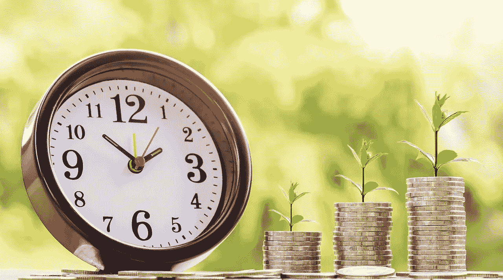
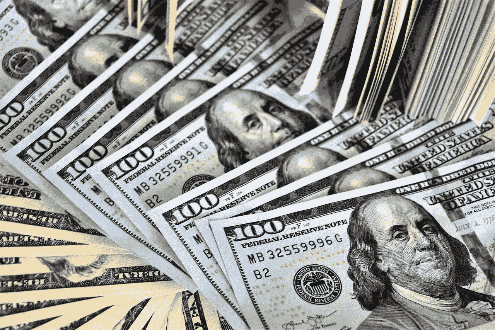
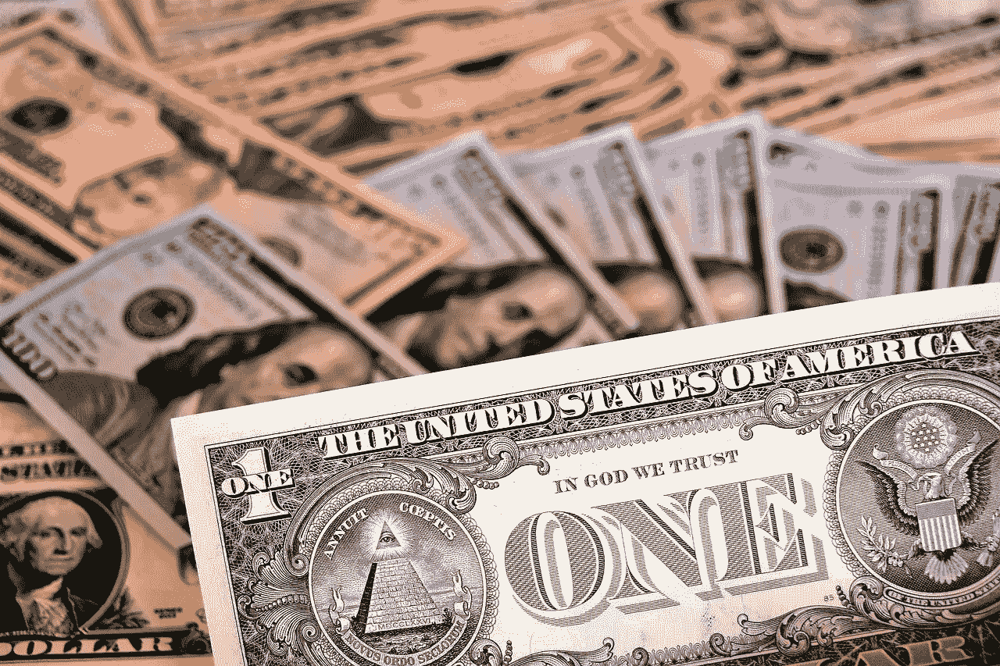
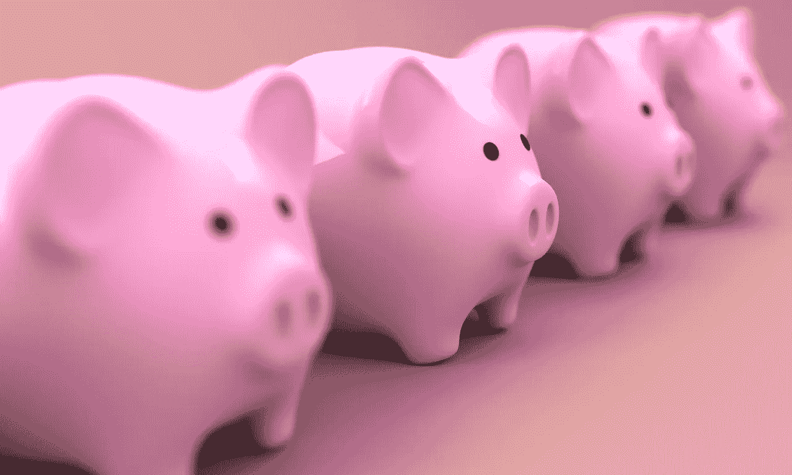
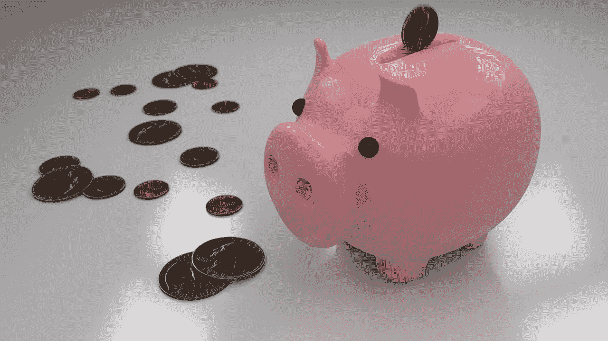

# 沃伦·巴菲特的现金之家:伯克希尔·哈撒韦公司

> 原文：<https://medium.datadriveninvestor.com/warren-buffetts-house-of-cash-berkshire-hathaway-29036c6acb8c?source=collection_archive---------0----------------------->

"在伯克希尔，整体大于——远远大于——各部分的总和."——沃伦·E·巴菲特伯克希尔哈撒韦公司董事会主席，摘自 2018 年股东信。

伯克希尔哈撒韦公司(纽约证券交易所代码:BRK。A) 很容易理解，因为它是沃伦·巴菲特的现金之家。本质上，**伯克希尔哈撒韦公司(纽约证券交易所代码:BRK。B)** 旨在积累尽可能多的现金。

 [## 投资算法快速指南-数据驱动投资者

### 让我们想象一下 30 年前的股票市场:让我们想象一下现在:像现在的许多其他领域一样，投资市场已经…

www.datadriveninvestor.com](https://www.datadriveninvestor.com/2019/01/31/a-quick-guide-to-investment-algorithms/) 

例如，伯克希尔·哈撒韦公司在 2018 年 12 月 31 日拥有 1118.7 亿美元的现金和短期投资。重要的是，这一数字低于 2017 年 12 月的 1159.9 亿美元，但高于 2018 年 9 月的 1036.4 亿美元。值得注意的是，伯克希尔在 2018 年第三季度积累了 82.3 亿美元的现金。

因此，价值投资者需要问一问伯克希尔哈撒韦公司是如何获得这么多现金的。奇怪的是，我可以用一个简单的词来解释巴菲特现金屋的成功:浮存。具体来说，巴菲特设计伯克希尔公司产生大量的浮存金，从而获得大量现金。

# **巴菲特的现金之家如何积累更多现金**

特别是，巴菲特本人估计，伯克希尔哈撒韦公司，汽车保险巨头 GEICO 在 2018 年产生了价值 221 亿美元的浮存金。此外，巴菲特在其 2018 年[股东信](http://www.berkshirehathaway.com/letters/2018ltr.pdf)中计算出 GEICO 的浮存金从 1995 年的 25 亿美元增长到 2018 年的 221 亿美元。

澄清一下，浮存金是沃伦大叔对保险公司从保费中获得的现金的昵称。具体来说，浮存金是保险费和已付赔款之间的差额。例如，GEICO 通过销售人们需要的产品来产生浮存金；汽车保险，分期付款。如果投保人想要保险，他或她必须每月支付现金。

然而，浮存金可以指一个企业所接受的任何定期的现金支付。例如，租金、抵押付款、贷款付款、信用卡付款、汽车付款、广告付款、报纸或杂志订阅和公用事业付款。

# **浮存金是巴菲特现金屋的钥匙**

因此，伯克希尔·哈撒韦公司的投资组合中充斥着股票和上市公司。

例如，公用事业控股公司[，伯克希尔哈撒韦能源](https://www.berkshirehathawayenergyco.com/)。伯克希尔旗下的公用事业公司如 NV Energy 产生浮存金，因为如果用户需要电力，他们必须每月支付账单。

很能说明问题的是，伯克希尔·哈撒韦持有的五大股票包括信用卡巨头**美国运通(纽约证券交易所:AXP)** 、**苹果(纳斯达克:AAPL)** 、**富国银行(纽约证券交易所:WFC)** 、**可口可乐(纽约证券交易所:KO)** 和**美国银行(纽约证券交易所:BAC)** 。很明显，这五家公司中的四家。美国运通、苹果、美国银行和富国银行产生浮存。

首先，美国运通从所有信用卡支付中产生浮存金。值得注意的是，美国运通要求持卡人每月支付余额。其次，富国银行和美国银行是通过贷款、抵押贷款和信用卡支付创造浮存的银行。

第三，苹果通过 iTunes、Apple Music、App Store 和其他订阅收集 float。值得注意的是，苹果音乐的价格可能是每月 9.99 美元，家庭每月 14.99 美元，学生每月 4.99 美元，12 个月订阅 99 美元， *TechCrunch* [报道](https://techcrunch.com/2017/06/19/apple-music-quietly-added-a-99-annual-subscription-plan/)。因此，巴菲特拥有苹果是因为它的浮存。

# **为什么巴菲特喜欢现金**

巴菲特喜欢积累现金，因为他可以用这些现金来提高伯克希尔哈撒韦公司积累更多现金的能力。

因此，伯克希尔哈撒韦公司在 2009 年支付了 260 亿美元获得了伯灵顿北圣达菲铁路公司(BNSF)的完全控制权。BNSF[2018 年第四季度的营业收入为 62.06 亿美元，净收入为 13.72 亿美元，营业收入为 20.61 亿美元。](https://www.bnsf.com/about-bnsf/financial-information/pdf/4q-2018.pdf)

此外，BNSF 2018 年的同比收入增长了 12%。与此同时，BNSF 的净收入在 2018 年增长了 34%，铁路的营业收入在 2018 年增长了 8%。因此，巴菲特知道如何将现金转化为收入和收益。

巴菲特可以买下 Burlington Northern Santa Fe，因为他在 2009 年拥有大量现金。因此，巴菲特在 2008 年金融大崩溃期间变得更加富有，因为他的现金。

# 巴菲特的现金之家产生了多少钱？

在这种情况下，**伯克希尔哈撒韦公司(纽约证券交易所代码:BRK。在不景气的年份赚很多钱。**

例如，伯克希尔·哈撒韦公司 2018 年第四季度的净收入为-253.92 亿美元，季度毛利为-250.13 亿美元，营业收入为-280.13 亿美元。相比之下，伯克希尔哈撒韦公司报告 2018 年的年毛利为 100.21 亿美元，年营业收入为 100.21 亿美元，年净收入为 40.21 亿美元。

为了澄清，巴菲特在 2018 年的信中将这些损失归咎于公认会计准则(GAPP)的变化。具体来说，新的 GAPP 规则要求伯克希尔哈撒韦公司在 2018 年第四季度财务报告中记录非现金和资本利得损失。

然而，巴菲特指出，伯克希尔·哈撒韦公司在 2016 年至 2018 年间持续且令人满意的运营收益增长了 41%。相比之下，伯克希尔·哈撒韦公司 2016 年的运营收益为 176 亿美元，2018 年为 248.166 亿美元，这一数字令人满意。

# 伯克希尔·哈撒韦公司产生了多少现金？

好吧，那么多现金是巴菲特的现金之家产生的吗？不出意料，答案是很多。

例如，伯克希尔·哈撒韦公司 2018 年第四季度的自由现金流为 63.48 亿美元，运营现金流为 108.45 亿美元。因此，沃伦叔叔在浮动汇率和美国的大赌注正在得到回报。

此外，伯克希尔哈撒韦公司仍有能力创造大量收入。例如，伯克希尔 2018 年第四季度的收入为 2253.8 亿美元，2018 年第三季度为 2561.4 亿美元。

因此，当 ycharts 给出 2018 年第四季度的季度利润率为 [-90.02%](https://ycharts.com/companies/BRK.A) 时，伯克希尔·哈撒韦仍然赚钱。伯克希尔可以轻松消化这些损失，因为它积累了大量现金。

# **是伯克希尔·哈撒韦公司(BRK。b)周围最好的成长股？**

在这种情况下，我认为伯克希尔·哈撒韦公司是增长最快的股票之一，因为它持续增长的运营收益和现金令人满意。

因此，如果没有股息你也能生存，伯克希尔哈撒韦 B 类(纽约证券交易所代码:BRK。b)在 2019 年 3 月 8 日报告的 198.70 美元的价格下，非常值得纳入您的投资组合。我的预测是，在未来很长一段时间内，沃伦·巴菲特的现金储备将不断增加。

最后，请阅读沃伦大叔 [2018 伯克希尔哈撒韦股东信](http://www.berkshirehathaway.com/letters/2018ltr.pdf)。一如既往，你会像我一样从中学到新的东西。