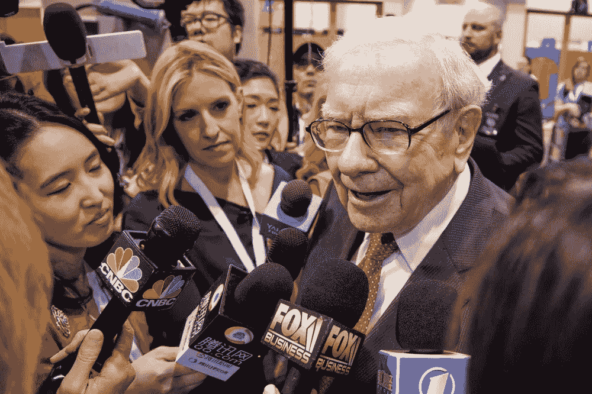

# 沃伦·巴菲特和 3G:问题多于答案

> 原文：<https://medium.datadriveninvestor.com/warrenbuffett-and-3g-more-questions-than-answers-fe27836b4f87?source=collection_archive---------9----------------------->

这篇文章的主要目的是试图获得专家的帮助，为越来越多的问题提供答案。这位奥马哈先知接受了标志性投资公司 3G 的三位创始合伙人，并罕见地推迟了授权，让后者掌管卡夫亨氏(Kraft Heinz)，尽管 3G 的经济利益并没有超过伯克希尔哈撒韦(Berkshire Hathaway，BRK)的利益。一，BRK。b)在开始时。

可以说，早在巴菲特之前，我就是 3G 的粉丝，但现在它已经失去了众所周知的“点石成金”的魅力，而 KHC 如今是一个极端的反向投资者。我非常赞赏 3G 及其成就，特别是让他们的百威英博成为我 2017 年的书*中的明星之一，反对#空头主义*。

 [## 算法交易的机器学习|数据驱动的投资者

### 当你的一个朋友在脸书上传你的新海滩照，平台建议给你的脸加上标签，这是…

www.datadriveninvestor.com](https://www.datadriveninvestor.com/2019/01/30/machine-learning-for-stock-market-investing/) 

将近半年前(2 月 24 日)，我在这里写了以下内容。“作为奥马哈先知最坚定的追随者之一，我必须关注他的一举一动，尽我所能预测他接下来可能会做什么。近年来，沃伦·巴菲特(Warren Buffett)曾直言不讳地“抱怨”(包括在他向伯克希尔·哈撒韦(Berkshire Hathaway)股东极力推荐的年度致股东信中)缺乏有吸引力的大规模收购目标。

这位奥马哈先知总是回避敌意收购，在竞争性投标中他也不付钱。这位传奇投资者感到遗憾的是，私人股本公司的现金太多，导致像他这样的价值投资者获利甚微。

在我 2018 年 5 月发表的一篇关于消费巨头品牌价值前景的文章中，我对卡夫亨氏(Kraft Heinz)等公司的前景感到好奇。我对这类公司品牌价值可持续性的信念已经开始动摇，而且在过去一年里还在继续。

在我写这篇文章的时候，我看了 KHC 的股票后，决定购买 ***而不是*** ，尽管事实上像 KHC 上周经历的抛售是我喜欢的典型购买机会。我不愿意扣动扳机。就像我在 2018 年 5 月的文章中所做的那样，我请更好的分析师来启发我。我只是没有足够的信心去直接参与。不过，我必须注意，因为我越来越想知道沃伦·巴菲特(Warren Buffett)可能会采取什么措施。

KHC 会是沃伦·巴菲特一直在等待的大象吗？当然，根据昨天的股东信，伯克希尔哈撒韦公司已经拥有 325，442，152 股股票，这使得该集团拥有这家食品公司 27%的股份，并与 3G 资本共同控制。伯克希尔哈撒韦公司和 3G 可能会认真考虑将卡夫亨氏私有化吗？

收购 KHC 肯定会给沃伦·巴菲特一个机会来削减伯克希尔公司超过 1120 亿美元的流动性，并可能在这个食品巨头中持有比其运营伙伴更多的股份，但这是一个好主意吗？我将遵从奥马哈先知的智慧。

他当然知道得更多。就我个人而言，我现在会保持观望。事实是(在我看来),公众市场的关注和华尔街对季度数据的持续关注确实使卡夫亨氏应该关注的长期规划更具挑战性，尽管奥马哈先知在对照组中。"

关于 KHC 传奇给沃伦·巴菲特带来的持续“头痛”的新闻报道比比皆是，所以我在这里就不转述了。鉴于许多读者比我更熟悉 3G(更不用说奥马哈先知了)，我的目标是问*你*巴菲特与 3G 的关系会如何发展。

***换句话说，我正试图“众包”一个关于巴菲特先生与 3G 未来关系的更知情和更全面的观点，尤其是在他们共同投资 KHC 的背景下。救命啊！***