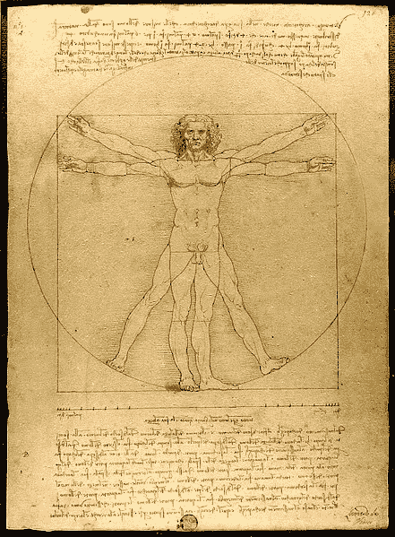
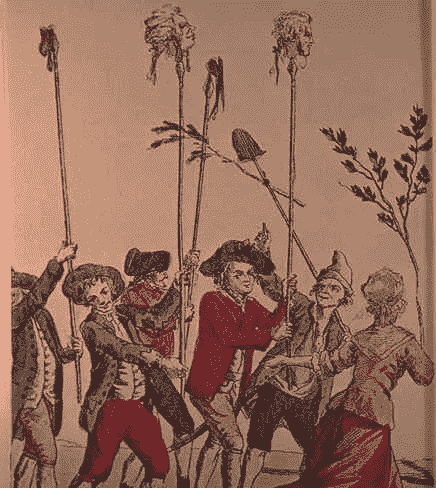
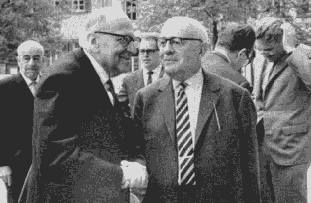
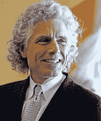

# 启蒙运动从一开始就注定了吗…

> 原文：<https://medium.datadriveninvestor.com/was-the-enlightenment-doomed-from-the-start-61d539112384?source=collection_archive---------5----------------------->

Source: [Wikipedia](https://en.wikipedia.org/wiki/Sinking_of_the_RMS_Titanic)

## …就像泰坦尼克号？

人们很少遵从理性生活，因为他们之间的事物是如此有序，以至于他们通常会互相嫉妒和制造麻烦。然而，他们几乎不能过孤独的生活，所以人类作为社会动物的定义已经得到了普遍的认同；事实上，男人确实从社交生活中得到更多的便利而不是伤害。本尼迪克特·德·斯宾诺莎(1677 年)(载于弗里曼，2014 年)

启蒙运动，理性的时代——多么伟大的时代，多么伟大的时代！

从 1620 年左右开始，到 1789 年法国大革命结束，它也被认为是“哲学”([维基百科](https://en.wikipedia.org/wiki/Age_of_Enlightenment)，2019)和科学的世纪，以其关于自由、平等和进步的讨厌想法破坏了君主制和教会的权威。一些有影响力的人物是休谟，康德，孟德斯鸠，卢梭，亚当斯密和伏尔泰，在美国本杰明富兰克林和托马斯杰斐逊。甚至一些欧洲统治者也被认为支持启蒙思想，包括俄国的叶卡捷琳娜二世、奥地利的约瑟夫二世和普鲁士的弗雷德里克二世。

然而，有人认为启蒙时代陷入了历史的黑洞，它的思想仍然只存在于“纸上”，存在于图书馆的一些布满灰尘的旧书中，充其量是重新扫描并放到网上。但是想法，不管是好是坏，都不会那么快消亡。有些存在了 2000 年甚至更久，比如宗教。震撼我们的想法往往是那些让我们良心不安的想法，是那些指出我们应该做而没有做的事情的想法。他们就像幽灵，仍然困扰着我们，就像古希腊的复仇女神。

在这篇文章中，我想讨论和比较一些对启蒙运动进行批判性思考的近期理论家的观点。特别是，马克斯·霍克海默和西奥多·阿多诺在 1944 年发表了一篇根本性的评论，即《启蒙运动的 T4 辩证法》。最近，捉鬼敢死队成员、加拿大裔美国认知科学家史蒂芬·平克写了他的两本书，分别是《现在的 [*启蒙:理性、科学、人文主义和进步的理由*](https://en.wikipedia.org/wiki/Enlightenment_Now) 和 [*我们本性中更好的天使*](https://en.wikipedia.org/wiki/The_Better_Angels_of_Our_Nature) *。*

霍克海默和阿多诺对启蒙运动的看法不能直接与平克的思想相提并论。他们的观点不仅完全不同，而且他们的工作目的也与平克的两本书完全不同。但我们在平克的作品中找到了霍克海默和阿多诺的主要批评点，这是有见地的，值得跟进，因为它触及了战后的核心价值观和我们每天都要面对的西方文明的后现代价值观。

首先仔细看看著名的法兰克福学派，它与德国法兰克福社会研究所有关联，是战后学生一代的理论天堂，他们试图与他们父辈的法西斯过去达成协议。霍克海默、阿多诺、马尔库塞、弗洛姆和哈贝马斯等人物仍然没有失去他们的重要性和影响力。法兰克福学派已经存在很长时间了。它于 1923 年在法兰克福成立，是第一个隶属于德国主要大学的马克思主义研究中心。那时马克思主义在欧洲很流行，不仅在知识分子中，而且在传统的工人阶级中也很流行。这种情况在第二次世界大战后发生了变化，当时只有小团体举着马克思主义旗帜，在 1968 年学生起义中达到高潮，这次起义很难得到工人阶级的支持。

Source: [Wikipedia](https://upload.wikimedia.org/wikipedia/commons/thumb/7/79/Operation_Upshot-Knothole_-_Badger_001.jpg/565px-Operation_Upshot-Knothole_-_Badger_001.jpg)

那么他们的“马克思主义”是什么样的呢？嗯，总的来说，当时的欧洲马克思主义者对马克思所预言的共产主义革命的现实非常失望。尽管马克思对资本主义经济学的分析深刻而富有洞察力，但他的政治议程或多或少是一厢情愿的。因此，马克思主义者思考马克思主义出了什么问题。但不仅如此。他们也非常担心法西斯主义在德国、奥地利、西班牙和意大利的兴起，以及社会主义在苏联变成斯大林主义。所以事情变得很糟糕，所以不仅仅是一些坏苹果。对于法兰克福学派的批判理论家西奥多·阿多诺和马克斯·霍克海默来说，在直接经历了德国法西斯主义的恐怖，迫使他们将学派暂时转移到美国之后，罪魁祸首是清楚的，他们的判断是无情的*“在进步思想的最普遍意义上，启蒙运动一直旨在将人们从恐惧中解放出来，并建立他们的主权。* ***然而完全开明的地球却洋洋得意地放射出灾难的光芒。***

*尽管认识到启蒙运动的进步议程，霍克海默和阿多诺还是看到了一些根本性的错误，是什么呢？*

*为了弄清楚这一点，我们需要稍微回顾一下，看看启蒙运动到底是怎么回事。*

**

*The Vitruvian Man. Source: [Wikipedia](https://en.wikipedia.org/wiki/Vitruvian_Man)*

*16 世纪和 17 世纪的欧洲经历了巨大的变化。科学的进步(开普勒 1571-1630，伽利略 1564-1642，牛顿 1642-1726)，政治格局的变化(三十年战争 1618-1648)，印刷媒体的出现(印刷机 1439)以及对美洲和亚洲部分地区的征服，改变了人们的世界观，从传统的“以上帝为中心”的宇宙转变为“以人类为中心”的宇宙，这在达芬奇(1452-1511)的著名作品中有所描绘以数学比例体现为“万物的尺度”(普罗泰戈拉)的人现在已经成为现代的象征性比喻。人们不再怀疑上帝和来世，而是更加关心人类。*

*下层阶级(农民、工人、仆人)和中产阶级在欧洲贵族的紧缩和战争下饱受煎熬。在法国，贵族 [**旧制度**](https://en.wikipedia.org/wiki/Ancien_R%C3%A9gime) 从中世纪晚期一直持续到 1789 年法国大革命，结束了君主制。自由和平等的思想在大西洋彼岸的大众知识分子中传播开来。一些代表美国新革命政府的美国外交官，*“本杰明·富兰克林和托马斯·杰斐逊曾在巴黎生活，在那里他们与法国知识分子阶层的成员自由交往”*(维基百科)。*

**

*Heads of aristocrats, on pikes. Source: [Wikipedia](https://en.wikipedia.org/wiki/Reign_of_Terror)*

*路易十六和他的大臣们、广大的法国贵族和神职人员已经失去了他们的影响力，这是过度征税、战争和僵化的法律体系扼杀了市场经济的结果。许多人在一系列暴力事件中丧生，这些暴力事件在 1793 年 6 月至 1794 年 7 月的恐怖统治中达到高潮。根据维基百科，16594 名“革命的敌人”被新的“科学”杀人机器——断头台——砍掉了脑袋，断头台被认为是“更人道”的。*

*法国和美国革命并没有像一些人可能认为的那样，预示着一种新的政治或道德行为方式，因为革命很少这样做。改变的是掌权的人。不再是贵族和神职人员，而是那些生产和控制国家财富的人，资产阶级。对农民和工人阶级来说，无论是经济上还是政治上，都没有多大变化。*

*启蒙运动的一些崇高思想确实进入了政治、法律和教育体系，但这并没有改变欧洲在欧洲内部以及全球范围内的主导战略。*

*记者克里斯·赫奇斯在 2013 年的文章《人类进步的神话》中写道*

> *在欧洲白人和欧美人的带领下，人类在长达 500 年的时间里一直在征服、掠夺、抢劫、剥削和污染地球，同时也杀害了挡在路上的土著社区。…对无休止的经济扩张和剥削的狂热已经成为一种诅咒，一种死刑。..我们缺乏情感和智力上的创造力来关闭全球资本主义的引擎。我们已经把自己绑在了一台向前旋转的末日机器上…*
> 
> *复杂的文明有自我毁灭的坏习惯。人类学家包括约瑟夫·泰恩特在[《复杂社会的崩溃》、](http://www.amazon.com/Collapse-of-Complex-Societies/dp/B004HP7PHK/ref=sr_1_1?s=books&ie=UTF8&qid=1358025980&sr=1-1&keywords=The+Collapse+of+Complex+Societies%2C)查尔斯·莱德曼在[《人类对古代环境的影响》、](http://www.amazon.com/Impact-Ancient-Environments-Charles-Redman/dp/0816519633/ref=sr_1_1?s=books&ie=UTF8&qid=1358026065&sr=1-1&keywords=%22Human+Impact+on+Ancient+Environments%22)和罗纳德·赖特在[《进步简史》](http://www.amazon.com/A-Short-History-of-Progress/dp/B00817TEQU/ref=sr_1_4?s=books&ie=UTF8&qid=1358026114&sr=1-4&keywords=%22A+Short+History+of+Progress%22)中列出了导致系统崩溃的常见模式。这一次的不同之处在于，当我们坠落时，整个星球都会跟着我们一起坠落。*

*克里斯·赫奇斯的评估呼应了法兰克福学派在 1944 年二战即将结束时首次出版的《启蒙辩证法》一书中的尖锐批评。*

**

*Photograph taken in [Heidelberg](https://commons.wikimedia.org/wiki/Heidelberg), April 1964, by Jeremy J. Shapiro at the Max Weber-Soziologentag. Horkheimer is front left, Adorno front right, and Habermas is in the background, right, running his hand through his hair. Siegfried Landshut is in the background left. Source [Wikipedia](https://en.wikipedia.org/wiki/Frankfurt_School)*

*法兰克福学派的批判理论家马克斯·霍克海默和西奥多·阿多诺将西方的文化逻辑，即启蒙运动，认定为一个神话。他们问了一个问题，为什么像德国这样的文明国家会屈服于雅利安人关于邪恶法西斯政权的传说，一个在科学、文学和哲学方面享有盛誉的国家。启蒙运动的主要哲学家如康德或黑格尔是德国人。*

*在他们的书《启蒙的辩证法》中，他们指出弗朗西斯·培根(1561-1626)已经讨论了追溯到希腊的启蒙运动的基本思想。*

> *虽然培根不是数学家，但他非常了解在他之后出现的科学潮流。他所设想的人类理解和事物本质之间的“幸福匹配”是一种父权制的匹配:头脑战胜了迷信，是为了统治不抱幻想的自然。知识是一种力量，它永无止境，无论是对造物的奴役，还是对世间主宰的顺从。技术是这种知识的精髓。它的目的既不是产生概念，也不是图像，也不是理解的快乐，而是方法，剥削他人的劳动，资本。……人类寻求向自然学习的是如何利用自然来完全控制自然和人类。其他都不算。(霍克海默&阿多诺，1989)*

*启蒙运动，所以霍克海默和阿多诺是支持资产阶级的资本主义企业，并以怀疑的眼光看待*“任何不符合可计算性和效用标准的东西”*和任何对其统治的威胁。*

*因此，他们说:*

> *形式逻辑……为启蒙思想家提供了一个让世界变得可计算的模式。在柏拉图最后的著作中，神话般的形式与数字的等式表达了所有去神话化的渴望:数字成为启蒙的经典。*

*一旦世界变得可测量，它就变得可计算，一旦可计算，它就变得可利用。我现在可以计算出奴役 X 个人所需要的枪的数量，并确保我赢了。那些不可计算的东西仍然是危险的来源，要么被攻击和压制，被嘲笑，要么被忽视。*

*最后，霍克海默和阿多诺认为，启蒙运动的思想将人类的本质归结为语言、数学思维、推理和物质进步，将感情、艺术、音乐和身体及其所有乐趣归入“地下世界”。当然，我们已经从柏拉图和基督教经典中听过了。今天，看看 STEM(科学、技术、工程、数学)在教育中相对于艺术和人文学科的作用。*

*加拿大裔美国认知科学家[【史蒂芬·平克】](https://en.wikipedia.org/wiki/Steven_Pinker)、 [*的两本书《现在的启蒙:理性、科学、人文主义和进步的理由*](https://en.wikipedia.org/wiki/Enlightenment_Now) 和 [*我们天性中的美好天使*](https://en.wikipedia.org/wiki/The_Better_Angels_of_Our_Nature) 紧跟启蒙运动的足迹，所以维基百科。平克认为*

> *理性、科学的[启蒙](https://en.wikipedia.org/wiki/Age_of_Enlightenment)价值观和[人文主义](https://en.wikipedia.org/wiki/Humanism)带来了进步；用数据展示我们的进步，健康、繁荣、安全、和平和幸福在全球范围内呈上升趋势；并从认知科学的角度解释了为什么这一进步值得赞赏。这是平克 2011 年的书《T4:我们本性中更好的天使》的续篇。(维基百科，2018 年)*

**

*Steven Pinker. Photo by Rose Lincoln. Source: [Wikipedia](https://stevenpinker.com/content/photographs-steven-pinker)*

*认知科学家和心理学家平克认为，“这些价值观正受到宗教原教旨主义、政治正确和后现代主义等现代趋势的威胁。这些都是一些非历史学家的重大论断。*

*过了一会儿，历史专家才抬起头来。然而，2018 年 3 月的一整期学术历史期刊最终接受了他，并对他的理论提出了严厉的批评。*

*《历史反思》的编辑琳达·米切尔写道:*

> *最后说一下这个特刊。我认为这是一个好兆头，因为我作为高级编辑的最后一份工作是监督这一期的出版，这一期致力于对进化心理学家史蒂芬·平克的主张进行广泛而博学的批评，这些主张是:( a)现代世界没有前现代世界那么暴力,( b)历史学家没有以应有的尊重对待 17 世纪和 18 世纪被称为“启蒙运动”的时期。*
> 
> *正如本刊一遍又一遍地展示的那样，这些说法不仅有问题和争议，而且明显带有倾向性。不是历史学家的平克属于这样一群人，他们相信书写历史很容易，任何人都可以做到。我们知道，造就一名优秀历史学家的是历史研究的理论、方法和材料方面的训练。我们知道历史不仅仅是一个故事。历史写作是劳动密集型的，通常需要数百小时来筛选多种语言和多种形式的档案材料。..**本期的 12 篇文章展示了批评平克最畅销的伪历史研究的方法和结论的最佳历史写作类型。**(米切尔，2018 年)*

*第 44 卷第 1 期*历史反思/历史回顾*中的文章真实地撕裂了平克。*

*例如，Mark Micale 在提到“更好的天使”时写道，*

> *在这本非常长的书中，作者精选了一些例子来推进他的论点；交替理想化和污名化整个过去的时代；并不断驳回大量反证。每一页似乎都在宣扬一种过度概括，因为平克践踏了对人类暴力历史进行令人信服的描述所需要的复杂性和资格。“更好的天使”提出了一个严重简单化的论点，不可能与二十世纪的暴行相一致，并且暗示了对现在的一种天真的、也许是不负责任的理解，而不是对人类过去的本地化、语境化的知识以及对地点和时间的特殊性的承认——这是专业历史学家的谋生之道。平克对史学的运用自始至终都是肤浅的和有倾向性的。 (Micale，2018)*

*和菲利普·德怀尔在同一份杂志上，*

> *平克将历史叙事简化为一个简单的二分法:在启蒙运动之前，世界是迷信、残酷和暴力的；启蒙运动之后，世界变得理性，更加和平。通过这样做，他将暴力简化为一个相当简单的概念；所有的暴力都可以等同于无理性、不理智和无知。**历史从来不像平克让他的读者相信的那样简单，暴力是一个更复杂的概念，它通常不是由迷信或不理智驱动的，而是完全“理性”的动机。***

*因此，简而言之，平克的书是“假新闻”，并得到了比尔盖茨([维基百科](https://en.wikipedia.org/wiki/Enlightenment_Now)，2019)的认可，他称之为“*我最喜欢的新书*”，这也没有使它更有说服力。*

*总之，19 世纪的理想主义哲学家格奥尔格·威廉·弗里德里希·黑格尔有一句名言*“密涅瓦的猫头鹰只有在黄昏降临时才会张开翅膀”*——这意味着哲学只是在时代的最后才开始理解一种历史状况，就在它逝去的时候。哲学只出现在“现实的成熟”中，因为它事后才明白。*

*人们可能会认为，200 年后，关于启蒙运动的公开问题将会得到广泛解决，然而，我们仍然远离更深入的理解，可能是因为我们仍然过于沉浸在其中。霍克海默和阿多诺的批判仍然重要，这是对“现代”启蒙思想所代表的绝对价值体系的早期后现代分析，强调语言、理性、数理逻辑、可计算性、物质进步和西方意识形态优势。启蒙运动的合理性是一个神话，在狂妄自大的背后，我们发现了非理性、残酷的剥削和纯粹的恐怖。*

*平克的分析似乎有着特定的政治和意识形态目的，即“粉饰”启蒙思想为纯粹的伦理和哲学进步，并将现代时代的错误归咎于后现代主义者或原教旨主义者，或者用今天的说法，“归咎于俄罗斯人”。在当今的大数据和人工智能时代，社会和科学中的“可计算性”及其风险只会加剧。但是这个分析还得再等一天。*

***参考文献***

*Dwywer，P. (2018 年 3 月)。粉饰历史:平克对启蒙运动和暴力的(错误)描述。*历史反思，44(* 1 *)，54–65*。[https://doi.org/10.3167/hrrh.2018.440107](https://doi.org/10.3167/hrrh.2018.440107)*

*弗里曼，W.J. (2014)。*大脑的社会:一项关于爱与恨的神经科学研究* (INNS 系列文本、专论和论文集系列)(第 1 版。)【Kindle】。从 Amazon.com 取回*

*霍克海默，m .和阿多诺，T.W .，卡明斯，j .).(1989).*启蒙的辩证法*。纽约州纽约市:连续体*

*利奥塔(1993 年)。后现代状况:关于知识的报告(9。印刷。由…编辑).明尼阿波利斯:明尼苏达大学出版社。*

*Micale，M.S .，Dwywer，P. (2018 年 3 月)。简介:历史、暴力和史蒂芬·平克。*历史反思，44(* 1 *)，*1–5。[https://doi.org/10.3167/hrrh.2018.440102](https://doi.org/10.3167/hrrh.2018.440102)*

*Micale，硕士(2018 年 3 月)。平克漏掉的。*历史反思/历史反思，44(* 1 *)，*128–139 页。[https://doi.org/10.3167/hrrh.2018.440113](https://doi.org/10.3167/hrrh.2018.440113)*

*米切尔，L.E. (2018，3 月)。社论:来自资深编辑琳达·e·米切尔的消息。*历史反思/rérefions Historiques，44(* 1 *)，* v-vi。[https://doi.org/10.3167/hrrh.2018.440101](https://doi.org/10.3167/hrrh.2018.440101)*

*维基百科。(2018) *。G.W.F .黑格尔《法哲学》(1820 年)，《序言》；由 S W .戴德翻译，1896 年。从*[https://en.wikipedia.org/wiki/Owl_of_Athena](https://en.wikipedia.org/wiki/Owl_of_Athena)检索*