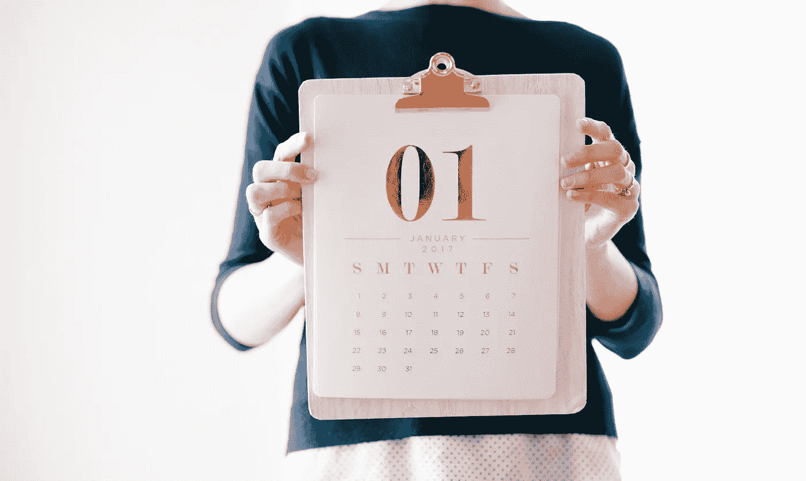
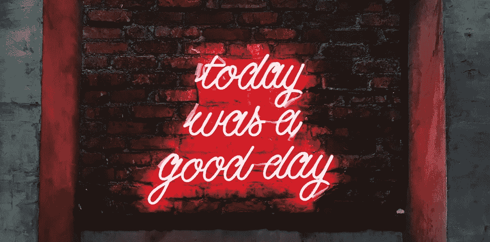

# 今天成功了吗？

> 原文：<https://medium.datadriveninvestor.com/wastodayasuccess-d752bcb918d0?source=collection_archive---------15----------------------->

What does success mean to you?

“哦，当这种情况发生时，或者当我拥有这种情况时，我可以成功，”人们经常说。

但是为什么要等待成功呢？如果你现在能够感受到真正的成功，会有什么改变？每天？

就像我有时会想，在社交媒体和其他媒体或平台上，每个人都是不同的。我思考我追随的人，有些人更倾向于商业，有些人倾向于时尚或模特，有些人倾向于体育或娱乐。我看到的是人们对成功的看法不同。

 [## 摔倒不是失败。-数据驱动型投资者

### 你只有在放弃的时候才会失败。每个英雄都会倒下，我们活着就是为了失败者出现的时刻；上升到…

www.datadriveninvestor.com](https://www.datadriveninvestor.com/2019/01/17/falling-isnt-failing/) 

似乎没有人真正以同样的方式重视成功。

也许一个人认为会让他们感到成功的事情不会。

对一个人来说，如果他们知道家人无条件地爱他们，他们可能会觉得最成功。

另一方面，也许从大学毕业后马上实现他们的理想职业会让他们感觉最成功。

但我意识到的是，无论我对成功的定义是什么，或者你对成功的定义是什么，我们为什么要等待呢？也许我们不能很快实现我们的长期目标，但是我们可以设定每天的目标并实现它们。我们可以通过实现它们来体验成功。

> 我认为，我们应该问自己的问题不是“我怎样才能成功？”
> 
> 而是，
> 
> “我今天做了什么能在短期内给我带来成功？”

这有着巨大的价值。尤其是在我们可能看不到终点线的情况下。尤其是在我们可能会遇到障碍、感到不成功或类似失败的时候，我认为继续坚持下去并设定目标是非常必要的，这样可以在短期内克服挑战，为我们带来成功。

Everyone has a different timeline, especially for their success

在此基础上，对你身边的人来说，成功意味着什么？

我想起了我姐姐和我，她的一些目标包括上医学院，明年以高平均成绩从高中毕业。对我来说，我的目标从来不是获得高 GPA，即使在现在的 MBA 项目中，我的目标也是获得职业世界所需的知识和技能。我没有和她一样的抱负，因此，我不能期望她和我一样定义成功。

同样，看看婚姻，配偶的成功可以是每晚 6 点和大家一起吃饭。第二个配偶的成功可能是财务稳定和在他们想去的任何地方一起吃饭的自由。这些是相互矛盾的。如果一个人想在固定的时间吃饭，那么他们什么时候吃饭就比他们吃什么更重要。他们的配偶可能不同意这种观点。

人们似乎经常陷入让别人为他们定义成功的困境。但实际上，我们的成功仅仅是我们的成功。

But, let’s be honest. Today was a good day because we had another day.

斗争是取悦或避免让我们最亲近的人不高兴的自然趋势。因此，我们可能会花太多时间去倾听外界的声音。虽然这些声音可能会让我们最感兴趣，但他们可能不会真正理解我们想要的是什么。他们可能会看到我们有一份高薪的职业，一个家庭，没有债务，并认为我们已经“成功”了，而对我们来说，我们才刚刚开始。

> 社会也经常定义成功。成功的形象，高级时装，好车，大房子。我们就是这样定义成功的吗？作为个人？作为一家人？作为一家公司？

> “我认为我一天的成功是基于我播下的种子，而不是我收获的果实。”——罗伯特·路易斯·史蒂文森