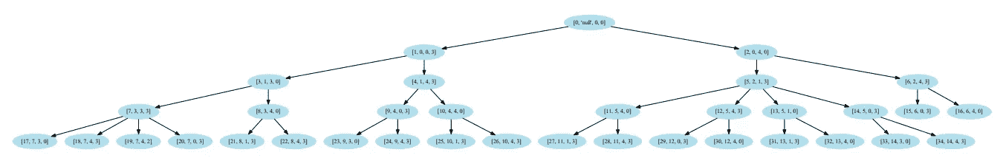

# 水壶问题:一个天真的解决方案

> 原文：<https://medium.datadriveninvestor.com/water-jug-problem-a-naive-solution-ae2a26c7a2e3?source=collection_archive---------11----------------------->

因此，在 Btech-CSE 的第七学期，我报名参加了人工智能课程。我有点兴奋地去了解正在发生的时髦事情。

> AI(这个花哨的术语)不过是算法，对算法的操纵。

作为学习人工智能的第一步，我们被要求为水壶问题建立一个简单的逻辑。

## **问题**

有两个容积为`A`升和`B`升的水壶。现在，我们必须追踪水的后续转移的所有可能的适当路径，以获得`x`罐`A`中的 1 升水。假设我们有无限的水源。

最后，我们必须找到达到目标状态的最佳路径。`x`水壶里的一升水`A`。

## **进场**

因此，我采用了动态方法来解决问题，动态方法是一种分而治之的策略。在这种方法中，我们将问题分成不同的子问题，然后单独计算它们，最后，存储这些子问题的输出以防止重复计算，从而节省大量时间。

所以，我首先试图使所有可能的组合从单一状态中产生。比如，

```
// Assuming we have A = 5 and B = 4
{(3,3)} : {(0,3), (3,0), (5,1), (2,4), (5,3), (3,4)}
```

我已经创建了一个类来执行这个操作。

之后，我试图创建一个树，其中根节点是我们的初始状态，它的子状态或派生状态是由我之前创建的类生成的。然后，递归地导出每个子节点并生成整个树(呼吸优先搜索方法)。

**注意:——我遵循了这样的模式，树的某个特定级别的 x 属性和 y 名称的节点不同于任何其他级别或分支的 x 属性和 y 名称的节点(类似的状态可能会频繁到达)。**

因为在这个递归函数中没有停止点，我们必须在一个特定的迭代之后停止它的执行，我选择了 256，它产生了大约 1500 个状态。



Tree generated up-to 10 iterations

# 打印路径

现在，在我们生成了树之后，我们必须遍历它并打印出所有通向我们的目标状态的路径(这里是`[0,2]`)。

1.  按索引方式遍历图，直到到达所需的节点。
2.  现在，当到达期望的节点时，该节点被回溯到初始节点或`root node`,回溯节点的路径被打印。
3.  对于所需节点的每个实例，都会打印该路径。

[解决方案的 Github 链接](https://github.com/proman24/Water-Jug-Problem)