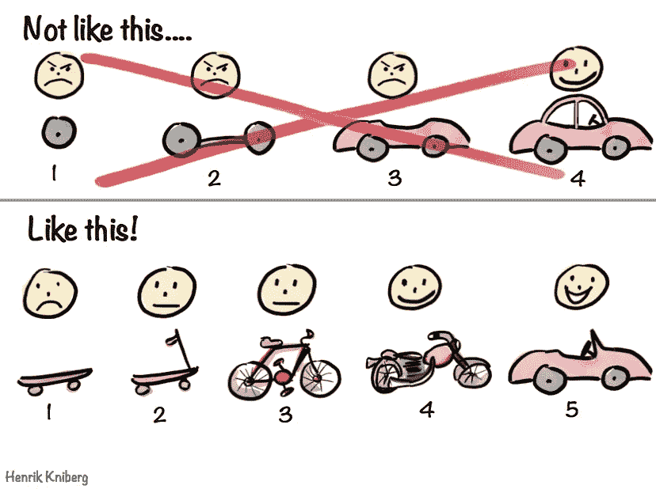

# IT 交付中的瀑布与敏捷

> 原文：<https://medium.datadriveninvestor.com/waterfall-vs-agile-in-it-delivery-db0eb15b9b87?source=collection_archive---------44----------------------->

## IT 交付如何经常出错，大型在位企业能从颠覆其行业的初创企业中学到什么

现在，我有幸与北美、欧洲、大洋洲和加勒比海地区的七家不同的银行和保险公司合作。这些机构有什么共同之处？他们都在努力按时按预算成功实施大型 IT 项目。

这篇文章强调了我在其中一家公司看到的 IT 交付挑战，并将这一经历与我去年夏天工作过的南非人寿保险初创公司[simple Financial Services](http://www,simply.co.za)的日常业务进行了直接对比。

## IT 规划一般现任者

首先，强调银行和保险提供商通常如何进行 it 规划是很重要的。

例如，我过去的一个客户是一家银行，其组织结构由“功能”而非“产品”组成。这意味着有一个庞大的 IT 部门负责交付来自“业务”的所有 IT 请求。

由于财政年度从 10 月开始，年度规划周期将从 7 月开始。每个业务单元将为他们当前的产品(那些需要它的产品)的改进写出详细的规格和计划，并且一旦计划被写出，它们将被转发给 it 部门的某人以“确定”项目的范围。然后，这个人将确定所需资源的类型(即 UX 设计师、后端/前端开发人员等。)以及交付解决方案所需的小时数。

因为它被视为一个职能支助单位，所以没有考虑到该计划的优点；此时，IT 的角色只是评估完成请求需要多长时间。

完成估算后，IT 部门会将成本数字转发给业务部门，在那里有人负责最终确定业务计划，该计划将在年度 IT 优先级会议上提交给高级管理人员(以及所有其他计划)。

IT 优先级会议的目标是决定哪些项目得到资助，哪些项目推迟到下一年。优先顺序通常如下:

1.  *监管所需项目*
2.  *被确定为业务关键战略重点的项目*
3.  *预计股本回报率最高的项目*

那时的公式很简单:一旦项目被排序，它就会查看它们现有的容量，并画一条“线”。那些“线上”的项目将得到资助，而那些“线下”的项目将得不到资助(注意:在一些罕见的情况下，会讨论通过新的招聘或外包来扩大 IT 能力，但这是一种例外，而不是常态)。

一旦计划被“锁定”为一年，它将开始(通常在筒仓中)实施商定的解决方案。这种类型的实现就是通常所说的*瀑布*。

## 瀑布的问题

可以想象，事情很少按计划进行，所以各种各样的实现问题通常会在随后的几个月中出现。在这家银行的案例中，以下三个问题是最常见的:

1.  *IT 和业务部门之间的反馈回路有限* —导致沟通仅在临近截止日期时才加强(并且通常只是沟通延迟)
2.  *在规划阶段*对预期完成时间的错误判断——通常由于对业务需求的理解有限而导致全面延迟
3.  *按照“设计”构建解决方案，并且没有经过适当的用户测试* —导致创建的解决方案最终没有被客户采用/效率低下

由于这些问题，IT 主管的工作压力很大，因为他一直承受着来自业务各个领域的压力。此外，增加按时交付*的能力*意味着他不能按预算交付*，因为雇佣新员工只会在他们的预算中显示为“增加的成本”(即使更快地交付项目可能仍然是业务的净正价值创造)。*

## *初创企业的 IT 规划*

*相比之下，我在南非人寿保险颠覆者[的同事们并没有在每年八月参加大型的年度 IT 优先会议。他们的优先化会议每隔一个星期五举行一次——会上讨论具体的“门票”(而不是难以估计的大项目),并“转移”到即将到来的*冲刺*中。这个过程是这样的:](http://www.simply.co.za)*

1.  **周三:*将有一个 1 小时的业务会议(有 IT 部门参与),每个业务部门将在会上概述他们未来两周的工作重点*
2.  **周四:*它会查看[特雷罗](https://trello.com)(正在使用的项目管理工具)上的所有“标签”(在任者的规格和计划的小得多的版本)，并“确定”每张标签的大小*
3.  **星期五:*同一组人将在星期五早上重新集合，并根据现有的容量限制和对业务的预期价值对票据进行优先排序*

*最后，让我印象深刻的是，IT 部门能够了解他们未来两周的确切容量限制(他们甚至考虑到了员工的假期)。最重要的是，他们只会致力于做那些总计达到其现有能力 80%的项目——为他们提供一个缓冲区来处理紧急和意外的事情或延迟。*

## **敏捷的优势**

*如上所述，现在应该很清楚*敏捷*带来了几个好处，但是我想到的快速好处是使用*瀑布*直接解决我在银行最常看到的三个问题:*

1.  **IT 部门和业务部门之间的反馈循环显著增加*(即，他们最多能在 2 周内互不交谈)*
2.  **完成评估更准确*(事实证明，我们人类不擅长评估大而复杂的事情，但更擅长评估小而更确定/直接的事情)*
3.  **“票证请求”在设计时考虑到了最终用户*(因为新功能每两周部署一次，企业会根据用户反馈不断改变其优先级)*

## *那又怎样？*

*在为金融服务行业的现有者和颠覆者工作过之后，我清楚地认识到，如果现有者希望进步，他们将不得不接受一种不同于他们今天所习惯的工作节奏。*

*在职者需要从*瀑布*过渡到*敏捷*计划，特别是对于 IT 交付；因为这样做只会帮助他们跟上金融科技和保险科技的步伐。*

*下图完美地总结了*瀑布*计划与*敏捷的不同之处。如果你的目标是从 A 点到 B 点，你应该问问自己，制定一年内制造一辆汽车的计划(作为例子)是否是到达目的地的最佳方式。相比之下，一家初创公司每两周就会制造出最少的可行产品(首先制造一个滑板，然后是踏板车、自行车、摩托车，最后是汽车)。**

*你告诉我，你认为哪种工作方式最有可能让你在预算内和准时到达 B 点。*

**