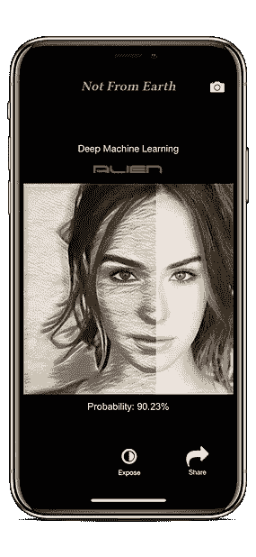
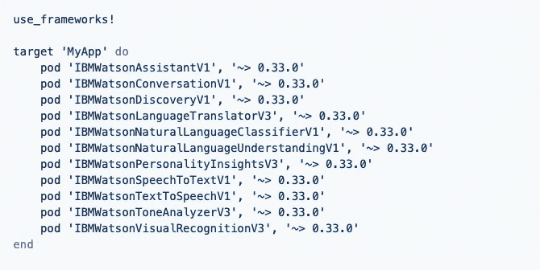

# Watson Swift SDK 0.33 概览

> 原文：<https://medium.datadriveninvestor.com/watson-swift-sdk-0-33-at-a-glance-f48daad2acbb?source=collection_archive---------10----------------------->

IBM 最终发布了支持 Cocoapods 的 Watson SDK 版本。所有以前的版本都需要使用 Carthage 和一个有点复杂的安装过程。

为什么这很重要？沃森为开发者提供了令人难以置信的工具。但是起步困难一直是节目的绊脚石。将 IBM 编译与苹果开发版本匹配是一件痛苦的事情。Cocoapods 是使用 Github 的开发人员的首选安装方法。

我刚升级到 Xcode 10 和 IOS 12。我知道让沃森工作会很痛苦。令我惊喜的是，有 Cocoapods 支持的 0.33 版本运行得非常完美。

现在，包括任何 Watson 库，如 VisualRecognition 或 SpeechToText，都是轻而易举的事情。这里有一个可供开发者放入 podfiles 的库列表。

从您的终端，运行“pod install”命令，并打开生成或更新。xcworkspace 文件。你的沃森库已经可以使用了。要更新到新版本，只需使用“pod 更新”。

在源文件中导入框架时，排除 IBM Watson 前缀和版本后缀。例如，安装 WatsonAssistantV1 后，作为“导入助手”导入到您的源文件中。

另一个有趣的改进是[沃森 SDK 文档](http://watson-developer-cloud.github.io/swift-sdk/)。有人一直在忙着改进这些文档。

如果你是 Swift 开发人员，我强烈推荐你在 Github 上查看 [Watson Swift SDK，并在云端访问 Watson。](https://github.com/watson-developer-cloud/swift-sdk)

我正在构建一个应用程序，用于检测来自其他世界的访客，然后使用风格转移效果(艺术科学)暴露他们的真实本性。所以我正在结合 IBM Watson VisualRecognition 和 Apple CoreML 来寻找和揭露外星人或外星人混血儿。该应用程序可以通过训练有素的图像识别模型识别几乎任何东西。

你可能想知道，一个应用程序如何使用沃森图像识别来寻找外星人？训练沃森看到来自太空的游客将是另一篇令人着迷的文章的主题。

对于程序员来说，使用云中的 Watson 进行训练，然后动态下载训练好的模型，以便在移动设备上进行快速识别，这非常酷。使用 CoreML 的 Watson 使增强现实中的图像识别成为可能。