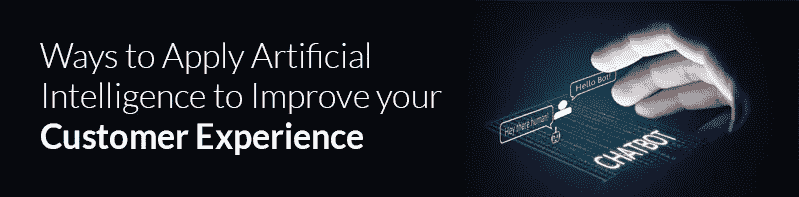

# 应用人工智能改善客户体验的方法

> 原文：<https://medium.datadriveninvestor.com/ways-to-apply-artificial-intelligence-to-improve-your-customer-experience-716571b6095c?source=collection_archive---------33----------------------->

如今，机器学习和人工智能在许多行业都有所增长。随着 it 的影响，业务流程和公司运营正在经历巨大的变革。随着人工智能在商业中的应用，客户体验和用户旅程可能是已经发生积极变化的两个重要因素。人工智能是指通过让机器像任何人一样有能力和足够聪明来解决问题的方法而产生的东西！这比编写复杂的准则让计算机遵循要好得多。计算机现在被编程为从经验中学习。营销行业主要一直在使用人工智能服务来利用这些好处。以下是应用人工智能改善客户体验的四种方式:

**>与客户的自动互动-** 如果你雇佣经验丰富、技术熟练的员工做简单的事情，那纯粹是浪费人才。人工智能服务是一种新兴技术，可以轻松地执行这些事情，让员工更加专注于关键流程。研究表明，未来大量的客户互动将由这项技术来完成。我可以在这里给你提供人工智能的日常例子。它包括来自网络运营商的支付账单的提醒信息，通过你在餐馆的智能手机的数字支付网关等。这种好处的基本概念是以数字方式消除人们的日常工作。即时支付、顺畅的交易和一致的体验是这项技术可能为客户提供的几个基本要素。

**>扩充你的劳动力-** 如果我不得不为你提供另一个由[人工智能公司提供的人工智能的强大应用](http://24framesdigital.com/What-we-do/360-Videos-and-VR.php)；你自己的公司已经有了。将枯燥的客户体验转变为卓越体验的最简单方法是主动预测客户的需求，并在情感层面上与他们建立联系。在发展业务关系时，与客户和谐相处是非常重要的，而人际关系网是决定你的产品能否传播的两个因素。你必须让你的员工更好地理解买家的行为。这将有助于你发现是什么让他们参与购买他们选择的产品或服务，他们的购买模式如何随着时间的推移而改变等等。这种商业中的人工智能让你积极主动、专注，并与客户的需求保持同步。

**>专注于不间断的虚拟体验-** 当消费者购买任何产品或服务时；因为他在寻找质量；他还对购买体验进行了评级。除了需求，情感欲望也是迫使顾客购买各种产品的一个主要因素。他们寻找适合他们预算和满足他们需求的品牌。我建议你研究买家行为周期的不同阶段和数据分析，这将有助于你提升客户体验。数据分析在网站上进行分析是非常重要的，因为及时回复客户的查询非常重要。通过这种方式，你可以找到你可以解决的痛点或漏洞，为客户提供愉快的购买体验。

**>个性化沟通-** 了解顾客的心理，同时努力让你的谈话更加个性化。如果你继续作为第三方营销或宣传你的产品或服务；一段时间后，你可能会失去你的潜在买家。人工智能引入了几种技术来个性化与客户的交流。它们包括地理围栏、忠诚度计划、反馈信息。Geoforcing 使您能够检测客户的位置，并向他们发送基于区域的营销信息。另一方面，忠诚度计划的目标是给予顾客忠诚度奖励。使用这些方法，你确实可以提升顾客对品牌的体验。人工智能服务已经帮助营销人员预测客户真正需要什么。

[人工智能组织](http://24framesdigital.com/)与客户和谐相处的潜力远远超出我们的想象。销售服务、营销解决方案和成本优化是您可以从多个方面发展企业的关键领域。通过这种独特技术的创造性解决方案仍在大量增长。探索人工智能有巨大的空间，它将帮助你塑造你努力提供的客户体验。