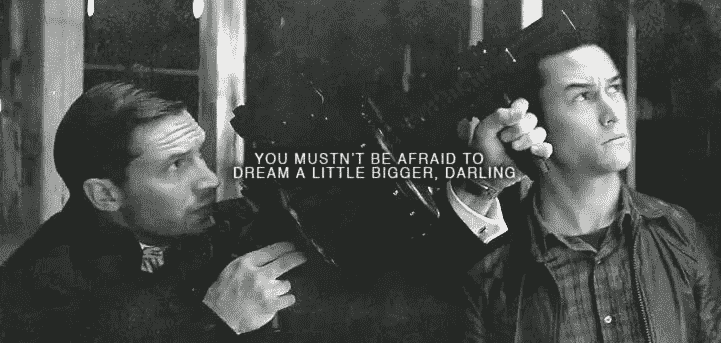

# 我们今天正处于奇迹的危机中。

> 原文：<https://medium.datadriveninvestor.com/we-are-in-a-crisis-of-wonder-today-4a51dfcabca6?source=collection_archive---------12----------------------->



```
“I didn’t ask for ‘success,’ I asked for wonder.” - Rob Bell
```

我们今天正处于奇迹的危机中。在现代世界中，我们拥有了我们曾经在物质上需要的一切，然而我们现在感到无聊、恐惧和心烦意乱。

我们更关注一部电影在首映周末赚了多少钱，而不是它讲述的故事。

一家初创公司之所以成为头条新闻，是因为它筹集了一轮资金，而不是它如何让客户的生活变得更好。

我们走错了路。

当我们真诚地帮助别人时，就会创造出令人瞠目的长期公司价值。当员工在工作中充分发挥自我，创造出让客户敬畏的产品和服务时。

我们渴望奇迹，但我们一直活在表面的光芒中。

让我们尝试真正大胆的东西，而不是一个更好的吸引人注意力的捕鼠器，这样你就可以卖广告了。我们在骑行趋势上停留在#startupland。弄清楚风投或有限合伙人想要什么，这样我们就能获得更高的估值或加价交易。

人生苦短。当今世界，我们有很多有趣的难题。让我们利用这个历史上独一无二的时刻。

为大问题建立解决方案，这些大问题会让我们在大胆的尝试中尿裤子。

建造一些东西，让我们每天早上醒来，惊奇地说“这就是我今天要做的事？厉害了。”因为这就是一切。