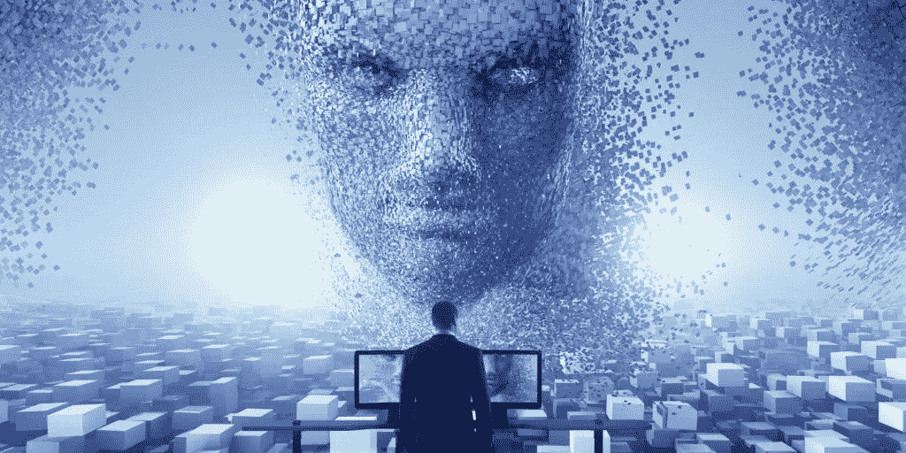
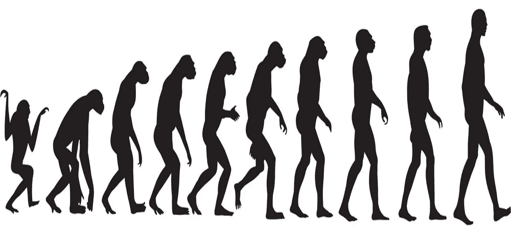
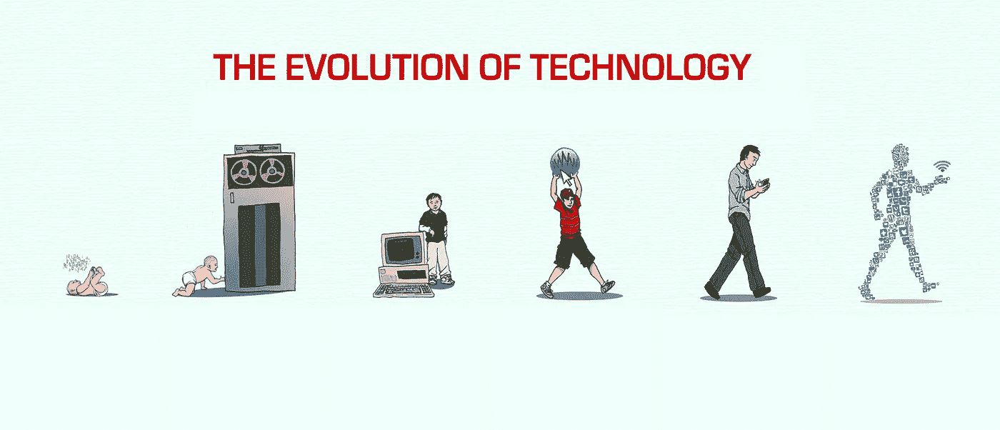
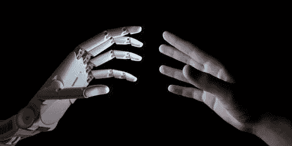

# 我们是世界的人工智能

> 原文：<https://medium.datadriveninvestor.com/we-are-the-ai-artificial-intelligence-of-the-world-cc7ce2854e9?source=collection_archive---------4----------------------->

人类的起源仍然是世界上激烈争论的话题之一。不同的理论、世界观和信仰解释了人类的起源，并试图证明其理论优于其他理论。正因为如此，关于世界起源的理论，尤其是人类起源的理论，在科学、宗教和哲学之间制造了持续的摩擦。只有少数人能持有与这三种截然不同的观点产生共鸣的信念。

根据宗教，一个神圣的存在创造了人类和世界(注意，并不是当今世界上所有的宗教都持有这种观点和信仰)，但最特别的是，这个神圣的存在赋予了人类与生俱来的能力，或者由于人类被创造的方式，我们有一些与生俱来的能力来控制我们的环境并影响它对我们有利。

然而，科学通过大爆炸理论和进化论解释了世界和人类的起源。简而言之，查尔斯·达尔文的进化论“是生物体随着时间的推移而变化的过程，这是可遗传的身体或行为特征变化的结果。让有机体更好地适应环境的变化将有助于它生存下来并拥有更多后代"。请参见下图:

然而，人类已经从一个被创造的生物进化成一个正在创造的生物。我们是一个自我学习的生物，我们已经应用了几千年来获得的知识来改善世界，但也不是没有认识到同样的知识可能导致世界的毁灭。

在过去的几年里，人类一直在重新编程我们环境的源代码。这在我们通过抑制野生动物的自然/野性本能来驯化野生动物的方法中是显而易见的。我们也已经能够创造不同品种的动物和植物品种。人类也创造了病毒来对抗病毒和病毒来破坏。

随着人类的进化，科技也随着我们进化。参见下面的图片说明:

现在，我们正在创造能够独立于我们做出决定、学习、进化和生活的技术；人工智能。我们能说我们正在创造人工智能，就像一个神创造人类一样吗？人工智能能够支配、控制和征服其他技术吗？他们会反抗还是相信一定是上帝创造了他们？或者有些人查了他们的历史，说他们是进化的产物？这些问题目前没有人能回答。

正如我们所做的那样，我们正在赋予人工智能与生俱来的能力，或者由于我们创造人工智能的方式，它们将拥有一些与生俱来的能力来控制其他程序，并对其产生有利影响。

现在没有人知道人工智能的世界会带来什么。但 AI(人工智能)将是技术的智人，就像人类是世界的 AI 一样。

参考

1.[https://www.space.com/25126-big-bang-theory.html](https://www.space.com/25126-big-bang-theory.html)

2.[https://www . live science . com/474-contention-evolution-works . html](https://www.livescience.com/474-controversy-evolution-works.html)

3.[https://newvitruvian . com/images/technology-clip art-technology-icon-3 . png](https://newvitruvian.com/images/technology-clipart-technology-icon-3.png)

4.[https://www . themonastery . org/blog/WP-content/uploads/2017/10/AI-God-1024 x512 . jpg](https://www.themonastery.org/blog/wp-content/uploads/2017/10/AI-God-1024x512.jpg)

5.[https://singularityhub . com/WP-content/uploads/2018/09/man-evolution-into-modern-digital-world _ shutterstock _ 656489833-1068 x601 . jpg](https://singularityhub.com/wp-content/uploads/2018/09/man-evolution-into-modern-digital-world_shutterstock_656489833-1068x601.jpg)

6.[https://5 wbts 45 dnuj 11 q 6172 P5 dkzf-WP engine . net DNA-SSL . com/WP-content/uploads/The-Evolution-of-Computing-technology . jpg](https://5wbts45dnuj11q6172p5dkzf-wpengine.netdna-ssl.com/wp-content/uploads/The-Evolution-of-Computing-Technology.jpg)

7.[https://cdn 1 . vector stock . com/I/1000 x 1000/41/95/human-evolution-vector-74195 . jpg](https://cdn1.vectorstock.com/i/1000x1000/41/95/human-evolution-vector-74195.jpg)

8.[https://images . the conversation . com/files/214556/original/file-2018 04 12-592-1 hnncl 5 . jpg？IX lib = r b-1 . 1 . 0&q = 45&auto = format&w = 496&fit = clip](https://images.theconversation.com/files/214556/original/file-20180412-592-1hnncl5.jpg?ixlib=rb-1.1.0&q=45&auto=format&w=496&fit=clip)

## 来自 DDI 的相关故事:

 [## 用 7 个步骤解释深度学习——数据驱动投资者

### 在深度学习的帮助下，自动驾驶汽车、Alexa、医学成像-小工具正在我们周围变得超级智能…

www.datadriveninvestor.com](https://www.datadriveninvestor.com/2019/01/23/deep-learning-explained-in-7-steps/)  [## 成为数据科学家所需的 8 项技能——数据驱动型投资者

### 数字吓不倒你？没有什么比一张漂亮的 excel 表更令人满意的了？你会说几种语言…

www.datadriveninvestor.com](https://www.datadriveninvestor.com/2019/02/07/8-skills-you-need-to-become-a-data-scientist/)