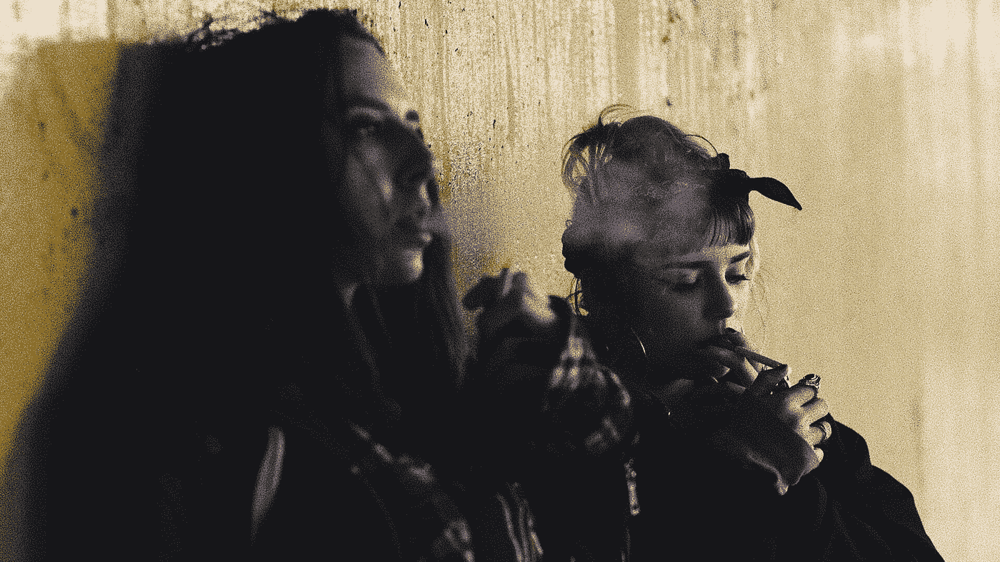

# 我们屏蔽了社交媒体，这引起了公愤。

> 原文：<https://medium.datadriveninvestor.com/we-blocked-access-to-social-media-it-caused-at-outrage-4c7829389c51?source=collection_archive---------16----------------------->

## 上瘾，我们看不出来。

Photo by [Mikail Duran](https://unsplash.com/@mikailduran?utm_source=medium&utm_medium=referral) on [Unsplash](https://unsplash.com?utm_source=medium&utm_medium=referral)

在最近的一项研究中，基于之前的发现，我们想进行一个简单的实验。

在校园 WiFi 上随机屏蔽社交媒体访问。

公平地说，由于这项研究仍在进行中，我无权透露细节。

但这也是一个有趣的分享，所以这就是我们的经历。

我们编写了一个脚本，在特定的演讲期间随机阻止社交媒体访问——这样我们就可以明显地看到学生的反应。

起初，这是一种平静和抚慰的机制——似乎没有人感到愤怒。

很快，这些消息开始像野火一样传播开来；

***“您访问(插入社交媒体网站)有困难吗？”***

it 部门开始超负荷地抱怨校园 WiFi 出问题了。

愤怒之下，一些学生明显心烦意乱。

就好像我们正在目睹一场女英雄流行病。

一些学生甚至传递消息说，他们通过个人网络在手机上访问网站没有问题；都怪校园 WiFi。

***“嘿我找到了一个修罗！换成 4G 就行了…又能用了"***

***“OMG 那才救了我的命！*感谢“**

学生们紧张不安，没有耐心，经常因为一点点的变化而失控。

***“这个怎么不行！”—一个学生在讲课时大喊。***

这就是我们出于同情而释放的恐惧——实验立即被放弃了。

突然出现了一线希望，学生们突然变得更有耐心，更冷静，就好像他们终于接受了多巴胺疗法。

我们感到震惊，这是我们一直被警告的吗？

泰德·卡钦斯基的漫谈；已定罪的连环黑仔。

阿尔多斯·赫胥黎，一个美丽的新世界。

乔治奥威尔， **1984。**

他们都给我们留下了一个挥之不去的信息，有一天技术会控制你。

> **想想看……如果屏蔽社交媒体访问让一群无辜的学生进入了退缩状态；你的手机在多大程度上控制着你？**

采取简单的步骤，想想你多久看一次手机通知。

我们在神经科学系的合作伙伴正在通过对受试者进行实验来分析多巴胺的释放。

与此同时，我建议阅读以下研究:

 [## 网络色情成瘾的神经科学:回顾与更新

### 所有滥用的药物都会影响来自腹侧被盖区(VTA)的中脑边缘多巴胺(DA)通路

www.ncbi.nlm.nih.gov](https://www.ncbi.nlm.nih.gov/pmc/articles/PMC4600144/)  [## 社交媒体引发多巴胺升高

### 关键要点你知道在完成一次很好的锻炼后，或者当你用一次胜利让你的老板惊叹时，你是如何感到兴奋的…

www.ama.org](https://www.ama.org/publications/MarketingNews/Pages/feeding-the-addiction.aspx)  [## 网络成瘾:研究与实践的简要总结

### 有问题的计算机使用是一个日益增长的社会问题，正在全世界范围内展开辩论。网络成瘾(IAD)…

www.ncbi.nlm.nih.gov](https://www.ncbi.nlm.nih.gov/pmc/articles/PMC3480687/) 

原发表[此处。](https://www.datadriveninvestor.com/2018/12/01/we-blocked-access-to-social-media-it-caused-an-outrage/)