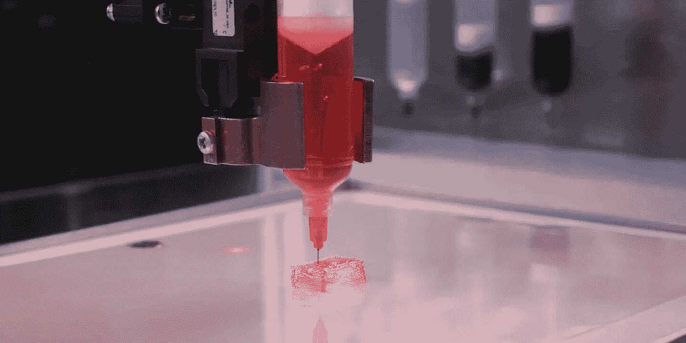
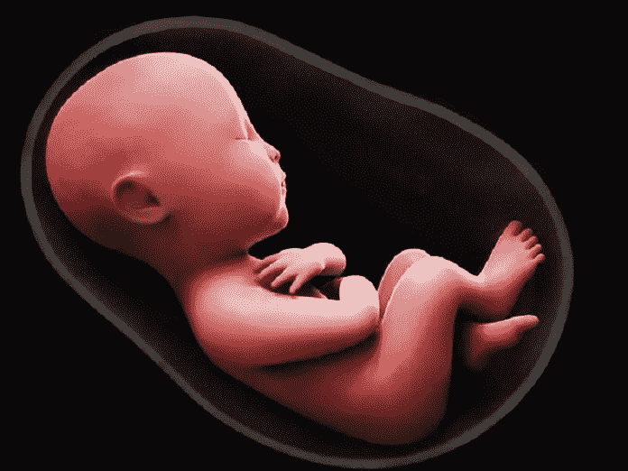

# 如果可能的话，我们可能是最后一代用传统方式生孩子的人

> 原文：<https://medium.datadriveninvestor.com/we-could-be-the-last-generation-to-have-children-the-old-fashioned-way-if-at-all-85fcd687cbed?source=collection_archive---------11----------------------->

## 无限的寿命和人造卵子和精子可能会改变我们对家庭的观念

在 [超人类主义澳大利亚](https://www.transhumanism.com.au/)大会上，我们已经就人类健康的未来做了几次演讲，最近一次是在 TEDxMelbourne。这篇文章谈论生殖的未来。

今天的人类比以往任何时候都更长寿、更健康。已知最长寿的人活到了 122 岁。一些研究人员，如著名的生物老年学专家奥布里·德·格里，认为我们可以把健康人的寿命延长到 1000 岁，最终长生不老。

虽然达到 1000 岁可能还很遥远，但随着生物技术的最新发展，这一代人中的大多数人可能至少活到 122 岁。

在年，除了延长寿命，人造卵子、精子和子宫可能很快就能为人类所用。这带来了几乎无限期推迟生育的可能性。

随着健康延伸疗法和实验室婴儿成为现实，我们对家庭和性别的概念可能会被颠覆，这可能会极大地改变人们的生活目标。

好工作、婚姻和孩子这些传统目标可能会被抛到九霄云外，越来越多的人可能会选择根本不要孩子。

随着生活水平的提高，生育率已经在下降

据 I t 预测，到 2030 年，无子女夫妇将成为澳大利亚最常见的家庭类型，所以看起来很多人已经选择不要孩子了。卫生技术的进步可能会加强这一趋势。

对于那些想要孩子的人来说，女性的年龄是决定何时开始生育的巨大推动力。一些研究称，女性的生育能力从 30 岁开始迅速下降。

然而，这种生物钟的滴答声可能很快就会成为过去。生育窗口可以随着健康寿命的延长而增加，而人造卵子和精子可以让夫妇创造出亲生孩子，不管父母的年龄或健康状况如何。

**通过药物清除死亡细胞可以延长我们的健康寿命**

烯醇化剂是一种清除我们体内衰老细胞的疗法，衰老细胞是指已经停止分裂并可能伤害其他健康细胞的细胞。这种疗法最近吸引了很多关注和资金。

Unity Biotechnology 公司正在研发一系列清除衰老细胞的药物。首先是治疗骨关节炎，已经进入人体试验。Unity 还在开发治疗糖尿病和年龄引起的眼睛退化、认知能力下降、肾脏疾病和一些肺部疾病的药物。随着年龄的增长，患这些疾病的风险也会增加。

衰老疗法的前提是它能逆转衰老细胞造成的损伤。随着年龄的增长，你的身体积累衰老细胞，导致许多与年龄相关的疾病。溶解疗法找到并破坏这些细胞。

**3D 打印器官有助于延长我们的生命和健康**

33d 打印器官被誉为器官短缺危机的解决方案，同时也给了人们一个更健康长寿的机会。这项技术使用干细胞等有机材料来创造器官，这些器官可以像人体器官一样复制和运作。

对于那些在移植名单上的人来说，Prellis Biologics 的技术使 3D 打印器官更接近于一个真正的选择。除了复制向组织提供营养和氧气所需的复杂毛细结构的能力外，他们还开发了一种近乎即时的 3D 打印方法。

很可能人类可以比心脏和胃等更复杂的器官更快地 3D 打印出不太复杂的部分，如肌腱和韧带。3D 打印器官的美妙之处在于，它可以根据需要该身体部位的人进行定制匹配。

**人类生殖的未来用实验室制造出卵子和精子**

女性的卵子和男性的精子可能不再是创造婴儿的必要条件。干细胞现在可以转化成人造卵子和精子。这可以简单地通过从你的皮肤中提取细胞，将其转化为干细胞，然后将其转化为卵子和精子来实现。所有这些都可以在体外完成。

两名日本科学家首先在老鼠身上进行了这项实验，他们从老鼠的尾巴上取下细胞，重新编程为干细胞，然后用它们生成卵子。他们的工作记录在科学杂志《自然》上。

来自中国科学院动物研究所和九州大学的科学家已经证明可以在老鼠身上制造人造精子。人造精子然后被注入老鼠的卵子。这产生了胚胎，然后将这些胚胎植入雌性小鼠体内。健康的小老鼠出生了。

美国、日本和中国的研究人员正在研究如何在人类身上重现同样的结果。如果可行的话，这可能对不孕不育者有所帮助。

婴儿有可能在女性体外成长

人造子宫的创造可能会使在女性体外培育婴儿的选择成为现实。

我们已经有了某种形式的人工子宫。这些是给那些需要帮助才能成长和生存的早产儿用的。今天的保育箱只能支持 23 周以上出生的婴儿，而不是用来将胚胎培养成足月婴儿的。人造子宫将允许胚胎足月生产。

在费城儿童医院，早产儿已经通过人工子宫长到足月。这些子宫充满了一种类似于羊水的物质，这是一种保护性的液体，可以缓冲胎儿，帮助它获取营养和排出废物。还有一个人造胎盘给小羊提供营养。

**实验室生殖的伦理问题**

T4:ome 可能会反对实验室制造卵子和精子的想法，但这不会阻止进步。

一个国家反对的，另一个国家可能会拥护。例如，尽管美国在允许通过基因编辑技术 CRISPR 修改人类基因方面进展缓慢，但中国已经推进了人类 CRISPR 试验，以治疗包括肺癌、糖尿病和阿尔茨海默氏症在内的多种疾病。一些国家可能会在一开始反对，但当他们看到经济上的利害关系时，可能会迎头赶上。

家庭结构和社会可能会发生巨大变化

这让我们回想起这些生物技术的发展如何颠覆了我们对家庭和性别的概念。

这意味着同性夫妇可以生育与他们双方都有血缘关系的孩子。这也意味着父母可以同时是孩子的生母和生父，因为一个人可以创造完全由自己细胞组成的卵子和精子。这将意味着妇女不再需要怀孩子，因为孩子可以在人体外成长。

重要的是，想要孩子的愿望和时间框架可能会迅速改变。如果人们不再被限制在特定的时间框架内，人们可能会推迟到很晚的时候或者根本不要孩子。

人们可能会选择花更多的时间追求自己的爱好和激情，总会有企业和企业家迎合这个不断变化的社会。

**我只写新兴科技和** [**超人性**](https://www.transhumanism.com.au/) **。如果你也想知道如何理解一个受到人工智能、区块链和其他新兴技术影响的世界，请跟随我。**

