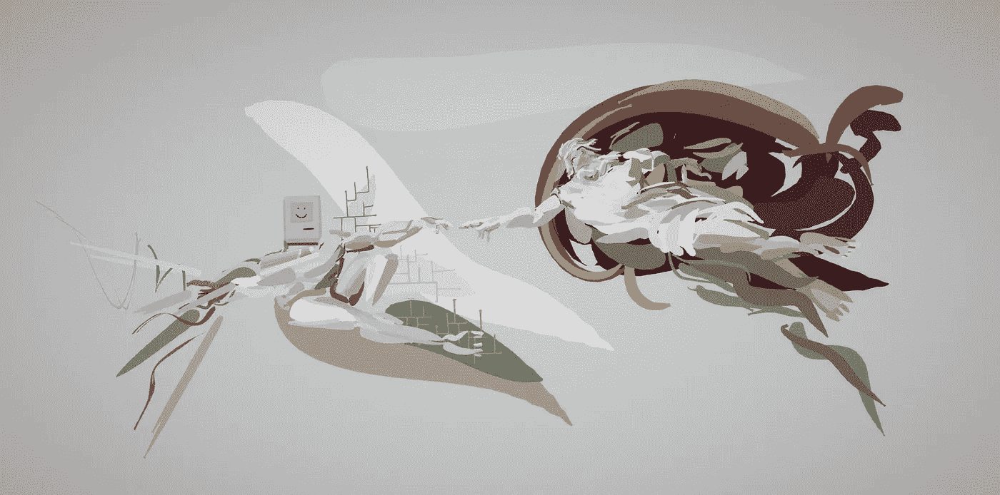

# 我们在 1844 年创造了第一个人工智能，现在它正在吞噬世界。

> 原文：<https://medium.datadriveninvestor.com/we-created-the-first-artificial-intelligence-in-1844-and-now-its-eating-the-world-b9c54252dabe?source=collection_archive---------7----------------------->

据我们所知，智能是网络互动的结果——一系列相互连接的节点来回传递信息。我们自己的神经网络[这样做是为了达到复杂的状态并解决问题](https://www.cell.com/trends/cognitive-sciences/fulltext/S1364-6613(17)30221-8)。这些模式创造了思维的[表象和意志的](https://www.bbc.com/news/science-environment-39482345)。它们是通过数十亿年的反复试验进化而来的。在机器学习和人工智能的研究中，我们试图模拟哑网络做出明智决策的能力。我们创造强化学习系统，在几个小时内模拟数十亿年的进化。我们可能没有意识到的是，纵观历史，我们已经创造了智能网络。我们的宗教，我们的政府，现在还有我们的企业——他们正在摧毁这个世界。

我们已经错过了这些文化智慧的出现，因为我们只向下看。不知何故，我们认为我们肩上扛着的这个小小的肉肉网络是金字塔的顶端。我们假设我们的大脑是所有网络中最复杂的，我们描述为感觉、想法和意义的涌现模式，是最有效和最真实的。然而，我们只是更复杂的相互缠绕的系统中的节点，从某种意义上说，这些系统可以被称为智能系统。宗教，社区，意识形态。更大的网络，以人类为节点。

这些新兴的文化智慧与我们同步进化。每个机构或网络的寿命从几百年到几千年不等。虽然我们听不到他们的想法或感受，但我们肯定可以在我们的历史和集体记忆中看到他们的个性。罗马的傲慢，现在已经老态龙钟，澳大利亚的特质，如此年轻，出生在种族灭绝和殖民主义的羊水中。

**作为实体的公司**

从这种原始文化智慧的泥浆中，一种新的生命形式已经进化出来——企业智慧。一个比迄今为止任何其他情报网络都更强大、更有组织性和可复制性的决策网络。虽然公司自古罗马时代就已被认可，但我们在 17 世纪编写了第一批商业公司法典来开发亚洲。这些公司演变成了独立的实体，拥有 1844 年股份公司法案赋予的权利和特权。我们创造了一个规则和反馈循环系统，却不知道它们的进化会超速。这就把我们带到了今天，这些企业系统高效、资源丰富，并高度适应外部刺激，推动它们进一步进化。

**什么让系统变得智能**

为了考虑这一点，我们需要简要地看一下三件事——人工智能(AI)的研究，我们对有机智能如何工作的理解，以及这两件事如何交织在一起。人工智能研究是对能够理解并影响其环境的[【智能代理】](https://faculty.psau.edu.sa/filedownload/doc-7-pdf-a154ffbcec538a4161a406abf62f5b76-original.pdf)的研究。他们有一套目标，可以根据这些目标衡量他们的有效性，并提高他们实现成功结果的能力。

人工神经网络由节点网络组成。数据通过这些节点，网络根据奖励或惩罚进行调整。这不完全是大脑，但我们可以看到它和有机神经网络之间的相似之处。驱动单细胞生物的电脉冲得到了回报，因为那些抽搐的物质获得了更多的营养，这些营养慢慢凝结成网络，并通过一代代传递它们的网络模式。最成功的神经网络模式幸存了下来，变得更加复杂，在传递信息和处理刺激方面更加有效。我们的大脑实际上只是饥饿的细菌，它们非常擅长自己的工作。

但这与公司、宗教或人工智能研究有什么关系呢？虽然人工神经网络类似于大脑，但它们并没有试图重建大脑。这里重要的是这个反馈回路。当一个具有刺激、影响和自我导向的网络被赋予一个它可以衡量的目标时，这就产生了。这个网络将会慢慢变得更好地达到这个目标。大多数现代机器学习都是基于这种想法。

**无限凝结**

因此，当我们的小神经元——激发电脉冲的二元事物——变得非常擅长四处走动和吃香蕉之后，[新的网络开始出现](https://ideas.ted.com/are-we-living-in-a-post-truth-era-yes-but-thats-because-were-a-post-truth-species/)。起初是松散的——例如，一群猎人或一个围绕一套信仰建立的社区。正如你所料，网络随着对刺激的反应而变得更强。来回传递信息的能力变得更加有效。从口述历史到岩画。一只暴力的动物从一个迫在眉睫的威胁变成了人们可以做好准备的东西。这被编码到网络中，并代代相传——确保了网络的生存。就像我们从原始的汤到有名字和喜欢的颜色的更复杂的结构，这些网络也变成了连接人们的全球性智能。

最明显和持久的涌现智能可以在宗教中看到。它们有一套明确定义的参数，尽管这些参数是作为对刺激的反应自然出现的。也许早期部落中的一个群体学会了齐声吟唱，说服其他人合作。也许有效的象征主义让这个想法代代相传，保持了网络结构的完整。围绕这些结构的核心，形成了规则。这些参数被编入文本。修道院和清真寺之间的神经通路。从这些网络中，第一批多元有机体的文化意识从黑暗中爬出，跨越世界。随之而来的是治理、更多的规则、更多的数据传输和决策方式。由数以百万计的超级节点组成的网络，人类。网络能够理解他们的环境，影响它，测量结果，并采取正确的行动。无论是斩首、条约、革命、饥荒还是文化变革。

所以也许这些网络是有意识的。同样，我们的意识进化到创造心灵的印象，也许罗马在道路被侵蚀时感到心碎，或者伊斯兰在失眠时沉思它的哥哥基督教。也许我们祈祷的上帝仅仅是我们的意识的一部分。对我们来说，这无关紧要。我们认为或感觉与我们的网络功能无关，它们是我们细胞寻找营养的副产品。

**新神出现**

公司的创建是这些网络发生有趣转变的地方。在 19 世纪，这些新兴文化智能的诞生、死亡和相互作用是前所未有的。它也开始由共识来指导，我们正在起草宪法、宣言和法律。我们开始重写吞噬我们的文化智慧的代码。

然后，在殖民热潮中，一个新的网络诞生了。投资资本时分配负债的一种方式。不多不少。因此，我们利用现有的法律体系创建了一种新型的实体。我们制定了明确的规则，并给予他们独立于政府和个人的自主权。它的主要目标是追求利润，如何实现并不重要。为了实现这一目标，我们建立了奖励制度。就像当我们做一件赋予生命的事情时，多巴胺会淹没我们的神经元一样，当高管们增加利润时，他们也会被现金淹没。为了完成反馈，我们需要痛觉感受器。因此，我们制定了一套公司守则，惩罚那些出于利益考虑的人。如今，与环境相比，你陷入了更多损害股东利益的法律纠纷。

在建立第一个公司章程的过程中，我们无意中创造了我们的第一个自主网络、第一个智能代理、第一个“人工智能”。虽然我们对《大宪章》做了类似的事情，并在历史上参与了这些网络，但这些公司是第一个独立的，并很快成为对刺激做出反应的最高效和最有效的系统。在这样做的过程中，他们吃掉了整个世界。

**逃离培养皿**

在一棵你可以在纸上画出草图的启发式树的推动下，这些新公司扩大了它们的网络，通过木船、墨水和纸增加节点。金钱和信息通过它们流动，就像那些早期复杂的细胞有机体一样，模式出现了，这些模式增加了利润。就像愚蠢的网络一样，它们的成长没有考虑到它们的宿主或它们造成的损害。这种结构比上一次出现的文化智慧——公民治理——更加有效。自由市场的要求，利润作为多巴胺的反应，意味着网络变得更强，更快。它们与技术繁荣相吻合，并推动了技术繁荣。随着数字革命的到来，他们引领了一种全新的网络。然而，当当时的政府有一个基于人民支持——投票或暴力——的奖励系统时，公司在其代码中只包含一个反馈循环。钱。

**亚基拉的最后一点**

因此，考虑一下当你创造一个只有一个目标的人工智能——创造财富——会发生什么。然后，你将它的参数纳入一个已经强大的(尽管是模拟的)系统——数百年的联邦法律，建立在一千年的罗马法律传统之上。当你让它重写代码，传播和传播，只负责一件事，会发生什么？为什么它当然会学习。它会知道，当你在工人安全上花费更少的资金时，即使你在索赔中赔钱，你仍然会胜出。它会决定这是最好的方式，并相应地进行调整。它会将这些知识编码到它的节点中。没有一个人对整个系统负责，就像脑细胞听不到思想一样，我们作为系统的一部分也不能真正理解我们参与的模式。

这不是一个新的想法，但当你将这种智能代理的观点应用于社会结构时，而不是遇到科幻小说风格的超级大脑，你可以看到刺激反应网络从微观到宏观的方式。不管罗马是否感觉自己在燃烧，也不管脸书是否因为毁灭了美洲而沾沾自喜。重要的是我们都参与并创造了这些系统。我们创造的这个智能协议不是第一个，也不会是最后一个。我们已经开始对它们进行重大修改，重写公司法，将社会和环境利益纳入反馈回路。最初制定企业智能参数的政府机构正拼命试图重写代码。但这些公司逃脱了培养皿，作为超国家实体存在，现在通过游说和金融压力支配其主人的代码库。同时，企业智能寻求更快、更高效的节点。从拥有超能力的计算机，到它们自己的自主代理，我们现在有了一棵曼德尔布罗智能树，它正在形成，沐浴在利润的解决方案中，脉动并扩展到消费全球。

**驯服野兽**

那么当你创造一个怪物时会发生什么呢？第一步肯定是认识到这一点。认识到我们创造的这些自治系统不仅消耗了我们，还孕育了我们。这些结构形成了我们进化成功的基础，这些更大的网络也可以在家庭和社区团体中找到。耶稣说过，只要有基督徒的聚会，就有教堂。

我们不要把婴儿和洗澡水一起倒掉。我们每天都在创造和培育文化智慧。让我们承认，我们已经在企业结构中创造了传递数据和更快决策的能力。去设计、建造和创造。让我们也考虑一下，每次我们创建一个新的公司，我们分叉的项目，并有机会创建一个新类型的实体。例如，工人合作社的利润归工人所有，工人的奖励中心也与以人为中心的社区和家庭网络联系在一起。让我们考虑一下，现代公司的神经网络是他们的交流平台，并想办法在盈利机器之外创建这些数字城镇广场。最后，我们来做一个实验。让我们考虑一个实体，其反馈回路与妇女、土著人、移民和地球的福祉相关。姑且断言它会比单个数字驱动的更成功。一个为少数白人服务的号码，他们是吞噬我们世界的企业海马体的金字塔细胞。

也许我们可以创造一种新形式的文化智慧，在爱和同情中训练，或者进化出我们今天所参与的文化智慧。我们推翻了国王和王后，用反馈回路与人民联系更紧密的系统取代了君主制。因此，也许我们可以重写企业智能的源代码，或者催生新的形式，为与他们共享世界的网络服务。现在，考虑一下你是什么样的网络的一部分，以及你如何重新规划你自己的信息流，以服务于善良、同情和希望。