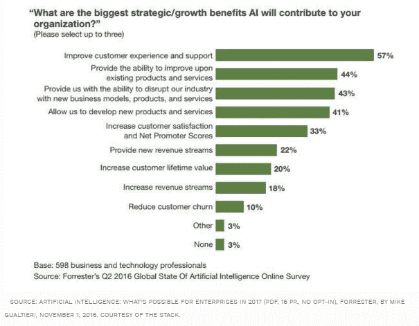
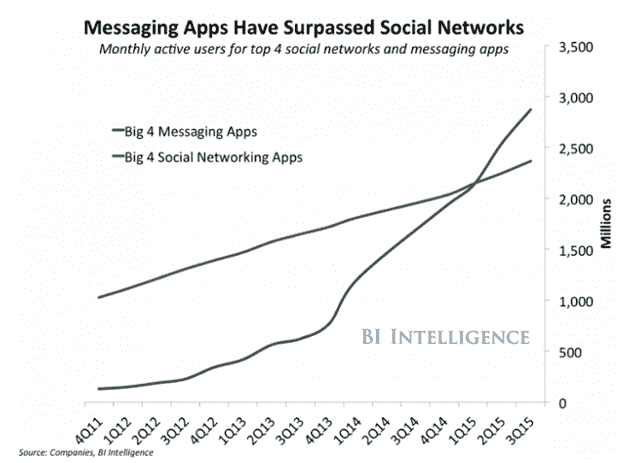

# 我们不太了解“趋势”，但这些是我们对 2019 年的看法

> 原文：<https://medium.datadriveninvestor.com/we-dont-know-much-about-trends-but-these-are-the-things-we-believe-for-2019-4b0067df00a1?source=collection_archive---------14----------------------->

2019 年的营销趋势？不，对我们来说太老套了。

Photo by [Franki Chamaki](https://unsplash.com/@franki?utm_source=medium&utm_medium=referral) on [Unsplash](https://unsplash.com?utm_source=medium&utm_medium=referral)

我们可以写一篇关于 2019 年营销趋势的文章，但所有公司都在写它，我们不想只是其中一家。因此，本文将探讨一些我们认为在 2019 年营销方面将会引人注目的事情。

我们生活在一个技术进步日益显著的世界。因此，人工智能将是我们认为 2019 年反复出现的主题之一。

> 这种数据分析多年来一直在发展，使公司能够建立一个更清晰的目标受众，渠道或转换的图片

[**人工智能**](https://www.cio.com/article/3302739/marketing-industry/how-ai-is-reshaping-marketing.html) 和 [**机器学习**](https://www.forbes.com/sites/louiscolumbus/2018/02/25/10-ways-machine-learning-is-revolutionizing-marketing/#478156015bb6) 无疑是占据你新兴技术雷达屏幕的最突出的新技术之一。尽管如此，在发展的早期阶段，它们在改变公司如何改善客户的在线旅程以及如何分析数据方面的潜力，清楚地表明了它们可以增加的价值。

人工智能营销解决方案提供了弥合数据收集、研究和执行之间差距的方法。人工智能营销是一个分析客户数据的过程，目的是预测客户的下一步行动，改善他们对公司的体验。

这种数据分析多年来一直在发展，使公司能够建立一个更清晰的目标受众、渠道或转化的图片。借助正确的工具，营销人员可以以可持续的方式提高活动绩效和投资回报率。然而，我们是在泛泛而谈。先说 AI 必不可少的营销基本面。

[**大数据**](http://analytics-magazine.org/big-data-in-marketing-analytics/)

对于营销组织来说，大数据是新营销格局的基本结果，它诞生于我们现在生活的数字世界。

大数据包括对大型数据集的收集、细分和研究，以便营销人员能够在正确的时间通过正确的渠道向正确的人传递正确的信息，从而为客户提供良好的体验。大数据的优势:

*   客户参与。大数据不仅可以洞察您的客户是谁，还可以洞察他们在哪里，他们想要什么，他们希望如何以及何时被联系。
*   客户保持和忠诚度。大数据可以帮助您发现是什么影响了客户忠诚度，是什么让他们一次又一次地回来。
*   营销优化/绩效。借助大数据，您可以确定多渠道的最佳营销支出，并通过测试、测量和分析不断优化营销计划。

[**机器学习**](https://www.forbes.com/sites/louiscolumbus/2018/02/25/10-ways-machine-learning-is-revolutionizing-marketing/#478156015bb6)

机器学习平台结合大数据很有用。它们可以帮助识别常见的趋势或事件，并预测常见的响应和反应，以便营销人员可以了解某些行为重复发生的原因和可能性，以便采取行动。

> *2018 年，84%的营销组织正在实施或扩大人工智能和机器学习。*
> 
> *75%使用 AI 和机器学习的企业将客户满意度提升了 10%以上。*
> 
> *根据凯捷的数据，四分之三实施人工智能和机器学习的组织将新产品和服务的销售额提高了 10%以上。*

**人工智能营销的主要优势**

人工智能营销因其提供的洞察力而受到营销人员的更多关注。根据普华永道最近的一项研究，72%的人将人工智能视为“商业优势”。所以就人工智能的优势而言:

**更智能的搜索**

随着技术的进步，一切都变得更聪明，包括公众可能会变得更有文化。现在任何问题都可以在谷歌上找到答案。人们比以往任何时候都更快地找到他们正在寻找的东西。有了人工智能和大数据解决方案，就有可能分析这些研究模式，并确定应该集中更多努力的领域，以采取行动并提供人们正在寻找的东西。

**更智能的广告——程序化广告**

有了新的丰富数据，在线广告可以变得更加智能和有效。人工智能解决方案可以更深入地研究关键词搜索、社交档案和其他在线数据，以将活动推向正确的位置并取得成功。

因此，通过人工智能和大数据的结合，公司在与市场的斗争中拥有了两个强大的工具，以取得成功。

**机器人**

客户服务是人工智能未来将发挥重要作用的一个领域。聊天机器人已经在几家公司中存在，但并不是所有的公司都意识到这些机器人能给你的公司带来的优势或价值。这使得他们可以通过这种策略节省时间和费用。人工智能机器人可以访问互联网数据、信息和搜索历史的全部价值，这使它们比人类机器人更有效率，并且每周 7 天、每天 24 小时可用。

**聊天机器人**

听到这个话题会越来越普遍。聊天机器人似乎会一直存在下去，对于任何重视贴近消费者和关心他们之间关系的公司来说，聊天机器人都是一个优势。品牌和消费者互动的方式彻底改变了互联网的面貌。社交网络的发展给品牌带来了巨大的挑战，也带来了巨大的优势，从他们的方式到需要学习新的工具和应用程序，如消息应用程序和聊天机器人！

越来越多的顾客希望快速得到服务，如果这种情况没有发生，很可能你的顾客会向竞争对手寻求帮助。因此，为了避免这种情况，一个快速应对你所有 24/7 消费者问题的方法就是聊天机器人。

聊天机器人是你生意的私人助理。他们可以 24/7 全天候快速响应消费者提出的疑问，从而增加客户服务的价值。

通过 Business Insider 最近发表的一项研究，我们可以说，在消费者的日常生活中，消息应用程序——消息应用程序——已经比社交网络更具代表性，这本身就表明了他们公司拥有聊天机器人的重要性。

虽然聊天机器人对公司来说是一种附加值，但它有必要不断更新，因为应该记住，我们的目标应该是始终提供尽可能最好的客户和消费者体验，而不是创建一种使两者之间的交流变得冷淡和无趣的自动化交互形式。

作为与消费者保持密切和快速联系的一种方式，除了使用上面提到的聊天机器人之外，还有 WhatsApp 应用程序。

**WhatsApp**

越来越多的公司选择使用 WhatsApp。这种应用有许多优点，其中一个主要的优点是:它没有成本。

WhatsApp 可以让你与消费者保持直接联系，这种方式比电子邮件营销更快捷、更贴近。

在全球范围内，有 15 亿(是的，几十亿)用户，也就是说你的受众就在这几十亿当中。除了这个大数字，WhatsApp 还有 70%的打开率，这意味着你的客户很可能会打开你的消息。

该应用程序与聊天机器人有几个不同之处(除了上述因素之外)。允许向客户提供个性化服务。顾客的任何疑问都可以被暴露出来，并得到快速和个性化的回答，从而提供良好的服务，这取决于消费者的体验和顾客忠诚度。

除了疑问之外，它还能让您与客户分享贵公司的相关新闻和内容。新闻和内容作为你的公司为了吸引客户而进行的促销活动。

对于任何在数字平台上工作的企业家来说，制作高质量的内容营销都是重中之重。进行 Whatsapp 营销的方法之一是发送带有登录页面的链接，告知你的受众点击时他们将获得的好处，以及你可以在页面上找到什么。主要目标是让人们与你的网站互动，以便注册或最终购买。这一切“不花一分钱。”

最后，无需花钱做广告或购买媒体空间就可以进行病毒式营销。通过创造一些让你的观众高兴的东西，人们会自动地与他们的熟人分享。这种形式的病毒式营销是任何公司的梦想，可以在高速公路上用这种应用程序实现。

这个想法是通过即时消息创建有创意和有影响力的内容，并迅速达到尽可能广泛的受众。这个主题自动将我们引向 2019 年我们希望看到的另一个主题。

[**内容视频**](https://contentmarketinginstitute.com/what-is-content-marketing/)

我们越来越生活在一个形象最重要的社会。葡萄牙有一句谚语:“一幅图像胜过千言万语”。因此，我们希望在 2019 年看到的是数字格式的相关内容的创作。

2019 年，视频格式将继续存在，这不仅是因为喜欢看视频的消费者是阅读文本的 4 倍，还因为它用来交流数字内容的大多数工具(例如:脸书和 Instagram)相比其他工具都提高了 reach 格式的视频。

内容就是一切。你已经知道你需要吸引你的观众:启发他们，激发他们的想法，激发他们或诉诸他们的情感。

然而，仅仅创造内容是不够的，为了脱颖而出并取得成功，为你的每一个目标受众创造个性化的、真实的、有吸引力的和有针对性的内容才是根本

如今，你需要一套完整的战略来满足你的视频需求。人们每天在社交媒体上观看无数小时的视频。脸书、Instagram 或其他平台，这些都是接触你的公众的巨大机会。

这是我们希望在 2019 年看到的一些主题。我们相信它们都是任何公司成功的基础，也是创造价值的基础。以上所有话题都是 [*Marq:s*](https://marques-digital.com/) 例外出借的服务。如需更多信息，请访问我们的网站并联系我们。

文章最初发布在 [Marq:s Digital](http://www.marques-digital.com)