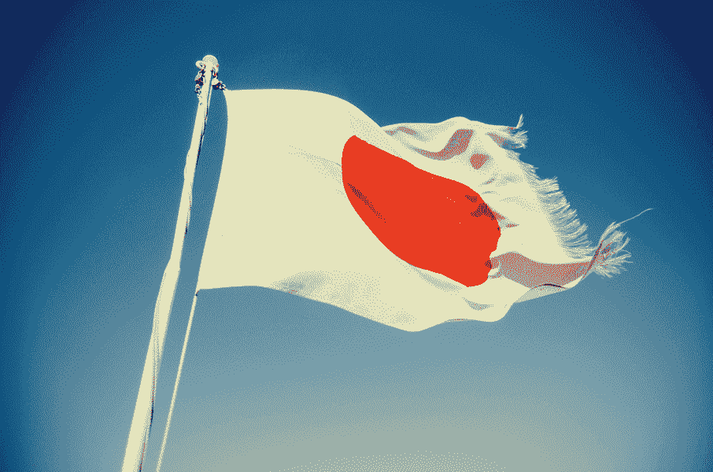

# 我们不怎么说 Arigato

> 原文：<https://medium.datadriveninvestor.com/we-dont-say-arigato-that-much-8046511f556b?source=collection_archive---------0----------------------->

我们伴随着**索尼**长大，看**日盛**，研究**丰田主义**，玩**任天堂，然而你却叫不出一个日本企业家**。为什么呢？！

日本人是一群有趣的人。他们是工业设计领域的精英。他们是一个高度创新和真正正义的社会，尽管有隐蔽青年、原始人和这个花花公子

literally 0 people will find this baldie imbecile amusing. Mission totally accomplished Toryama!

我属于那种应该真正感谢日本人的一代人。**不仅仅是在动画和娱乐方面，还有像这些疯狂的童年记忆**

how about this @Joaquim Monchique?

还因为他们是你第一次男人间互动的重要组成部分:我们**因为他们而成为书呆子**。

而且，就像日本 101 哲学一样，**女性真的被排除在主要角色之外**。事实上，有人说日本真人之间的社交网络正接近灭绝:他们如此依赖网络和虚拟现实，以至于他们更喜欢周末和猫一起玩游戏或去酒吧，而不是和他们爱的人一起看电影。他们所爱的人是**公子哥儿**、**小三儿**，随便什么能让你的船*翻近*。

 [## 计划者让社交媒体保持正轨|数据驱动的投资者

### 如果想达到并保持最高效率，忙碌的人会坚持使用系统。这是 Tweepsmap 和…背后的前提

www.datadriveninvestor.com](https://www.datadriveninvestor.com/2019/03/11/schedulers-keep-social-media-on-track/) 

我从未去过日本，但我觉得我对这个国家的了解比我自己的了解还要多。他们**喜欢他们的美食**，他们真的谈论和吹嘘它

yeah they like some grub

我知道他们是天生的战士(尽管在下一个视频中他们被中国人踢了屁股)。我也知道他们有一个帝国主义的东西在进行

China 10 — Japan -52\. Flawless victory.

我知道**他们喜欢创造**，用令人敬畏的想法**勾画出草图并赢得满堂喝彩**

If Jobs hadn’t 100% American blood… I’m betting my chances this guy was not raised in Cleveland

我也知道一些日本演员:渡边谦。

**就这些**。

“Come on Leo, don’t you die on me!”

但是**雅达利**呢？**索尼**？**尼康**？**日立**？**丰田**？**任天堂**？**日本 SEGA** ？**Comme des garons**？

对迈克尔·贝来说(因此占世界认知的 98%)，日本人不会比这更重要

is there a shittiest Michael Bay movie? please do name it

就像俄罗斯人是一文不值的奴才一样(是的，因为他们喝醉了)，他们可以从最糟糕的情况中找到积极的一面

why did Michael Bay harass 0 women?!

在学校里，当你学习第二次世界大战的悬崖笔记时，你会被告知他们是**反派**。嗯，你只需要跳出历史 101 和迈克尔·贝的生活，就能了解他妈的全貌，我说得对吗？

Clint’s tribute was actually pretty ‘passable’

日本人是如此的可怕和无畏，以至于我仍然被这样的视频困扰着…

他们对我小时候和今天的我来说是如此的无用，以至于我从来没有听过这个家伙的话！

他们在宣传上是如此的操纵和廉价，这可能是有史以来最糟糕和最狡猾的动画了，对吗？

他们对妇女、儿童和所有人都比我们残忍，对吗？

**没有**。

**他们几乎是一样的。**

只需添加**样式**。

it’s not a bad looking car…

**牛逼**。

令人惊叹的美食

Sushi God!

这些家伙的音乐

if Japan had a Top+ this would be a regular at #1\. Just for a week.

或者这些杜德蒂的歌

at least they didn’t steal it

或者，我个人最喜欢的，这些疯狂的 DOGS！！！

care for some Jap Rap? +nobodyknows, masters of J-Pop

或者你甚至可以选择“古典”。增田先生，上台吧！

I don’t care for One Piece, THIS IS the GOAT

而且更古典！平野先生，放下大提琴！

if you’re into characters named Zeno, Silva, Pitou, Gon Freecss or just Perfect storytelling and animation then Hunter X Hunter might be your thang

在比尔和马克被打败之前，日本人几乎在所有事情上都表现出色。

索尼在**设计和创新**方面领先。他们期待已久的迷你唱片演唱会陷入疯狂，随之而来的是肖恩·帕克和 mp3。 *Kuso* ！

丰田是第一家全力推行 [eco](http://blog.toyota.co.uk/toyota-pioneers-biosynthetic-hoses) 的汽车制造商。丰田也有著名的[坚不可摧的汽车](https://www.youtube.com/watch?v=kFnVZXQD5_k)。

雅达利通过这个被称为**街机游戏**的小东西，让我们都成为了**游戏玩家**。

the original Pong, back in 1972

尽管拉尔夫·h·鲍尔早在 1922 年就画出了视频游戏机的草图，但他们还是在市场上迅速击败了美国人。

索尼克和马里奥正在吵**索尼突然进来踢他们的屁股**(顺便说一句:*你知道索尼克真名叫*吗？好吧，我们并不在乎，不是吗？).我永远不会忘记这样的游戏

或者

仅仅因为**他们是**(并且**仍然是** ) **游戏设计杰作**。

他们会踢足球。就连巴西人也会同意这一点。

从中田家族到本田家族。**他们可以**！嘿浩克，还记得[当年的](https://www.youtube.com/watch?v=Nns_xfIcYWQ)吗？

那么视频游戏呢？当然，他们踢一些严重的屁股…

他们是真正的潮流引领者

dude on the left is going 80 and still sowing stuff; dude on the right is the head designer @Issey Miyake

他们也可以做**一些应用**

 [## App Store 上的 kirakira+

### 阅读评论，比较客户评级，查看截图，了解更多关于 kirakira+的信息。下载 kirakira+并享受…

itunes.apple.com](https://itunes.apple.com/us/app/kirakira/id955687901?mt=8)  [## Simeji 日文键盘+表情符号 Google Play 上的 Android 应用程序

### Simeji 是一个简单易用的日文输入表情键盘。

play.google.com](https://play.google.com/store/apps/details?id=com.adamrocker.android.input.simeji&hl=en) 

他们可以建造东西

他们可以**不构建东西**。

yup, run for your Moe’s Azaria.

所以…

**向你在路上看到的下一辆普锐斯鞠躬**。

尽管这可能会伤害你的内心！

Domo arigato 日本。你们将永远是一群有趣的人！

so the actor is Korean but the focus here’s on the SONG!!!!