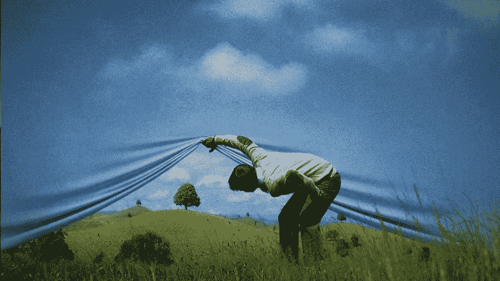
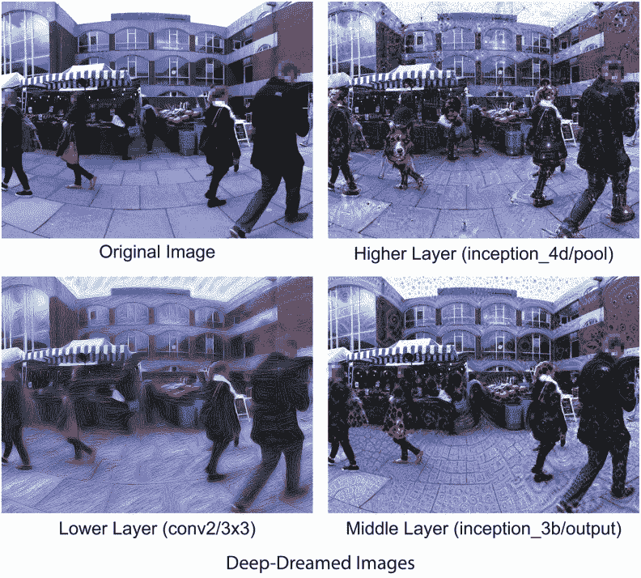
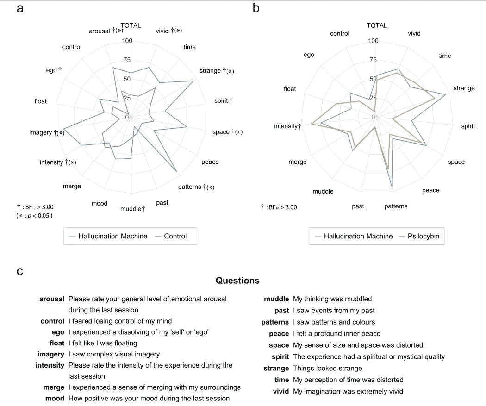

# 我们，人类机器，在稀释的意识状态下对我们的现实产生幻觉

> 原文：<https://medium.datadriveninvestor.com/we-human-machines-hallucinate-our-reality-in-diluted-states-of-consciousness-90a15e94834d?source=collection_archive---------5----------------------->

> **要改变一个人，需要的是改变他对自己的认知。”**

*亚伯拉罕·马斯洛*

*人类被存在于人类历史摇篮中的渴望所包围。对自身起源、意义和存在推断的探索。*

*在陷入自我问题的朝圣中，意识是折磨我们物种核心的主题。几十年前，神经科学和人工智能领域已经开始触及其生物功能的表面。*

*Anil Seth 博士是最现代的神经科学家和思想家之一，他正在探索科学的背后。对他来说，意识状态的改变改变了他们对现实的感知。一个多变的虚构的现实。*

* [## 人工智能与创造力:作为创意引擎的比根——数据驱动的投资者

### 的确，2018 年可以被视为人工智能创造的创造力全盛时期的开始。当然可以…

www.datadriveninvestor.com](https://www.datadriveninvestor.com/2019/02/13/ai-creativity-biggan-as-a-creative-engine/) 

他超越了，如果一个现实是虚构的，它是幻觉，在这种情况下，我们是一个生物机器，在意识的等级机制中对真实的每一个感知产生幻觉。在 TED 演讲中，他用一种有趣的方式，总结性地解释了科学在寻找良心运作机制中所做的努力，以及幻觉理论是如何适用的:

在具有精神治疗或致幻作用的药物中，可以清楚地注意到意识状态的改变(改变精神模式，导致个体以不同形式从根本上体验其“正常”模式之外的意识[1，2])，即不同版本的自我。在这个意义上，赛斯看到了一个研究意识感知背后机制的机会。

药物的精神作用是意识科学和精神病学潜在的重要工具。了解这一点后，他建立了一种叫做“致幻剂机器”的方法[1]，这是一种结合虚拟现实中的屏幕行为实验和人工神经网络来研究视觉系统参与人类幻觉的方法。

主要目的是找到不需要药物就能引起意识状态改变的条件。

下图我们看到了一个名为“深度梦境”的模拟环境，它是由一种受人脑视觉功能启发的人工智能创造的:

Extracted image from reference [1]

赛斯用这种方法证实，接受视觉神经反馈实验条件的参与者被诱导自然地改变意识状态，而不需要精神药物。它导致幻觉中大量的感觉和短暂的扭曲体验。

下图是一些没有意识状态改变(控制)效果的人体实验与“致幻剂机器”方法改变的对比。右边是“致幻机器”与个体对精神作用(裸盖菇素)的比较:

Extracted image from reference [1]

这条新的研究路线，让我们对我们作为人类所拥有的关于什么是真实的或者只是我们所相信的幻觉的确定性产生了很多疑问。一种虚假的存在主义，一种虚幻的单一自我，它实际上呈现出存在于意识改变状态中的不同版本。

神经科学给我们带来了关于感官的重要教导，远远超出了视觉、听觉、味觉和嗅觉的古老感知。我们拥有更多的丰富性，比如说，我们有体感，一种允许我们在身体内外体验不同部位的感觉的感知。我们现在正在探索致幻，我们如何构建与我们的精神状态相关的现实感觉。

参考资料:

[1]圭介·铃木，阿尼尔·k·塞斯*等*，研究改变知觉现象学的深梦虚拟现实平台，圭介·铃木，阿尼尔·k·塞斯*等*，自然科学报告，2017。

[2] Tart，C. T .研究意识状态改变的科学基础。Sci。找到了。研究改变状态意识，1972 年。* 

****其他语言-****

*   *[*葡萄牙语*](https://www.brainlatam.com/blog/nos-maquinas-humanas-alucinamos-a-nossa-realidade-em-estados-diluidos-de-consciencia--341)*

*[发表在大脑支持神经科学上的博客](https://www.brainlatam.com/blog/we-human-machines-hallucinate-our-reality-in-diluted-states-of-consciousness-342)*