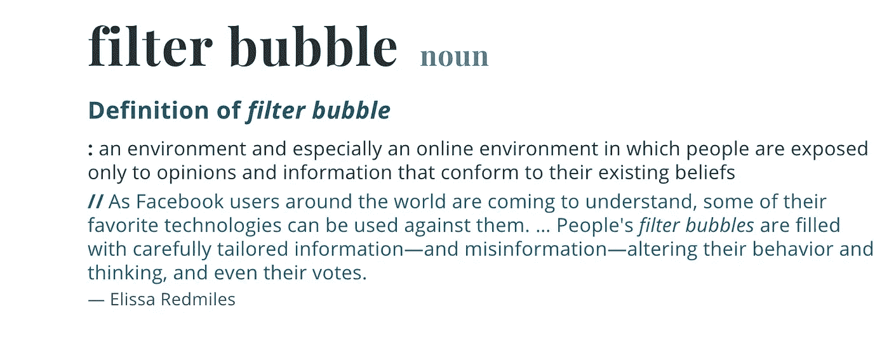

# 我们知道硅谷算法排序的危险

> 原文：<https://medium.datadriveninvestor.com/we-know-the-dangers-of-silicon-valleys-algorithmic-sorting-a56fa5e59192?source=collection_archive---------12----------------------->

# 以下是如何打破他们考虑不周的过滤泡沫

**尝试利用人口统计学、历史性的公民参与和社会隔离的流行**

(source: Merriam Webster Dictionary)

几个月前，当我沮丧地冲出家门时，报名参加志愿者是我最想不到的事情。相反，我的任务是找到一台可以工作的打印机(我的打印机不配合)。

我需要尽快打印、公证并邮寄一份文件。我跑向我的车，希望我的当地图书馆提供打印服务(我所在地区的一些分支机构提供，一些不提供。

我抓起我的手机，认为我应该打电话确认一下。

“是的，我们有打印机，”工作人员告诉我。“我们今晚营业到晚上 9 点，既然你在这里，为什么不填一份申请表，成为我们的志愿者呢？”

我惊讶地笑了。

“当然可以。为什么不呢？”

大约一个月后，我在弗吉尼亚州亚历山大市的邓肯图书馆做志愿者，每周花几个小时帮助重组漫画小说区。这是一个真正非凡的社区空间，跨越了对书籍和数字内容的热爱。它的节目充满了针对社区每一个成员的活动——孩子、移民、艺术爱好者、电影爱好者。不知何故，它也是一个安静的学习场所，并为那些有需要的人提供一种郡服务咨询台。

 [## 算法诱人的商业逻辑——数据驱动的投资者

### 某些机器行为总是让我感到惊讶。我对他们从自己的成就中学习的能力感到惊讶…

www.datadriveninvestor.com](https://www.datadriveninvestor.com/2019/03/22/the-seductive-business-logic-of-algorithms/) 

我喜欢了解工作人员、项目内容和以前是我邻居的人们。

James M. Duncan library branch manager Brack Spovall (photo credit: CMaddux)

我在一个地区体验到了一种罕见的社区感——那就是华盛顿特区(也是我的家乡)——这里以短暂性、政治变动和对地位的盲目崇拜而闻名。

然而，尽管有充分的证据证明志愿服务的好处，但我们中参与其中的人越来越少。事实上，马里兰大学 T2 分校的一项研究报告称，美国的志愿服务已经降至 15 年来的最低水平。

但是考虑一下由 [ICMA 执行董事 Marc Ott](https://icma.org/executive-director) 和合著者 Myung J. Lee 所做的思想实验，他们共同撰写了一篇[专栏文章](https://thehill.com/blogs/congress-blog/politics/426409-voting-is-up-volunteering-is-down-midterm-lessons-for-civic)，题为“投票上升，志愿服务下降:公民参与的中期课程”,发表在今年早些时候的《国会山》。

“…驱使人们去投票的公民动力也可能为志愿服务的复兴创造条件。美国人……不应该再等两年才采取行动。我们能否复制上个月选举的投票率，以重振对志愿服务的兴趣？”

作者还提供了招募志愿者的指南，这些志愿者在美国的城镇、县和城市中扮演着重要的角色。

社区参与——或者说目前缺乏社区参与——不仅仅是完成工作。它是关于联系——正如我们所知，人类是群居动物——和一种感觉，即我们的生活，尽管有缺陷、挣扎和欢乐的时刻，却是有意义的。

罗伯特·d·普特南在他的书《独自打保龄球:美国社区的崩溃和复兴》中极其详细地描述了我们流行的孤独和脱离。

无偿帮助的行为可以帮助我们缓解这种社会弊病。我个人可以担保这种长生不老药。