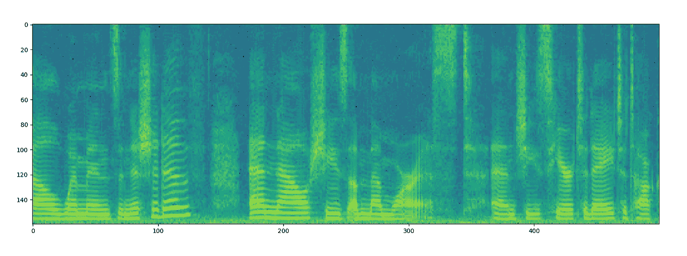
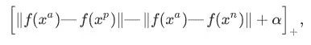
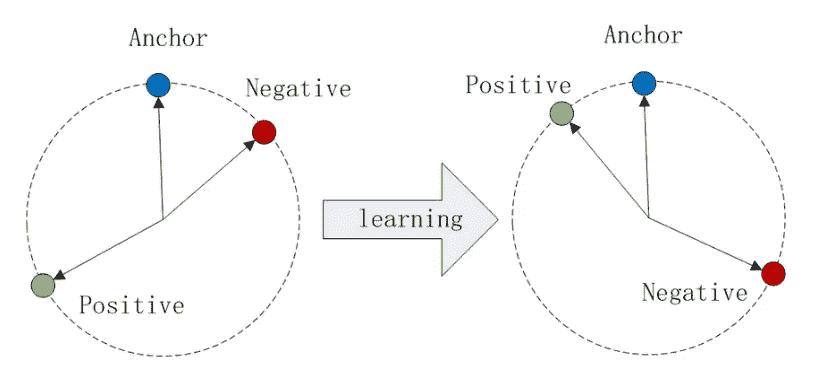

# 在你说完“你好”之前，我们就知道你是谁了

> 原文：<https://medium.datadriveninvestor.com/we-know-who-you-are-before-you-finish-saying-hello-414db577d62d?source=collection_archive---------9----------------------->

神经数据实验室的神经网络可以通过一个明显的音节来识别谁在说话。尽管本文没有直接讨论基于语音的身份识别，但这个主题与它有部分联系。我们将讨论神经网络的特征，所谓的 d 向量，可用于语音处理:从验证到语音和情感识别。

# 基础知识

一秒钟的声音可以包含 8000 到 48000 个数字，具体取决于采样率。这些数字可以被看作是麦克风振膜或动态平衡位置的偏差。事实上，这样的解释是过分的:信号在下一时刻的幅度取决于前一时刻，这意味着信号可以在不损失信息的情况下被压缩。有许多方法可以最小化信号的大小。其中大多数是基于声音的物理特性和人类听觉。

在神经网络被证明是有用的(广义上)之前，社区曾经使用手工制作的功能。最广泛使用和认可的是 [Pitch](https://medium.com/@neurodatalab/pitch-tracking-or-how-to-estimate-the-fundamental-frequency-in-speech-on-the-examples-of-praat-fe0ca50f61fd) 和 [MFCC](https://en.wikipedia.org/wiki/Mel-frequency_cepstrum) 。前者具有声带振动速率的物理意义，通常因人而异，取决于音准。梅尔频率倒谱系数(MFCC)的概念是基于人类声音感知的非线性，尤其是音量和频率。人们认为一种声音比另一种声音高一些，而事实上，它们的频率在一定次数上是不同的。

这些和其他手动计算的特征是不可逆的，因为一部分信号将会丢失。尽管它对于某些任务来说并不重要，但如果能想到一个更有效、更通用的替代方案，那就太好了。

解决问题的关键是傅立叶变换，它可以将音频信号表示为不同频率和振幅的波的总和。事实上，人类的语音不是静止的，这意味着它的频谱在不同的时刻会有所不同。该特征允许通过频谱图查看其时间-频率表示。

为了构建声谱图，您需要将声音分割成 10 毫秒长的重叠帧。然后对它们中的每一个计算傅立叶变换，并把它们的模放入声谱图上的一列。这种变换(几乎)是互易的。换句话说，可以通过傅立叶变换和 Griffin-Lim 算法来恢复初始音频信号(当然，由于傅立叶变换是复杂的，并且声谱图是实值对象，因此使用迭代 Griffin-Lim 算法来至少近似地恢复相位，因此会有一些数据丢失)。所以，如果你取振幅的对数，你会得到:

*A spectrogram of the 5-sec speech.*

用卷积神经网络处理它们也很方便。

这里有一个图像处理的窍门:有包含不同对象样本的大型数据库(如 ImageNet)。您可以训练一个大型网络来识别它们，然后针对我们的特定任务进行额外训练，或者从内部完全连接的层之一获取结果输出。这种架构被认为能够很好地获得输出图像的信息特征。但从经验上讲，如果神经网络是从零开始训练的，结果总是会更好。

d-向量(有时也称为 x-向量)的概念有点类似于使用经过训练的 ImageNet 网络，只是没有光谱图的数据库。在这种情况下，自动编码器可以被认为是一种出路，但他们不知道应该关注声谱图的哪一部分，这使得他们的工作不能令人满意。

# **我们需要更深入**

文章的主要部分来了。

有一项众所周知的人类语音验证任务，其中系统基本上将输入语音与数据库中的人进行匹配。知道如何建立这样的系统是一项不同的任务。有许多参数(例如，讲话的长度；如果每个人都朗读相同的文本；设定一对一或一对一)在不同的情况下会变得很关键，但是我们需要关注不同的事情。

例如:如果我们训练网络来识别人类，特征的质量会有多高？我们做的任何事情都是为了获得特性。

在这种情况下我们可以依靠直觉和【2015 年的这篇文章。在这里，作者教网络人脸识别。诀窍是:他们使用三重损失。

这个想法很简单；归一化倒数第二个图层中的要素，使它们位于单位圆上，并将一个类中的点设置为彼此靠近放置，如果它们属于不同的类，则设置为远离放置。这可以通过以下方式实现:从范围中为每个锚点选择两个以上的点——一个来自同一个类，另一个来自另一个类，以便它们是积极的和消极的。然后，形成点的损失:

其中 x-输入图像，f-归一化后的网络输出，alpha 手动设置参数，[]_ {+}-ReLU 函数。定性地说，如果至少在一个α中锚和正之间的距离大于锚和负之间的距离，那么损失的值等于 0。等级之间的差异越小，价值就越大。

*Here`s what happens to the features after Triplet Loss training.*

对了，你可以聪明的把三胞胎联合起来。在某些时候，损失的价值会变小，所以你可以考虑离主播近的负点，而不是为了加速训练而去找不同的班级。然而，对于大型数据集来说，这是很难做到的，因为您需要计算类之间的成对距离，这种距离在每个网络的训练迭代之后会发生变化。

三重缺失比用于通常分类的分类交叉熵更有优势。如果用交叉熵训练该模型，它会将来自同一类的所有点放入一个小的域中，而不适合该任务的数据可能会在该过程中丢失。我们打算使用神经网络作为一个特征的生成器，而不是用于验证，因此我们不需要它。对于三重态损失，将不同的类分布到单位圆上的不同域中比将一个类分组更重要。

在根据光谱图训练特征生成器之前，您需要做的最后一件事是确定它们的大小。很明显，我们取的时隙越大，分类就越准确，特征就越平均。这就是为什么选择 1-3 个音素(音节)的信号长度是好的。半秒钟就可以了。

我们采用 VoxCeleb2 数据集进行训练。6300 扬声器中的每一个都有几个几分钟长的音频文件(它们都是在不同的条件下录制的)。使用部分文件进行培训，使用其他文件进行验证。然后选择卷积网络的结构，加入三重损耗，开始训练。

结果令人难以置信。在 1080Ti 上差不多两周的训练(没错，就是那么长)，分类准确率达到了 55%。当然，这看起来并不多，但是前 5 名占了 78%。如果我们只考虑最响亮的部分，主要是重读元音，前 5 名的准确率将提高到 91%。基本上，我们可以通过一个词非常准确地识别一个人。然而，这并不重要。

这一切都是为了在分类前从倒数第二个图层获得输出的要素。我们在我们的任务中测试了它们，结果比我们使用传统方法进行特征计算要好。例如，在情绪识别中使用 d 向量可以击败最先进的解决方案高达 4%。我们关于这方面的文章被 2019 年 FICC 奥运会接受。但是情感认同是另一个时代的故事。

**作者**:grigory Sterling，深度学习专家，Neurodata 实验室。