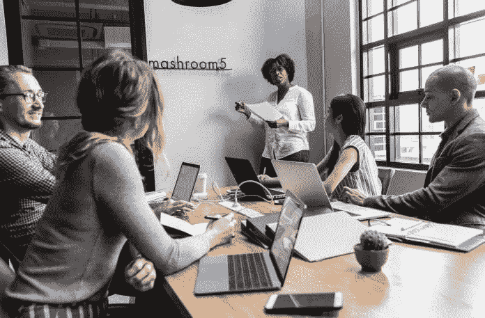

# 我们从失败中学到的比从成功中学到的更多

> 原文：<https://medium.datadriveninvestor.com/we-learn-more-from-failure-than-from-success-99bb231237cd?source=collection_archive---------30----------------------->

## 挫折往往催生创新

成功的企业家从大大小小的失败中建立起他们的企业。正如[伊薇特·芦荟](https://twitter.com/Yvette_Aloe)所知道的，从婴儿到有经验的专业人士，失败阻碍了每个人。那些成功的人从错误中获益。

Aloe 是地球村中心的认证生活教练、演讲者、创始人和战略家，该中心专门从事业务增长咨询、平面设计、网页设计和营销，以及业务、销售和管理培训。

对于任何有很多潜在失败点的企业家来说，这都是一个难题。芦荟记住了这个和其他的错误——甚至追溯到她最初在学校的失败。

“我第一次遭遇失败是在大学代表队里，整整一学期我都失败了。是的，整整一个*学期，”她说，这种经历仍然刺痛着我。“失败是当你没有达到你为自己或他人设定的期望时。让我伤心的是没有达到父母的期望。*

“我对自己感到失望，想出了我本可以做得更好的所有方案，”芦荟说。“其中很大一部分是考虑如何向他人传达我的‘失败’是毁灭性的。”

她考虑如何创造一种允许人们接受失败的文化。

“从我们的词汇中去掉‘失败’这个词，”芦荟说。“基本上没有失败这回事。只有*反馈*。当我们开始变老时，我们才知道失败的概念。

“例如，拿一个正在学习走路的婴儿来说，”她说。“没有人会在婴儿摔倒时去对他们说，‘我觉得走路不适合你’，或者‘看看你的朋友。他们已经会走路了，而你却在这里爬行。不管婴儿多久跌倒一次，他们都会爬起来再试一次。"

社会在顺境和逆境中都扮演着重要的角色。

“我们可以创造一种拥抱失败的文化，不仅在人们成功时奖励他们，而且在他们‘失败’时支持他们，”芦荟说。“失败鼓励创新。它让我们改进我们的想法和我们是谁，从我们的错误中学习。失败是一件好事。

# 视觉因素

“本质上，我们从失败中学到的比从成功中学到的更多，”她说。

如何对待失败，取决于眼光。

“想象我们生活在一个没有失败这个词的世界，”芦荟说。“有多少人仍然会站起来从他们的经历中学习？还有多少人会去追求自己的梦想？没有失败。只有反馈。”

这就引出了企业家应该如何充分拥抱和欢迎失败。

“我从我的错误中吸取教训，审视形势，”芦荟说。“我问自己，要得到我想要的结果，我能做些什么不同的事情。我知道有一种方法可以做到。我只需要找到它。我知道在经历失败后，我会变得更好。

“失败是我们变得更好的必要条件，”她说。“我们需要理解这一点，不要再为此打击自己。”

即使在最后一年，芦荟也有过挫折和反弹。

“失败告诉我，我不需要知道一切，”她说。“当我遇到困难时，可以去寻求帮助，向那些已经实现了我想要实现的目标的人寻求帮助。

“这也教会了我作为企业家的适应能力，”芦荟说。“你会听到和知道很多。失败帮助我改进了我的商业策略。这让我明白我所做的并不奏效。现在我有了一个比以前更好的商业策略。我的视野更大更好。”

# 回到根源

失败也是一个方便的提醒。

“这将有助于你深入挖掘，并记住你当初为什么开始，”芦荟说。“当我们不去想它，而是去想它的教训时，我们可以从中吸取教训。我们释放我们的全部潜力。”

那些成绩最好的人，把失败当成了敲门砖。

“我们通过关注我们可以改进的地方，将失败转化为成功，”芦荟说。“确保你学到了所有的知识。你已经看到了什么是行不通的。致力于寻找有效的方法。

“失败也给了你创新的机会，”她说。“尝试不同的解决方案。不要把你的自我价值感建立在结果上。即使失败也要知道自己足够了。”

有远见的企业主把每一天都视为新的一年的开始。

“我对企业家的建议是，你已经知道什么是行不通的，”芦荟说。“现在尝试一些不同的东西。[快速故障和正向故障](https://www.datadriveninvestor.com/2018/11/19/fail-fast-fail-often-and-win/)。我们从失败中学到的比从成功中学到的更多。

“不要把你的自我价值建立在你事业的成果上，”她说。“不管你失败了多少次，要知道你已经足够了，并继续相信这个过程。你的努力会有回报的。”

**关于作者**

吉姆·卡扎曼是[拉戈金融服务公司](http://largofinancialservices.com)的经理，曾在空军和联邦政府的公共事务部门工作。你可以在[推特](https://twitter.com/JKatzaman)、[脸书](https://www.facebook.com/jim.katzaman)和 [LinkedIn](https://www.linkedin.com/in/jim-katzaman-33641b21/) 上和他联系。

*原载于 2019 年 1 月 10 日*[*【www.datadriveninvestor.com】*](http://bit.ly/2FmvBIx)*。*