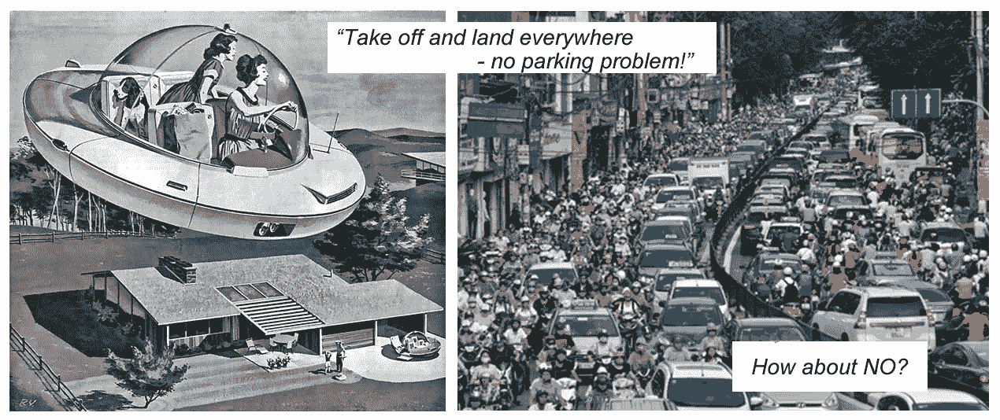
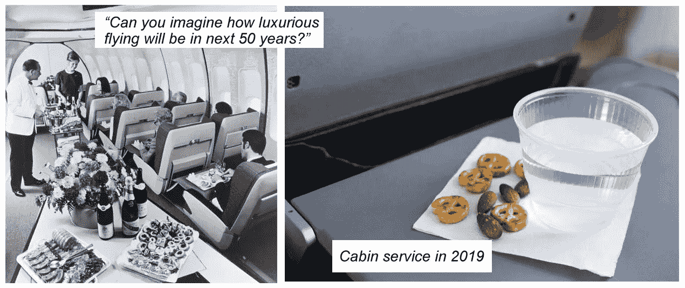
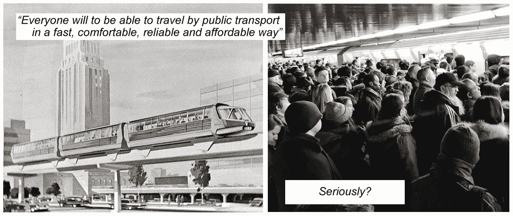
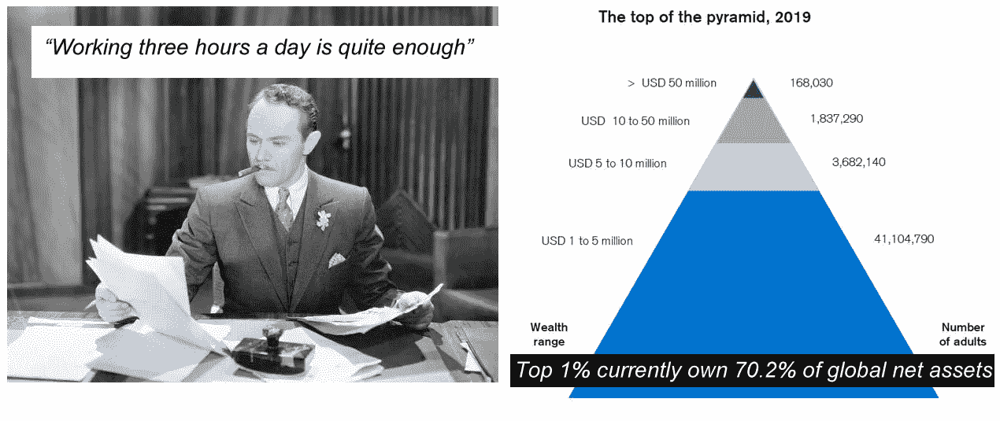
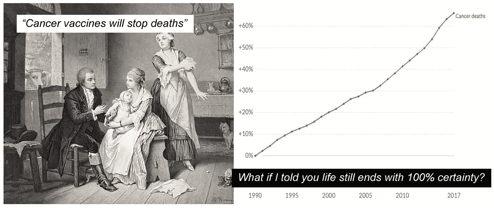

# 我们生活在一个神奇的时代！

> 原文：<https://medium.datadriveninvestor.com/we-live-in-amazing-times-8d72b0fe5f77?source=collection_archive---------9----------------------->

他们每天都向我们灌输这样的消息:我们的世界——尤其是科技——正在以闪电般的速度变化和发展。数以亿计的人每天早上醒来都很害怕，为 2045 年的这一时刻做准备，因为变化的速度太快了，人类社会将无法接受。显然，这些变化确实已经有了自我意识，它们不再需要人们去适应它们。这也是智能不再被需要，被人工取代的最好证明。

*让我们看看几个领域，到目前为止，这些领域已经发生了变化，我们几乎认不出与以前形式的相似之处。*

*因为人类处理图像的速度比阅读文本快 6 万倍——我们将用图像来说明这些变化。*

# 飞行汽车

飞行汽车不仅仅出现在科幻电影和小说中。每个时代都有它的飞行汽车。即使是现在，也有相当多的这种观点的追随者逐字逐句地阅读公司的营销信息。飞行汽车的乌托邦愿景已经演变成无情的拥挤街道，道路和一切表明，这种“进步”将持续下去。他们承诺给我们花园城市。在我们注意到它之前，我们住在街道狭窄的混凝土工厂城市里。

 [## 在自动驾驶汽车发生事故的情况下，谁应该承担法律责任？数据驱动的投资者

### 我仍然认为自动驾驶汽车是一种奢侈品，而不是必需品…

www.datadriveninvestor.com](https://www.datadriveninvestor.com/2018/11/02/who-is-legally-accountable-in-the-case-of-an-autonomous-vehicle-accident/) 

甚至我们那些永远堵在交通堵塞中的冒烟的汽车也将被带走，我们最终都将骑上不修边幅的自行车。

# 你能想象未来的飞行会有多棒吗！

是的，我可以。我甚至不需要——这已经是现实了。在 50 年代和 60 年代，飞行在许多方面都是一种积极的体验。从没人叫你在机场脱裤子检查屁股之间有没有藏炸弹开始。你甚至不需要带身份证。20 世纪 50 年代的经济舱看起来更像现在的商务舱。头等舱显然和现代酒店房间一样宽敞。迷人的长腿“女招待”是表演的一部分。不幸的是，后来多元文化主义和铁丝网在候机厅被发明，最近女权主义变成了一种斗争形式。在 60 年代，飞机上供应“全餐”:汤、肉、沙拉、蔬菜和甜点。在接下来的几十年里，龙虾被奶酪三明治所取代，最近，我们最终得到了一杯水和两块饼干。

# 公共交通

对于大多数乘客来说，乘坐公共交通工具旅行已经变成了一场噩梦。我们被承诺乘坐悬浮货车和舒适的扶手椅进行舒适的旅行——以一种“快速、舒适、可靠和负担得起的方式”挨家挨户地进行。与此同时，我们每天都在又脏又臭的拥挤的公交车和地铁车厢里贬低自己，即使上面贴着“应对气候变化”和“改善空气质量”的标签也丝毫不能改善我们的心情。二月份在自行车道上充氧的替代方法似乎也不是一件好事。比起融入社会，我还是更喜欢堵在堵车里听音乐，坐在舒适的汽车座位上——抱歉。

# 我们将减少工作

你多久听说一次科技会给每个人带来繁荣？技术并不能使生活水平平等。地球村已经变成了全球触角。技术的发展主要是服务于它的拥有者和进取者。

全球的不平等意味着生产率提高的收益并没有被广泛分享。大多数人太穷了，不能少干活。战后时期，一些国家的不平等程度有所下降，但自 20 世纪 70 年代初以来，不平等程度急剧上升。前 1%的人目前拥有全球净资产的 70.2%。虽然最近这一指标没有前几年上升得快，但一切都表明未来趋势将是向上的。

# 癌症疫苗将彻底改变医学，阻止死亡。

如果我告诉你，生活仍然以 100%确定性结束呢？数百年来，医学仍然没有治疗最普通疾病的药物。新型抗微生物药物的开发正在下降。生物技术实验室更像是一个炼金术士的工作室——我们仍然不太了解人体，将不同的混合物混合在一起，希望它们会有正确的效果。Eroom 法则可以将最伟大的梦想家拉回现实。

在过去的 50 年里，人口翻了一番——过去有 40 亿人，现在有 80 亿人。这个数字再翻一倍需要多长时间？

*这意味着从有限的资源中获取商品的竞争越来越激烈。森林、耕地、矿产资源都在萎缩。我们建造房屋和娱乐的空间越来越少。我们已经发现了美洲和海洋中最失落的岛屿——无处可迁移。在这种情况下，有哪个头脑正常的人能预测全人类会有一个光明的未来？*

*新口号也无助于让现实变得甜蜜。我们应该乘坐飞行汽车，与此同时，我们完成了将旧裤子转化为地板抹布的工作，称之为高度“循环经济”。*

我们生活在一个神奇的时代！