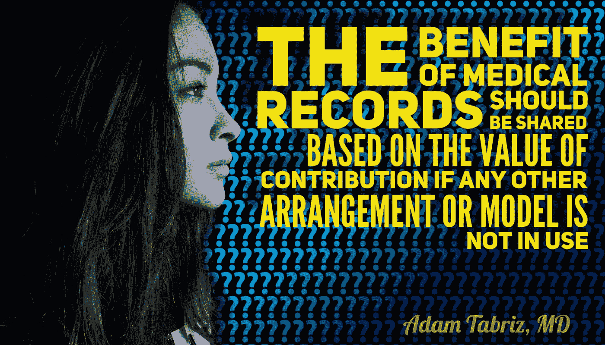

# 我们需要一个全面的 EHR 系统来控制病人

> 原文：<https://medium.datadriveninvestor.com/we-need-a-comprehensive-ehr-system-with-the-patient-in-control-5a7207f3ac86?source=collection_archive---------1----------------------->

**Healthcare, Technology, EHR, EMR**

国家健康 IT 协调员办公室的高级管理人员 John Fleming 最近在一次医疗技术隐私峰会上表示，现在是时候建立一个真正统一的电子健康记录系统了，该系统将来自不同医疗提供商的数据结合起来，并由患者控制。

这是一个时机已经成熟的想法，这是一个只有使用完全互操作的健康记录技术才能实现的愿景。

 [## 大笔资金和尖端技术:人工智能/人工智能投资将如何革新医疗保健…

### 在过去几年人工智能(AI)和机器学习(ML)的显著发展中…

www.datadriveninvestor.com](https://www.datadriveninvestor.com/2018/03/22/big-money-and-cutting-edge-technology-how-investment-in-ai-ml-will-revolutionize-the-healthcare-industry/) 

T 如今，医院和卫生系统控制着患者记录，而患者并不总是能够完全了解自己的健康史。当患者从属于卫生系统的医生那里转到由独立医生经营的专科诊所时，他们的健康记录并不总是随身携带。

这意味着临床医生不能总是看到患者的全部病史，这使得医生在规划治疗过程时处于不利地位。这也让患者觉得他们无法控制自己的医疗保健。

有可能找到更好的方法。这不是一个观点的问题，我这样说是因为我是这个系统的一部分，在这个系统中，病人可以控制他们自己的健康史。这个系统对提供者和病人都更好。

当我还是住院医生时，我在贝塞斯达海军医院和沃尔特·里德陆军医疗中心工作。在数字记录成为规范之前，那是纸质记录的时代。在沃尔特里德医院接受治疗的军事人员在从一个专家转移到另一个专家，或从一个医疗机构转移到另一个医疗机构时，都会携带自己的医疗档案。患者完全控制着自己的信息。

Walter Reed 使用了一个基于纸张的系统，该系统被电子健康记录颠覆的时机已经成熟。但是通过让病人完全控制自己的健康史，军方走在了时代的前面。

随着电子记录的使用不断普及，卫生管理人员不应该仅仅询问这种数字系统如何减轻他们的数据输入工作量或简化医院运营。他们还应该问，他们的 EHR 系统如何让病人坐在驾驶座上。

# 使患者能够控制自己的健康史将:

**允许更好的集中化**

**提高护理质量**

**帮助降低成本**

**降低医生责任和失误率**

**创造一个更具竞争力的市场**

**提高护理的连续性**

**解决许多健康信息隐私问题**

**创造无国界医疗**

最后一点——消除医疗领域的边界——尤其重要。患者在医院、诊断中心和独立运营的医疗诊所之间移动。在这些不同的环境中，临床医生需要能够看到患者的完整健康记录，这在今天仍然是一个挑战。

> *医疗保健应该从患者开始，患者应该是决定与哪个提供者共享哪些信息的人。*

随着健康记录越来越数字化，这个国家需要一个集中的健康记录系统。

虽然不同的利益相关者对如何最好地创建这种集中的系统持有不同的观点，但我从过去的经验中知道，让病人控制是真正实现这一目标的最好和唯一的方法。它不仅增强了患者的能力，还通过提高医患关系的效率，使医生能够提供更好的护理。

 [## 技术不能取代人类的接触

### 健康是人类最宝贵的资产之一，与其他商品和财富不同，它是独一无二的…

becominghuman.ai](https://becominghuman.ai/technology-cannot-replace-the-human-touch-bed5005deb00)