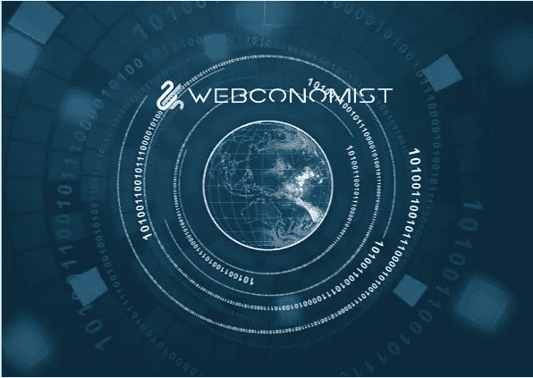

# 我们需要新的信息技术基本规则

> 原文：<https://medium.datadriveninvestor.com/we-need-new-ground-rules-for-information-technologies-2d36c1ddf842?source=collection_archive---------21----------------------->

直到最近二十年，信息技术的大部分影响都在公司和政府的大厅里。当然，随后出现了万维网，互联网。紧随其后的是社交媒体。智能手机、无线数据和无处不在的 WiFi 把事情带到了一个全新的水平。突然间，我们变成了电子人。

随着 2011 年阿拉伯之春的展开，西方民主国家欢呼民主增长的新时代即将到来，集会的呼声越来越大，但结果却是溅射出来，留下更多残暴的独裁者在位或被重新安置。在这一点上，社交媒体辜负了我们。现在，反民主国家使用信息技术来破坏民主，他们做得很好。从好的方面来看，它促进了 [#MeToo](https://metoomvmt.org/) 运动。很难想象扎克伯格或多尔西会想到他们工具的地缘政治和社会影响。

现在，我们正看到人工智能、区块链和加密货币以及物联网的崛起。所有这些都是非常宝贵和有益的。但它们也可能非常糟糕，极具破坏性。

如果我们现在应该学到了什么，那就是这些信息技术有一些内在的真理。应该解决的问题。我们需要的是一套政府和行业在考虑这些技术的部署和开发时将使用的基本规则。我称之为信息技术的规则，并在此简要概述，同时在我即将出版的新书《*不信任的系统》中深入探讨；科技能拯救我们复杂的世界吗？*

九个基本戒律是:

1.  所有的信息技术都有好与坏的双重目的。
2.  信息技术可以影响人类的能动性和自由意志
3.  对于任何信息技术，隐私都是必须考虑的
4.  任何信息技术都可以被利用
5.  任何信息技术都会产生社会和地缘政治影响
6.  必须在全球生态系统的背景下考虑所有信息技术。
7.  所有的信息技术都有意想不到的后果
8.  所有信息技术都将被用于其发明目的之外的目的。
9.  所有信息技术都会产生经济影响

可能还有其他的。这就是我今天在与大学院长和计算机科学教授、心理学家、人类学家和社会学家、首席信息官和首席技术官的交谈中所处的位置。从这些规则中，我们必须考虑立法和监管的含义，如何教育政治家，以及立法者如何适应快速变化的环境。

一些人可能认为这种想法阻碍了创新，抑制了经济增长。政府管得太多了。但是我们知道，技术不喜欢民主。随着我们的世界变得越来越复杂，我们将需要更多地求助于信息技术，尤其是人工智能。如果社交媒体技术教会了我们什么，那就是盲目地基于欲望的假设可能不是一个好主意。

你有什么要补充的话吗？

## 来自 DDI 的相关故事:

 [## 用 7 个步骤解释深度学习——数据驱动投资者

### 在深度学习的帮助下，自动驾驶汽车、Alexa、医学成像-小工具正在我们周围变得超级智能…

www.datadriveninvestor.com](https://www.datadriveninvestor.com/2019/01/23/deep-learning-explained-in-7-steps/)  [## 正在改变行业的 5 个真实世界区块链应用——数据驱动的投资者

### 除非你一直生活在岩石下，否则我相信你现在已经听说过区块链了。而区块链…

www.datadriveninvestor.com](https://www.datadriveninvestor.com/2019/02/13/5-real-world-blockchain-applications/)