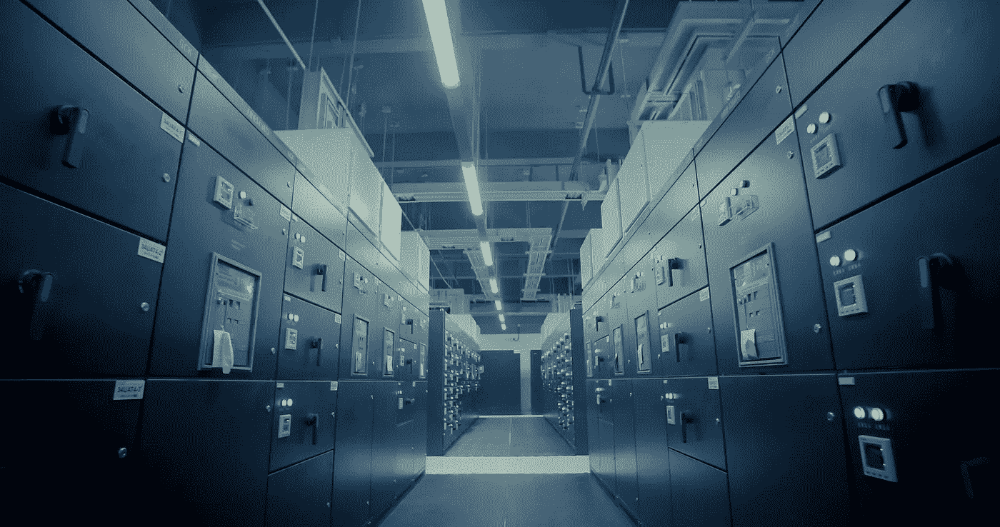

# 我们需要数千个设施来处理大数据

> 原文：<https://medium.datadriveninvestor.com/we-need-thousands-more-facilities-to-handle-big-data-7b7a38f1060e?source=collection_archive---------25----------------------->

由于全球数字化、物联网的发展和许多其他因素，每年大约会产生 600 的数据。这比当前数据中心所能处理的数据量多出约 200%，这意味着为了跟上快速增长的步伐，对数据量的需求越来越大。

根据一些顶级行业专业人士的说法，如果我们想继续处理新的和不断增长的企业创建的数据，到 2020 年，仅在美国，我们就需要大约 4，000 个以上的设施。这个近似值是考虑到每个数据中心大约有 25，000 平方英尺，可以处理高达 2.5 兆瓦的数据。

微软首席技术顾问戴夫·克劳利说:“与 2000 年左右的互联网泡沫不同，云计算的市值超过 4 万亿美元，是一个真正的商业机会。”。随着对更多数据中心需求的增长，潜在利润也在增长。

## 为什么我们需要更多的数据中心？

随着公司收集比以往更多的数据，作为一个技术社会，我们越来越需要更多的存储和处理能力。超过[世界上 90%的数据](http://bigdata-madesimple.com/exciting-facts-and-findings-about-big-data/)是在过去两年中创建的。对于没有足够空间来存储和分析这些“大数据”的公司来说，使用这些“大数据”来做出明智的业务决策、实现营销目的以及创造更好的客户体验可能是一项挑战。

这些大量的数据对于公司来说太多了，以至于他们无法在自己的四面墙内保持同步，因此他们寻找异地位置来安全地存储他们最敏感的数据。使用这些设施还可以让公司更好地管理其 IT 基础设施，从而防止重要服务、客户满意度甚至收入的损失。

即使公司选择利用云服务，他们仍然需要存储主机服务器的地方。对于绝大多数 IT 专业人员来说，找到一个安全、可靠且易于使用的设施是最好的解决方案。

## 我们如何获得更多？

在寻找可以用作数据中心的物业时，我们真的不必看得太远。虽然许多都是从头开始建造的，但仍有相当多的预建设施只需几次升级就可以变成可靠的数据中心。其中大部分是以前的公司办公室、呼叫中心或其他已经非常安全的空间，拥有高效运行数据中心所需的大量平方英尺。

有消息灵通、可靠的公司可以指导公司和买家获得他们自己的数据中心。更好地了解数据中心的工作方式，以及在启动数据中心之前需要投入的资源量，将使您更有可能取得成功。

无论您的预算、速度和存储需求，或者理想的位置，联系一位既了解行业又了解当前房地产市场的[顾问](https://www.linkedin.com/in/steve-friedman-0785bb/)对于任何寻求拥有数据中心资产的人来说都是明智的第一步。