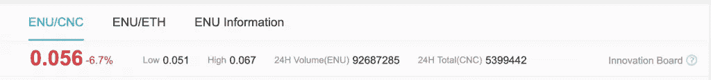

# 我们需要揭露可疑的交易

> 原文：<https://medium.datadriveninvestor.com/we-need-to-expose-shady-exchanges-85589c40ee66?source=collection_archive---------5----------------------->

经验丰富的密码交易员会非常清楚一些交易所采用的不诚实做法。一些人伪造他们的交易量，一些人沉迷于一点内幕交易，而其他人只是简单的骗局。

我见过很多交易所突然冒出来，然后又很快消失。我见过很多交易所因为自身的无能而被黑，也见过很多老式的退出骗局。

 [## 十大区块链课程-数据驱动的投资者

### 渴望在区块链发展吗？你想知道区块链是如何工作的，但不知道在哪里？或者就是太多了…

www.datadriveninvestor.com](https://www.datadriveninvestor.com/2019/03/08/top-10-blockchain-courses/) 

所有这些事件的共同点是什么？普通的投机者/加密交易者是唯一的输家。

我一次又一次地去过 AEX 等加密货币交易所，看到了明显是假币的交易量。就 AEX 而言，你可以从他们的[ENU/数控市场](https://www.aex.plus/page/trade.html?mk_type=CNC&trade_coin_name=ENU)中看到这一点。

## 为什么我确定这是假卷

当我在 2019 年 6 月 15 日开始写这篇文章时，他们的统计数据显示，这个市场的交易量超过 9200 万 ENU(见下文)。

据估计，ENU 代币[的流通供应量约为 5.26 亿英镑](https://wallet.enumivo.com/dashboard)。这意味着，在 2019 年 6 月 19 日，AEX 交易了一种广为人知的加密货币理论总供应量的 17%。

令人如此难以置信的一个原因在于，目前仍有超过 1.6 亿 ENU 有待从 ERC20 中交换。这意味着主网 ENU 的实际供应量不能超过 3 . 66 亿英镑。这意味着，根据他们的统计，AEX 对 ENU 市场的 CNC 交易实际上接近 ENU 总供应量的 25%。

但是等等，还有更多。 [Enumivo](https://somethingdecent.co.uk/tag/enumivo) 区块链是一辆使用 EOSIO 的 DPOS。这意味着必须有标记来为 BPs 投票。那些代币被锁住了，至少三天内不能移动。这意味着它们不可能在 19 日被交易。

快速搜索*"*[*enu . stake*](https://enumivo.org/explore/?enu=enu.stake)*"*账户显示，目前有超过 1.98 亿张 enu 代币被下注用于投票。

这使得我们的实际流通 ENU 总供应量下降到 1.68 亿。这意味着 AEX 想让你相信，他们在一天之内交易了超过 54%的 ENU 流动性供应。

怎么会有人相信这是真的？当 Enumivo 的创始人艾登·皮尔斯注意到这一点时，他通过 Twitter(见下文)对此进行了反击。

[https://twitter.com/EnuMivo/status/1141289730346123264](https://twitter.com/EnuMivo/status/1141289730346123264)

## 为什么这是一个如此重要的问题

从表面上看，交易所伪造交易量似乎并无大碍。人们总是伪造 YouTube 的浏览量和脸书的粉丝，为什么不在交易量上做同样的事情呢？

简单来说，就是人们受其影响的方式。伪造一个艺术家或品牌的社会存在会增加他们的流量，但人们不会去演唱会，或购买上衣，期待经济回报。买 crypto 的人会。

任何购买[加密货币](https://somethingdecent.co.uk/tag/cryptocurrency)的人，最终都希望看到他们的投资增值。那些说不知道的人根本没有听到这个问题。

经济学最基本的原则之一是供给和需求:如果供给有限而需求很高，价格就会上涨。

每个人都知道这一点，似乎不诚实的密码交易所正在利用这个简单的投资能力晴雨表赚钱。

当前的加密空间是一个价格一夜之间大幅波动的空间，尤其是在停滞的市场中。这一事实使得低交易量市场对投资者没有吸引力。显然，吸引他们最简单的方法就是遵循一句古老的谚语:假装直到你成功。

通过伪造如此巨大的交易量，该交易所给人一种市场稳定、流动性高的印象。这种印象会影响投资者，否则他们可能会避免涉足某个特定的市场。

## 采取行动

正如生活中的许多事情一样，对欺诈实体采取行动以完全避免它的最佳方式。

AEX 并不是唯一一家伪造交易量的加密货币交易所。我也希望 ENU 到 CNC 的市场不是他们唯一伪造的市场。

如果你怀疑一家交易所在伪造交易量，而事实上有很多这样的交易所，那就不惜一切代价避开它们。我们必须团结一致保护弱势群体。

防止虚假信息是区块链理工大学如此受欢迎的主要原因之一。交易所参与提供虚假数据是对它的嘲弄。

爱，和平和幸福。

[查看该内容的防字时间戳证书](https://somethingdecent.co.uk/opinions-blogs/cryptocurrency-blockchain-opinions/we-need-to-expose-shady-exchanges/#wordproof)

原文：<https://somethingdecent.co.uk/opinions-blogs/cryptocurrency-blockchain-opinions/we-need-to-expose-shady-exchanges/>